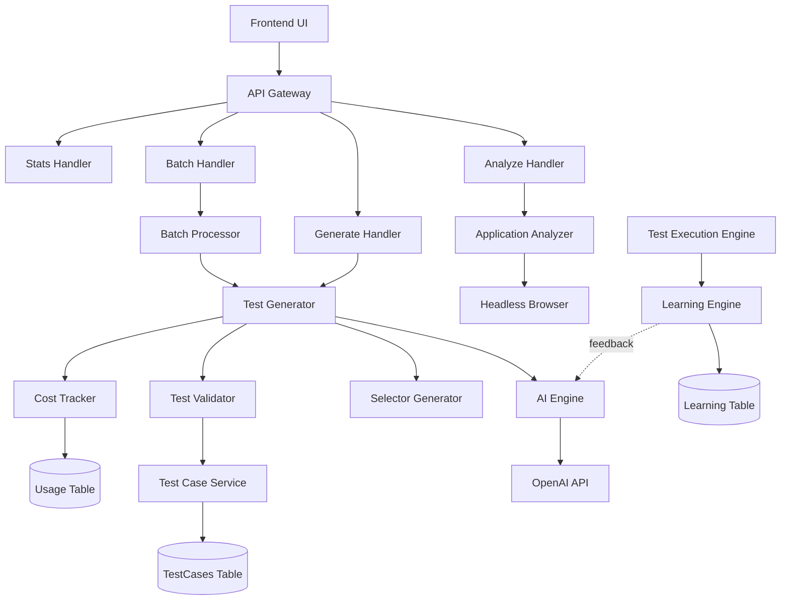

# Design Document: AI-Based Test Generation

## Overview

The AI-Based Test Generation feature leverages Large Language Model (LLM) technology to automatically analyze web applications and generate executable test cases. The system integrates with the existing test execution infrastructure, storing generated tests in the same TestCases table and using the same execution engine as manually created tests.

The feature consists of several key components:
- **AI Engine**: Integrates with OpenAI API to analyze web content and generate test specifications
- **Application Analyzer**: Examines web pages using headless browser automation to extract DOM structure and identify testable elements
- **Test Generator**: Converts AI analysis into executable test cases with proper step sequences
- **Selector Generator**: Creates robust CSS/XPath selectors that prioritize stability over brittleness
- **Test Validator**: Ensures generated tests meet schema requirements before persistence
- **Batch Processor**: Handles bulk test generation for multiple scenarios
- **Learning Engine**: Tracks execution results to improve future test generation
- **Cost Tracker**: Monitors LLM API usage and costs

## Architecture

### High-Level Architecture



### Component Interaction Flow

**Single Test Generation Flow:**
1. User provides URL and test scenario description via API
2. Analyze Handler invokes Application Analyzer to examine the web page
3. Application Analyzer uses headless browser to load page and extract DOM structure
4. Generate Handler receives analysis results and scenario description
5. Test Generator sends structured prompt to AI Engine
6. AI Engine calls OpenAI API with prompt and parses response
7. Selector Generator creates robust selectors for identified elements
8. Test Validator validates the generated test case structure
9. Test Case Service persists the validated test to DynamoDB
10. Cost Tracker records API usage and token consumption

**Batch Generation Flow:**
1. User provides URL and multiple scenario descriptions
2. Batch Processor analyzes the application once
3. Batch Processor generates tests for each scenario in parallel
4. Each generation follows the single test generation flow
5. Results are aggregated and returned with success/failure summary

**Learning Flow:**
1. Test Execution Engine executes generated tests
2. Execution results are recorded with success/failure status
3. Learning Engine analyzes failures to identify selector issues
4. Learning Engine updates selector strategy preferences
5. Future test generations use learned preferences via AI Engine feedback

## Components and Interfaces

### AI Engine

**Responsibility:** Integrate with OpenAI API to generate test specifications from web page analysis.

**Interface:**
```typescript
interface AIEngine {
  generateTestSpecification(
    analysis: ApplicationAnalysis,
    scenario: string,
    context?: LearningContext
  ): Promise<TestSpecification>;
  
  validateResponse(response: unknown): TestSpecification;
}

interface TestSpecification {
  testName: string;
  description: string;
  steps: AIGeneratedStep[];
  tags: string[];
}

interface AIGeneratedStep {
  action: 'navigate' | 'click' | 'type' | 'assert' | 'wait';
  description: string;
  elementDescription?: string;
  value?: string;
  assertion?: {
    type: 'exists' | 'visible' | 'text' | 'value' | 'attribute';
    expected: string;
  };
}

interface LearningContext {
  successfulPatterns: string[];
  failingPatterns: string[];
  selectorPreferences: SelectorStrategy[];
}
```

**Implementation Details:**
- Uses OpenAI GPT-4 or GPT-3.5-turbo models
- Implements retry logic with exponential backoff (3 attempts)
- Validates response schema before returning
- Logs all API interactions for debugging and cost tracking
- Implements circuit breaker pattern to prevent cascading failures
- Structures prompts to include: page analysis, scenario description, learning context, and output format requirements

### Application Analyzer

**Responsibility:** Examine web pages to identify testable elements and user flows.

**Interface:**
```typescript
interface ApplicationAnalyzer {
  analyze(url: string, options?: AnalysisOptions): Promise<ApplicationAnalysis>;
}

interface AnalysisOptions {
  waitForSelector?: string;
  timeout?: number;
  viewport?: { width: number; height: number };
}

interface ApplicationAnalysis {
  url: string;
  title: string;
  elements: IdentifiedElement[];
  patterns: UIPattern[];
  flows: UserFlow[];
  metadata: PageMetadata;
}

interface IdentifiedElement {
  type: 'button' | 'link' | 'input' | 'select' | 'textarea' | 'checkbox' | 'radio';
  attributes: {
    id?: string;
    class?: string;
    name?: string;
    'aria-label'?: string;
    'data-testid'?: string;
    placeholder?: string;
    text?: string;
  };
  xpath: string;
  cssPath: string;
}

interface UIPattern {
  type: 'form' | 'navigation' | 'modal' | 'table' | 'list';
  elements: IdentifiedElement[];
  description: string;
}

interface UserFlow {
  name: string;
  steps: string[];
  entryPoint: IdentifiedElement;
}

interface PageMetadata {
  viewport: { width: number; height: number };
  loadTime: number;
  isSPA: boolean;
}
```

**Implementation Details:**
- Uses Puppeteer for headless browser automation
- Waits for dynamic content to load (configurable timeout)
- Extracts all interactive elements with their attributes
- Identifies common UI patterns using heuristics
- Detects potential user flows based on navigation structure
- Handles single-page applications by waiting for network idle

### Test Generator

**Responsibility:** Convert AI-generated specifications into executable test cases.

**Interface:**
```typescript
interface TestGenerator {
  generate(
    specification: TestSpecification,
    analysis: ApplicationAnalysis,
    projectId: string,
    suiteId: string,
    userId: string
  ): Promise<TestCase>;
}
```

**Implementation Details:**
- Maps AI-generated steps to TestStep format
- Invokes Selector Generator for each element interaction
- Assigns step numbers sequentially
- Sets test case type based on step actions (primarily 'ui')
- Applies tags from specification plus 'ai-generated' tag
- Validates generated test before returning

### Selector Generator

**Responsibility:** Create robust selectors for UI elements.

**Interface:**
```typescript
interface SelectorGenerator {
  generateSelector(
    element: IdentifiedElement,
    allElements: IdentifiedElement[]
  ): string;
  
  validateSelector(
    selector: string,
    expectedElement: IdentifiedElement,
    allElements: IdentifiedElement[]
  ): boolean;
}

type SelectorStrategy = 
  | 'data-testid'
  | 'id'
  | 'aria-label'
  | 'name'
  | 'class'
  | 'xpath'
  | 'text-content';
```

**Implementation Details:**
- Prioritizes selectors in order: data-testid > id > aria-label > name > class > xpath
- Validates that generated selector uniquely identifies the target element
- Refines selector if it matches multiple elements
- Avoids position-based selectors (nth-child, index)
- Supports both CSS and XPath formats
- Returns CSS selectors by default, XPath as fallback

### Test Validator

**Responsibility:** Validate generated test cases before persistence.

**Interface:**
```typescript
interface TestValidator {
  validate(testCase: TestCase): ValidationResult;
}

interface ValidationResult {
  valid: boolean;
  errors: ValidationError[];
}

interface ValidationError {
  field: string;
  message: string;
}
```

**Implementation Details:**
- Validates test case structure against TestCase schema
- Checks that each step has valid action type
- Verifies required parameters for each action type
- Validates URLs in navigate steps (HTTP/HTTPS only)
- Ensures selectors are non-empty strings
- Verifies test case has non-empty name
- Checks that projectId and suiteId are valid UUIDs

### Batch Processor

**Responsibility:** Generate multiple test cases in a single operation.

**Interface:**
```typescript
interface BatchProcessor {
  generateBatch(
    url: string,
    scenarios: string[],
    projectId: string,
    suiteId: string,
    userId: string
  ): Promise<BatchResult>;
}

interface BatchResult {
  successful: TestCase[];
  failed: FailedGeneration[];
  summary: {
    total: number;
    succeeded: number;
    failed: number;
  };
}

interface FailedGeneration {
  scenario: string;
  error: string;
}
```

**Implementation Details:**
- Analyzes application once and reuses analysis for all scenarios
- Processes scenarios in parallel (configurable concurrency limit)
- Continues processing even if individual generations fail
- Collects all results and returns comprehensive summary
- Persists successful tests immediately
- Returns detailed error information for failures

### Learning Engine

**Responsibility:** Track execution results and improve future test generation.

**Interface:**
```typescript
interface LearningEngine {
  recordExecution(
    testCaseId: string,
    execution: TestExecution
  ): Promise<void>;
  
  getLearningContext(domain: string): Promise<LearningContext>;
  
  updateSelectorPreferences(
    domain: string,
    strategy: SelectorStrategy,
    success: boolean
  ): Promise<void>;
}

interface LearningData {
  domain: string;
  selectorStats: Map<SelectorStrategy, { successes: number; failures: number }>;
  failingSelectors: FailedSelector[];
  successfulPatterns: TestPattern[];
  lastUpdated: string;
}

interface FailedSelector {
  selector: string;
  strategy: SelectorStrategy;
  failureCount: number;
  lastFailure: string;
}

interface TestPattern {
  description: string;
  steps: string[];
  successRate: number;
}
```

**Implementation Details:**
- Stores learning data in DynamoDB with domain as partition key
- Tracks success/failure rates for each selector strategy
- Records failing selectors with failure counts
- Identifies successful test patterns based on execution history
- Provides learning context to AI Engine for improved generation
- Updates preferences after each test execution
- Extracts domain from test case URL for context grouping

### Cost Tracker

**Responsibility:** Monitor LLM API usage and costs.

**Interface:**
```typescript
interface CostTracker {
  recordUsage(
    userId: string,
    projectId: string,
    tokens: TokenUsage,
    cost: number
  ): Promise<void>;
  
  getUsageStats(
    userId?: string,
    projectId?: string,
    startDate?: string,
    endDate?: string
  ): Promise<UsageStats>;
  
  checkLimit(userId: string, projectId: string): Promise<boolean>;
}

interface TokenUsage {
  promptTokens: number;
  completionTokens: number;
  totalTokens: number;
}

interface UsageStats {
  totalCalls: number;
  totalTokens: number;
  estimatedCost: number;
  breakdown: {
    byUser: Map<string, number>;
    byProject: Map<string, number>;
    byDate: Map<string, number>;
  };
}
```

**Implementation Details:**
- Stores usage records in DynamoDB with composite key (userId, timestamp)
- Calculates costs based on OpenAI pricing (configurable rates)
- Supports per-user and per-project usage limits
- Aggregates statistics by user, project, and time period
- Enforces limits before allowing new generation requests
- Provides API endpoint for retrieving usage statistics

## Data Models

### AI Usage Table

**Table Name:** `AIUsage`

**Schema:**
```typescript
interface AIUsageRecord {
  userId: string;              // Partition Key
  timestamp: string;           // Sort Key (ISO timestamp)
  projectId: string;           // GSI1 Partition Key
  operationType: 'analyze' | 'generate' | 'batch';
  tokens: TokenUsage;
  cost: number;
  testCasesGenerated: number;
  metadata: {
    model: string;
    duration: number;
  };
}
```

**Indexes:**
- GSI1: projectId (PK), timestamp (SK) - Query usage by project
- GSI2: timestamp (PK) - Query usage by date range

### Learning Data Table

**Table Name:** `AILearning`

**Schema:**
```typescript
interface AILearningRecord {
  domain: string;              // Partition Key (e.g., "example.com")
  recordType: string;          // Sort Key ("stats" | "selector#<selector>" | "pattern#<id>")
  selectorStrategy?: SelectorStrategy;
  successCount?: number;
  failureCount?: number;
  selector?: string;
  pattern?: TestPattern;
  lastUpdated: string;
}
```

**Indexes:**
- No additional indexes needed (queries by domain)

### Test Case Extensions

The existing TestCases table will be extended with optional metadata for AI-generated tests:

```typescript
interface TestCase {
  // ... existing fields ...
  aiGenerated?: boolean;
  aiMetadata?: {
    generatedAt: string;
    model: string;
    scenario: string;
    analysisUrl: string;
    confidence?: number;
  };
}
```

## Correctness Properties


*A property is a characteristic or behavior that should hold true across all valid executions of a system—essentially, a formal statement about what the system should do. Properties serve as the bridge between human-readable specifications and machine-verifiable correctness guarantees.*

### Property 1: LLM Response Parsing Preserves Structure

*For any* valid LLM response containing test specification data, parsing the response should produce a TestSpecification object with all required fields (testName, description, steps, tags) populated.

**Validates: Requirements 1.3**

### Property 2: Response Schema Validation Correctness

*For any* LLM response, the AI_Engine validation should correctly classify it as valid (conforming to TestSpecification schema) or invalid (missing required fields or incorrect types).

**Validates: Requirements 1.6**

### Property 3: API Interaction Logging

*For any* LLM API call (successful or failed), a log entry should be created containing the request details, response status, and token usage.

**Validates: Requirements 1.7**

### Property 4: Interactive Element Identification

*For any* web page containing interactive elements (buttons, links, inputs, selects, textareas, checkboxes, radios), the Application_Analyzer should identify all such elements in the analysis results.

**Validates: Requirements 2.2**

### Property 5: Element Attribute Extraction Completeness

*For any* identified element, all present attributes (id, class, name, aria-label, data-testid, placeholder, text) should be extracted and included in the element's attribute map.

**Validates: Requirements 2.3**

### Property 6: UI Pattern Detection

*For any* web page containing common UI patterns (forms, navigation menus, modals, tables), the Application_Analyzer should detect and categorize these patterns in the analysis results.

**Validates: Requirements 2.4**

### Property 7: Page Metadata Capture

*For any* analyzed web page, the analysis results should include page metadata containing title, viewport configuration, and load time.

**Validates: Requirements 2.5**

### Property 8: User Flow Identification

*For any* web page with navigation links or form submissions, the Application_Analyzer should identify at least one potential user flow in the analysis results.

**Validates: Requirements 2.7**

### Property 9: Analysis Result Structure Completeness

*For any* successful application analysis, the returned ApplicationAnalysis object should contain all required fields: url, title, elements array, patterns array, flows array, and metadata object.

**Validates: Requirements 2.8**

### Property 10: Test Case Generation Completeness

*For any* valid ApplicationAnalysis and scenario description, the Test_Generator should produce a complete TestCase object with all required fields populated (testCaseId, name, description, type, steps, projectId, suiteId, userId, tags, timestamps).

**Validates: Requirements 3.1**

### Property 11: Test Step Action Type Validity

*For any* generated test case, all test steps should have action types from the supported set: navigate, click, type, assert, wait.

**Validates: Requirements 3.2**

### Property 12: Test Step Required Parameters

*For any* generated test step, it should contain all required parameters for its action type:
- navigate steps: target URL
- click steps: element selector
- type steps: element selector and value
- assert steps: assertion type, element selector, and expected value

**Validates: Requirements 3.3, 3.4, 3.5, 3.6**

### Property 13: Test Case Naming

*For any* generated test case, the name field should be a non-empty string.

**Validates: Requirements 3.7**

### Property 14: AI-Generated Tag Assignment

*For any* generated test case, the tags array should include the 'ai-generated' tag.

**Validates: Requirements 3.8**

### Property 15: Test Case Persistence Round-Trip

*For any* generated and persisted test case, retrieving it from the TestCases table by testCaseId should return an equivalent TestCase object with all fields preserved.

**Validates: Requirements 3.9**

### Property 16: Project Association Preservation

*For any* test case generated with a specified projectId, the persisted test case should have the same projectId value.

**Validates: Requirements 3.10**

### Property 17: Selector Priority Order

*For any* element with multiple available selector attributes, the Selector_Generator should choose the selector based on priority order: data-testid > id > aria-label > name > class > xpath.

**Validates: Requirements 4.1, 4.2, 4.3, 4.4**

### Property 18: Position-Based Selector Avoidance

*For any* generated selector, it should not contain position-based patterns such as nth-child, nth-of-type, or numeric indices.

**Validates: Requirements 4.6**

### Property 19: Selector Uniqueness

*For any* generated selector and its target element context, the selector should match exactly one element in the provided element list.

**Validates: Requirements 4.7**

### Property 20: Selector Refinement Produces Uniqueness

*For any* non-unique selector (matching multiple elements), the Selector_Generator refinement process should produce a selector that matches exactly one element.

**Validates: Requirements 4.8**

### Property 21: Test Case Schema Validation

*For any* test case, the Test_Validator should correctly identify whether it conforms to the TestCase schema (all required fields present with correct types).

**Validates: Requirements 5.1, 5.2, 5.3**

### Property 22: Selector Non-Empty Validation

*For any* test case with steps containing selectors (click, type, assert actions), validation should fail if any selector is an empty string.

**Validates: Requirements 5.4**

### Property 23: Navigate URL Validation

*For any* test case with navigate steps, validation should fail if any URL is not a valid HTTP or HTTPS URL.

**Validates: Requirements 5.5**

### Property 24: Test Case Name Validation

*For any* test case, validation should fail if the name field is empty or missing.

**Validates: Requirements 5.6**

### Property 25: Project ID Format Validation

*For any* test case, validation should fail if the projectId is not a valid UUID format.

**Validates: Requirements 5.7**

### Property 26: Validation Error Completeness

*For any* invalid test case with multiple validation failures, the Test_Validator should return all validation errors in the error list, not just the first failure.

**Validates: Requirements 5.8**

### Property 27: Valid Test Case Acceptance

*For any* test case that passes all validation rules, the Test_Validator should return a successful validation result (valid: true, errors: []).

**Validates: Requirements 5.9**

### Property 28: Batch Generation Attempt Count

*For any* batch generation request with N scenario descriptions, the Batch_Processor should attempt to generate N test cases (one per scenario).

**Validates: Requirements 6.1, 6.3**

### Property 29: Batch Result Completeness

*For any* batch generation request, the results should include an entry (successful or failed) for every input scenario.

**Validates: Requirements 6.5**

### Property 30: Batch Summary Accuracy

*For any* batch generation result, the summary counts (total, succeeded, failed) should match the actual number of results in the successful and failed arrays.

**Validates: Requirements 6.6**

### Property 31: Batch Failure Isolation

*For any* batch generation where one scenario fails, all other scenarios should still be processed and their results included in the batch result.

**Validates: Requirements 6.7**

### Property 32: Batch Success Persistence

*For any* batch generation result, all test cases in the successful array should be retrievable from the TestCases table.

**Validates: Requirements 6.8**

### Property 33: Batch Failure Details

*For any* batch generation with failed scenarios, each failed entry should include the scenario description and a descriptive error message.

**Validates: Requirements 6.9**

### Property 34: Execution Result Recording

*For any* executed AI-generated test case, the Learning_Engine should create a learning record containing the execution result (pass/fail/error) and test case metadata.

**Validates: Requirements 7.1**

### Property 35: Selector Failure Recording

*For any* test execution that fails due to a selector not finding an element, the Learning_Engine should record the failing selector and its strategy.

**Validates: Requirements 7.2**

### Property 36: Selector Strategy Success Tracking

*For any* selector strategy used in test executions, the Learning_Engine should maintain accurate success and failure counts.

**Validates: Requirements 7.3**

### Property 37: Test Pattern Success Tracking

*For any* test pattern (sequence of step actions) used in executions, the Learning_Engine should maintain accurate success and failure counts.

**Validates: Requirements 7.4**

### Property 38: Learning Context Provision

*For any* test generation request, the Learning_Engine should provide a LearningContext containing successful patterns, failing patterns, and selector strategy preferences for the target domain.

**Validates: Requirements 7.5, 7.6**

### Property 39: Domain-Specific Learning History

*For any* application domain, the Learning_Engine should maintain separate learning data (selector stats, failing selectors, successful patterns) that can be retrieved by domain name.

**Validates: Requirements 7.7**

### Property 40: API Response Status Code Correctness

*For any* API request outcome, the HTTP status code should match the result: 200 for success, 400 for validation errors, 401 for authentication failures, 403 for authorization failures, 500 for server errors.

**Validates: Requirements 8.7**

### Property 41: Error Response Format Consistency

*For any* API error response (4xx or 5xx status), the response body should be a JSON object containing an error message field.

**Validates: Requirements 8.8**

### Property 42: Success Response Data Completeness

*For any* successful test generation API response, the response body should contain the complete generated test case data or batch results.

**Validates: Requirements 8.9**

### Property 43: User API Call Tracking

*For any* user making LLM API calls through the system, the Cost_Tracker should maintain an accurate count of total API calls made by that user.

**Validates: Requirements 9.1**

### Property 44: Token Usage Recording

*For any* LLM API call, the Cost_Tracker should record the token usage (prompt tokens, completion tokens, total tokens) in the usage record.

**Validates: Requirements 9.2**

### Property 45: Cost Calculation Accuracy

*For any* token usage record, the calculated cost should equal (promptTokens × promptRate + completionTokens × completionRate) where rates are the configured API pricing.

**Validates: Requirements 9.3**

### Property 46: Usage Record Metadata

*For any* usage record, it should contain a timestamp and userId field.

**Validates: Requirements 9.4**

### Property 47: Usage Limit Enforcement

*For any* generation request where the user or project has reached the configured usage limit, the request should be rejected with an error.

**Validates: Requirements 9.5**

### Property 48: Usage Statistics Aggregation

*For any* time period query, the aggregated usage statistics should sum to the total of all individual usage records within that period.

**Validates: Requirements 9.8**

### Property 49: Error Logging Context

*For any* error that occurs in the system, a log entry should be created containing the error message, stack trace, and contextual information (userId, projectId, operation type).

**Validates: Requirements 10.7**

### Property 50: Error Response Traceability

*For any* error response returned by the API, it should include a unique request identifier for traceability.

**Validates: Requirements 10.8**

## Error Handling

### AI Engine Errors

**LLM API Failures:**
- Implement retry logic with exponential backoff (3 attempts: 1s, 2s, 4s delays)
- After all retries fail, return user-friendly error: "AI service temporarily unavailable. Please try again later."
- Log all API errors with request/response details for debugging

**Malformed LLM Responses:**
- Validate response schema before processing
- If validation fails, log the malformed response and return error: "AI generated invalid test specification. Please try again."
- Track malformed response rate for monitoring

**Rate Limiting:**
- Implement circuit breaker pattern (open after 5 consecutive failures, half-open after 60s)
- When circuit is open, return immediate error without calling API
- Queue requests when approaching rate limits

### Application Analyzer Errors

**Page Load Failures:**
- Set timeout for page load (30 seconds default)
- If timeout occurs, return error with details: "Failed to load page: timeout after 30s"
- Handle network errors, DNS failures, SSL errors with specific error messages

**Dynamic Content Issues:**
- Wait for network idle before analyzing (2 seconds of no network activity)
- If SPA detection fails, provide warning but continue with available content
- Log pages that require extended wait times for monitoring

### Test Generator Errors

**Invalid Analysis Input:**
- Validate ApplicationAnalysis structure before processing
- Return descriptive error if required fields are missing
- Provide suggestions for fixing invalid input

**Selector Generation Failures:**
- If no unique selector can be generated, include element description in error
- Suggest manual selector creation for problematic elements
- Log elements that consistently fail selector generation

### Validation Errors

**Schema Violations:**
- Collect all validation errors before returning (don't fail fast)
- Return structured error response with field-level error messages
- Include suggestions for fixing each validation error

**Business Rule Violations:**
- Validate projectId and suiteId exist before generating tests
- Check user permissions for the target project
- Return 403 Forbidden if user lacks permissions

### Database Errors

**Write Failures:**
- Implement retry logic for transient DynamoDB errors
- Rollback any partial changes if transaction fails
- Return 500 Internal Server Error with generic message (log details internally)

**Read Failures:**
- Retry transient errors (throttling, network issues)
- Return 404 Not Found if resource doesn't exist
- Return 500 for unexpected database errors

### Cost Management Errors

**Usage Limit Exceeded:**
- Check limits before processing request
- Return 429 Too Many Requests with error: "Usage limit exceeded. Please contact support to increase your limit."
- Include current usage and limit in error response

**Cost Tracking Failures:**
- Log cost tracking errors but don't fail the main operation
- Implement async cost tracking to avoid blocking requests
- Alert administrators if cost tracking consistently fails

## Testing Strategy

### Unit Testing

Unit tests will focus on specific examples, edge cases, and error conditions for individual components:

**AI Engine:**
- Test prompt construction with various analysis inputs
- Test response parsing with valid and malformed responses
- Test retry logic with simulated API failures
- Test circuit breaker state transitions
- Test schema validation with invalid responses

**Application Analyzer:**
- Test element identification with sample HTML pages
- Test attribute extraction for various element types
- Test UI pattern detection with known patterns
- Test SPA detection and wait logic
- Test error handling for page load failures

**Test Generator:**
- Test step generation for each action type
- Test tag assignment including 'ai-generated' tag
- Test projectId and suiteId association
- Test integration with Selector Generator
- Test validation integration

**Selector Generator:**
- Test priority order with elements having multiple attributes
- Test uniqueness validation with duplicate elements
- Test refinement logic for non-unique selectors
- Test position-based selector avoidance
- Test edge cases (elements with no attributes, dynamic IDs)

**Test Validator:**
- Test validation for each required field
- Test validation for each action type's parameters
- Test URL validation with valid and invalid URLs
- Test UUID validation for projectId
- Test error message completeness

**Batch Processor:**
- Test parallel processing with multiple scenarios
- Test failure isolation (one failure doesn't stop others)
- Test result aggregation and summary calculation
- Test persistence of successful tests

**Learning Engine:**
- Test execution result recording
- Test selector failure tracking
- Test success rate calculations
- Test learning context retrieval by domain
- Test preference adjustment logic

**Cost Tracker:**
- Test usage recording with various token counts
- Test cost calculation with different pricing rates
- Test limit enforcement
- Test usage aggregation by user, project, and time period

### Property-Based Testing

Property tests will verify universal properties across all inputs using a property-based testing library (fast-check for TypeScript). Each test will run a minimum of 100 iterations.

**Configuration:**
- Use fast-check library for TypeScript
- Configure 100 minimum iterations per property test
- Tag each test with: **Feature: ai-test-generation, Property {number}: {property_text}**

**Test Generators:**

Create generators for:
- ApplicationAnalysis objects with random elements, patterns, and flows
- TestSpecification objects with random steps and scenarios
- IdentifiedElement objects with various attribute combinations
- TestCase objects with random step sequences
- LLM responses (valid and invalid)
- Usage records with random token counts

**Property Test Implementation:**

Each correctness property (1-50) should be implemented as a property-based test:

```typescript
// Example: Property 10 - Test Case Generation Completeness
test('Property 10: Test Case Generation Completeness', async () => {
  await fc.assert(
    fc.asyncProperty(
      applicationAnalysisGenerator(),
      scenarioDescriptionGenerator(),
      async (analysis, scenario) => {
        const testCase = await testGenerator.generate(
          analysis,
          scenario,
          'project-id',
          'suite-id',
          'user-id'
        );
        
        // Verify all required fields are populated
        expect(testCase.testCaseId).toBeDefined();
        expect(testCase.name).toBeTruthy();
        expect(testCase.description).toBeTruthy();
        expect(testCase.type).toBeDefined();
        expect(testCase.steps).toBeInstanceOf(Array);
        expect(testCase.projectId).toBe('project-id');
        expect(testCase.suiteId).toBe('suite-id');
        expect(testCase.userId).toBe('user-id');
        expect(testCase.tags).toBeInstanceOf(Array);
        expect(testCase.createdAt).toBeDefined();
        expect(testCase.updatedAt).toBeDefined();
      }
    ),
    { numRuns: 100 }
  );
});
```

**Integration Testing:**

Integration tests will verify end-to-end flows:

- Test complete generation flow from URL to persisted test case
- Test batch generation with multiple scenarios
- Test learning feedback loop (generate → execute → learn → generate)
- Test API endpoints with authentication and authorization
- Test cost tracking integration
- Test error handling across component boundaries

**Mock Strategy:**

- Mock OpenAI API calls with configurable responses
- Mock Puppeteer browser for Application Analyzer tests
- Mock DynamoDB for database operations
- Use real implementations for business logic components
- Integration tests use LocalStack for AWS services

### Test Coverage Goals

- Unit test coverage: >80% for all components
- Property test coverage: All 50 correctness properties implemented
- Integration test coverage: All API endpoints and major flows
- Error path coverage: All error handling branches tested

