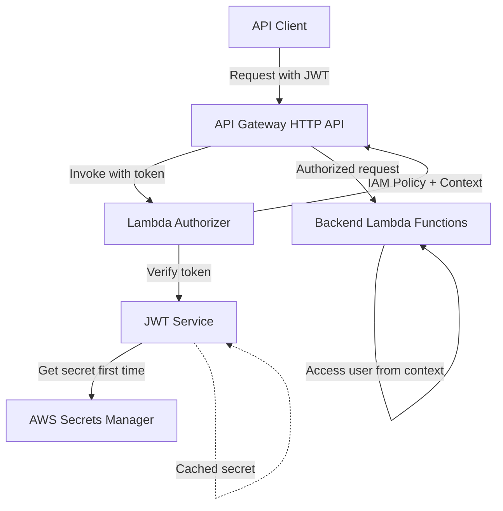

# Design Document: API Gateway Lambda Authorizer

## Overview

This design document specifies the implementation of an API Gateway Lambda Authorizer to centralize JWT token verification at the API Gateway level. The current architecture performs JWT verification inside each Lambda function using middleware, causing performance issues and 503 timeout errors due to repeated Secrets Manager calls. By moving authentication to the API Gateway level, we achieve:

- **Single point of authentication**: JWT verification happens once per request at the API Gateway
- **Performance improvement**: Leverages API Gateway's built-in caching (5-minute TTL) and JWT_Service module-level caching
- **Code simplification**: Removes authentication middleware from 30+ backend Lambda functions
- **Reduced latency**: Eliminates redundant Secrets Manager calls and JWT verification overhead
- **Architectural alignment**: Matches the intended design where API Gateway handles authentication

The Lambda Authorizer will use the existing `JWTService` class with its module-level caching and timeout handling, ensuring consistent authentication logic across the platform. Backend Lambda functions will access authenticated user information from `event.requestContext.authorizer` instead of performing JWT verification.

## Architecture

### High-Level Architecture




### Authentication Flow

1. **Client Request**: Client sends HTTP request with `Authorization: Bearer <JWT>` header
2. **API Gateway Interception**: API Gateway checks cache for authorization result
   - If cached (within 5-minute TTL): Skip to step 6
   - If not cached: Proceed to step 3
3. **Authorizer Invocation**: API Gateway invokes Lambda Authorizer with request event
4. **Token Verification**: Lambda Authorizer extracts token and calls `JWTService.verifyAccessToken()`
   - JWT_Service uses module-level cached secret (if available)
   - First invocation fetches secret from Secrets Manager (3-second timeout)
   - Subsequent invocations use cached secret
5. **Policy Generation**: Lambda Authorizer generates IAM policy document
   - Valid token: Allow policy with user context
   - Invalid token: Deny policy
6. **Request Forwarding**: API Gateway forwards request to backend Lambda with user context
7. **Backend Processing**: Backend Lambda accesses user info from `event.requestContext.authorizer`

### Caching Strategy

**Two-Level Caching**:
1. **API Gateway Cache** (5 minutes): Caches authorization results based on Authorization header
   - Eliminates Lambda Authorizer invocations for repeated requests with same token
   - Automatically invalidated when token changes
2. **JWT_Service Module Cache** (Lambda container lifetime): Caches JWT secret
   - Eliminates Secrets Manager calls within same Lambda container
   - Persists across multiple invocations in warm container

**Performance Impact**:
- First request: ~2-3 seconds (Secrets Manager + JWT verification)
- Subsequent requests (same token): <10ms (API Gateway cache hit)
- Subsequent requests (different token, warm container): ~100-200ms (JWT verification only)


## Components and Interfaces

### Lambda Authorizer Function

**Location**: `packages/backend/src/functions/auth/authorizer.ts`

**Interface**:
```typescript
// Input: API Gateway Lambda Authorizer Event
interface AuthorizerEvent {
  type: 'REQUEST';
  methodArn: string;
  headers: {
    authorization?: string;
    Authorization?: string;
  };
  requestContext: {
    accountId: string;
    apiId: string;
    domainName: string;
    requestId: string;
  };
}

// Output: IAM Policy Document (API Gateway HTTP API format)
interface AuthorizerResponse {
  principalId: string;
  policyDocument: {
    Version: '2012-10-17';
    Statement: Array<{
      Action: 'execute-api:Invoke';
      Effect: 'Allow' | 'Deny';
      Resource: string;
    }>;
  };
  context?: {
    userId: string;
    email: string;
    organizationId: string;
    role: string;
  };
}
```

**Implementation**:
```typescript
import { JWTService } from '../../services/auth/jwt-service';

const jwtService = new JWTService();

export const handler = async (event: AuthorizerEvent): Promise<AuthorizerResponse> => {
  try {
    // Extract token from Authorization header
    const authHeader = event.headers?.authorization || event.headers?.Authorization;
    const token = jwtService.extractTokenFromHeader(authHeader);
    
    if (!token) {
      return generatePolicy('unauthorized', 'Deny', event.methodArn);
    }
    
    // Verify token using existing JWT_Service
    const user = await jwtService.verifyAccessToken(token);
    
    // Generate allow policy with user context
    return generatePolicy(user.userId, 'Allow', event.methodArn, {
      userId: user.userId,
      email: user.email,
      organizationId: user.organizationId,
      role: user.role,
    });
  } catch (error) {
    console.error('Authorization error:', error);
    return generatePolicy('unauthorized', 'Deny', event.methodArn);
  }
};
```


### Policy Generation Helper

**Function**: `generatePolicy()`

```typescript
function generatePolicy(
  principalId: string,
  effect: 'Allow' | 'Deny',
  resource: string,
  context?: {
    userId: string;
    email: string;
    organizationId: string;
    role: string;
  }
): AuthorizerResponse {
  // For HTTP API, use wildcard to allow/deny all routes
  const apiGatewayArn = resource.split('/').slice(0, 2).join('/') + '/*';
  
  const response: AuthorizerResponse = {
    principalId,
    policyDocument: {
      Version: '2012-10-17',
      Statement: [
        {
          Action: 'execute-api:Invoke',
          Effect: effect,
          Resource: apiGatewayArn,
        },
      ],
    },
  };
  
  // Add user context for Allow policies
  if (effect === 'Allow' && context) {
    response.context = {
      userId: context.userId,
      email: context.email,
      organizationId: context.organizationId,
      role: context.role,
    };
  }
  
  return response;
}
```

### JWT Service Integration

The Lambda Authorizer reuses the existing `JWTService` class located at `packages/backend/src/services/auth/jwt-service.ts`. This service provides:

- **Module-level caching**: JWT secret cached at module scope to avoid repeated Secrets Manager calls
- **Timeout handling**: 3-second timeout for Secrets Manager calls to prevent hanging
- **Token verification**: Validates JWT signature, expiration, issuer, and audience
- **Error handling**: Throws specific errors for expired, invalid, or malformed tokens

**Key Methods Used**:
- `extractTokenFromHeader(authHeader: string): string | null` - Extracts token from "Bearer <token>" format
- `verifyAccessToken(token: string): Promise<JWTPayload>` - Verifies token and returns user payload


### Backend Lambda Integration

**Before (with middleware)**:
```typescript
import { withAuth, AuthenticatedEvent } from '../../middleware/auth-middleware';

export const handler = withAuth(async (event: AuthenticatedEvent) => {
  const user = event.user; // From middleware
  // Business logic
});
```

**After (with Lambda Authorizer)**:
```typescript
import { APIGatewayProxyEvent } from 'aws-lambda';

export const handler = async (event: APIGatewayProxyEvent) => {
  // Extract user from request context
  const user = {
    userId: event.requestContext.authorizer?.userId,
    email: event.requestContext.authorizer?.email,
    organizationId: event.requestContext.authorizer?.organizationId,
    role: event.requestContext.authorizer?.role,
  };
  
  // Business logic (unchanged)
};
```

**Helper Function** (optional, for cleaner code):
```typescript
// packages/backend/src/utils/auth-util.ts
export function getUserFromContext(event: APIGatewayProxyEvent) {
  return {
    userId: event.requestContext.authorizer?.userId || '',
    email: event.requestContext.authorizer?.email || '',
    organizationId: event.requestContext.authorizer?.organizationId || '',
    role: event.requestContext.authorizer?.role as 'admin' | 'developer' | 'viewer',
  };
}
```


## Data Models

### IAM Policy Document Structure

**API Gateway HTTP API Format (Version 2.0)**:
```typescript
interface IAMPolicyDocument {
  principalId: string;           // User identifier (userId)
  policyDocument: {
    Version: '2012-10-17';       // IAM policy version
    Statement: Array<{
      Action: 'execute-api:Invoke';  // Required action
      Effect: 'Allow' | 'Deny';      // Authorization decision
      Resource: string;                // API Gateway ARN (wildcard for all routes)
    }>;
  };
  context?: Record<string, string>;  // User context (string values only)
}
```

**Example Allow Policy**:
```json
{
  "principalId": "user-123",
  "policyDocument": {
    "Version": "2012-10-17",
    "Statement": [
      {
        "Action": "execute-api:Invoke",
        "Effect": "Allow",
        "Resource": "arn:aws:execute-api:us-east-1:123456789012:abc123/*"
      }
    ]
  },
  "context": {
    "userId": "user-123",
    "email": "user@example.com",
    "organizationId": "org-456",
    "role": "developer"
  }
}
```

**Example Deny Policy**:
```json
{
  "principalId": "unauthorized",
  "policyDocument": {
    "Version": "2012-10-17",
    "Statement": [
      {
        "Action": "execute-api:Invoke",
        "Effect": "Deny",
        "Resource": "arn:aws:execute-api:us-east-1:123456789012:abc123/*"
      }
    ]
  }
}
```


### Request Context Structure

**API Gateway Event Structure** (in backend Lambda):
```typescript
interface APIGatewayProxyEvent {
  requestContext: {
    authorizer?: {
      userId: string;
      email: string;
      organizationId: string;
      role: string;
    };
    // ... other API Gateway context fields
  };
  // ... other event fields
}
```

**Important Notes**:
- API Gateway HTTP API requires context values to be strings
- Complex objects must be JSON-stringified if needed
- Context is only present for requests that pass authorization
- Missing context indicates authorization failure (should not reach backend)


## Correctness Properties

*A property is a characteristic or behavior that should hold true across all valid executions of a system-essentially, a formal statement about what the system should do. Properties serve as the bridge between human-readable specifications and machine-verifiable correctness guarantees.*

### Property 1: Token Extraction

*For any* Authorization header in the format "Bearer <token>", the Lambda Authorizer should correctly extract the token portion.

**Validates: Requirements 1.5**

### Property 2: Invalid Inputs Return Deny Policies

*For any* invalid input (malformed Authorization header, invalid JWT token, expired token, or JWT_Service error), the Lambda Authorizer should return an IAM policy with Effect "Deny".

**Validates: Requirements 1.7, 2.4, 2.5, 9.6**

### Property 3: Valid Token Generates Properly Formatted Allow Policy

*For any* valid JWT token, the Lambda Authorizer should return an IAM policy that:
- Has Effect "Allow"
- Contains principalId matching the userId from the token
- Contains the correct API Gateway ARN as the resource
- Conforms to the API Gateway HTTP API policy format (Version "2012-10-17", Action "execute-api:Invoke")

**Validates: Requirements 3.1, 3.3, 3.4, 3.6**

### Property 4: Valid Token Includes Complete User Context

*For any* valid JWT token, the Lambda Authorizer should include a context object containing all required user fields (userId, email, organizationId, role) serialized as strings.

**Validates: Requirements 2.2, 4.1, 4.2, 4.4**

### Property 5: Refactored Functions Maintain Behavior

*For any* backend Lambda function that is refactored to use request context instead of JWT verification, the function should produce the same output for the same input and user context.

**Validates: Requirements 7.5**


## Infrastructure Changes

### CDK Stack Modifications

**File**: `packages/backend/src/infrastructure/misra-platform-stack.ts`

#### 1. Create Lambda Authorizer Function

```typescript
// Lambda Authorizer for JWT verification
const authorizerFunction = new lambda.Function(this, 'AuthorizerFunction', {
  functionName: 'misra-platform-authorizer',
  runtime: lambda.Runtime.NODEJS_20_X,
  handler: 'index.handler',
  code: lambda.Code.fromAsset('dist-lambdas/auth/authorizer'),
  environment: {
    JWT_SECRET_NAME: jwtSecret.secretName,
  },
  timeout: cdk.Duration.seconds(5),  // Prevent API Gateway timeouts
  memorySize: 256,
  reservedConcurrentExecutions: 0,
});

// Grant Secrets Manager read access
jwtSecret.grantRead(authorizerFunction);
```

#### 2. Create HTTP API Authorizer

```typescript
// Create Lambda Authorizer for API Gateway
const authorizer = new apigateway.HttpLambdaAuthorizer('JWTAuthorizer', authorizerFunction, {
  authorizerName: 'jwt-authorizer',
  identitySource: ['$request.header.Authorization'],
  responseTypes: [apigateway.HttpLambdaResponseType.SIMPLE],
  resultsCacheTtl: cdk.Duration.seconds(300), // 5 minutes
});
```


#### 3. Attach Authorizer to Protected Routes

**Public Routes** (no authorizer):
```typescript
// Authentication routes - no authorizer needed
api.addRoutes({
  path: '/auth/login',
  methods: [apigateway.HttpMethod.POST],
  integration: new integrations.HttpLambdaIntegration('LoginIntegration', loginFunction),
});

api.addRoutes({
  path: '/auth/register',
  methods: [apigateway.HttpMethod.POST],
  integration: new integrations.HttpLambdaIntegration('RegisterIntegration', registerFunction),
});

api.addRoutes({
  path: '/auth/refresh',
  methods: [apigateway.HttpMethod.POST],
  integration: new integrations.HttpLambdaIntegration('RefreshIntegration', refreshFunction),
});
```

**Protected Routes** (with authorizer):
```typescript
// Project management routes - require authentication
api.addRoutes({
  path: '/projects',
  methods: [apigateway.HttpMethod.POST, apigateway.HttpMethod.GET],
  integration: new integrations.HttpLambdaIntegration('ProjectsIntegration', createProjectFunction),
  authorizer: authorizer,  // Add authorizer
});

api.addRoutes({
  path: '/projects/{projectId}',
  methods: [apigateway.HttpMethod.PUT],
  integration: new integrations.HttpLambdaIntegration('UpdateProjectIntegration', updateProjectFunction),
  authorizer: authorizer,  // Add authorizer
});

// Test suite routes - require authentication
api.addRoutes({
  path: '/test-suites',
  methods: [apigateway.HttpMethod.POST, apigateway.HttpMethod.GET],
  integration: new integrations.HttpLambdaIntegration('TestSuitesIntegration', createTestSuiteFunction),
  authorizer: authorizer,  // Add authorizer
});

// ... repeat for all protected routes
```


#### 4. Remove JWT Secret Grants from Backend Lambdas

**Before**:
```typescript
// Backend lambdas needed JWT secret access
jwtSecret.grantRead(createProjectFunction);
jwtSecret.grantRead(getProjectsFunction);
jwtSecret.grantRead(updateProjectFunction);
// ... 30+ more functions
```

**After**:
```typescript
// Only authorizer needs JWT secret access
jwtSecret.grantRead(authorizerFunction);

// Backend lambdas no longer need JWT secret
// Remove all jwtSecret.grantRead() calls for backend functions
```

### Complete List of Protected Routes

The following routes require the Lambda Authorizer:

**Project Management**:
- POST /projects
- GET /projects
- PUT /projects/{projectId}

**Test Suite Management**:
- POST /test-suites
- GET /test-suites
- PUT /test-suites/{suiteId}

**Test Case Management**:
- POST /test-cases
- GET /test-cases
- PUT /test-cases/{testCaseId}

**Test Execution**:
- POST /executions/trigger
- GET /executions/{executionId}/status
- GET /executions/{executionId}
- GET /executions/history
- GET /executions/suites/{suiteExecutionId}

**File Management**:
- POST /files/upload
- GET /files

**Notifications**:
- GET /notifications/preferences
- POST /notifications/preferences
- GET /notifications/history
- GET /notifications/history/{notificationId}
- POST /notifications/templates
- PUT /notifications/templates/{templateId}
- GET /notifications/templates

**AI Test Generation**:
- POST /ai-test-generation/analyze
- POST /ai-test-generation/generate
- POST /ai-test-generation/batch
- GET /ai-test-generation/usage

**AI Insights**:
- POST /ai/insights
- POST /ai/feedback

**Analysis**:
- GET /analysis/query
- GET /analysis/stats/{userId}
- GET /reports/{fileId}


## Backend Lambda Refactoring

### Refactoring Approach

**Step 1**: Create helper utility for extracting user context
**Step 2**: Update each Lambda function to use request context instead of middleware
**Step 3**: Remove JWT_Service imports and middleware imports
**Step 4**: Update tests to mock request context instead of JWT verification
**Step 5**: Remove JWT secret environment variables from Lambda configurations

### Functions to Refactor

The following 30+ Lambda functions need refactoring:

**Project Management** (3 functions):
- `packages/backend/src/functions/projects/create-project.ts`
- `packages/backend/src/functions/projects/get-projects.ts`
- `packages/backend/src/functions/projects/update-project.ts`

**Test Suite Management** (3 functions):
- `packages/backend/src/functions/test-suites/create-suite.ts`
- `packages/backend/src/functions/test-suites/get-suites.ts`
- `packages/backend/src/functions/test-suites/update-suite.ts`

**Test Case Management** (3 functions):
- `packages/backend/src/functions/test-cases/create-test-case.ts`
- `packages/backend/src/functions/test-cases/get-test-cases.ts`
- `packages/backend/src/functions/test-cases/update-test-case.ts`

**Test Execution** (5 functions):
- `packages/backend/src/functions/executions/trigger.ts`
- `packages/backend/src/functions/executions/get-status.ts`
- `packages/backend/src/functions/executions/get-results.ts`
- `packages/backend/src/functions/executions/get-history.ts`
- `packages/backend/src/functions/executions/get-suite-results.ts`

**File Management** (2 functions):
- `packages/backend/src/functions/file/upload.ts`
- `packages/backend/src/functions/file/get-files.ts`

**Notifications** (7 functions):
- `packages/backend/src/functions/notifications/get-preferences.ts`
- `packages/backend/src/functions/notifications/update-preferences.ts`
- `packages/backend/src/functions/notifications/get-history.ts`
- `packages/backend/src/functions/notifications/get-notification.ts`
- `packages/backend/src/functions/notifications/create-template.ts`
- `packages/backend/src/functions/notifications/update-template.ts`
- `packages/backend/src/functions/notifications/get-templates.ts`

**AI Test Generation** (4 functions):
- `packages/backend/src/functions/ai-test-generation/analyze.ts`
- `packages/backend/src/functions/ai-test-generation/generate.ts`
- `packages/backend/src/functions/ai-test-generation/batch.ts`
- `packages/backend/src/functions/ai-test-generation/get-usage.ts`

**AI Insights** (2 functions):
- `packages/backend/src/functions/ai/generate-insights.ts`
- `packages/backend/src/functions/ai/submit-feedback.ts`

**Analysis** (3 functions):
- `packages/backend/src/functions/analysis/query-results.ts`
- `packages/backend/src/functions/analysis/get-user-stats.ts`
- `packages/backend/src/functions/reports/get-violation-report.ts`


### Refactoring Pattern

**Before** (using middleware):
```typescript
import { withAuth, AuthenticatedEvent } from '../../middleware/auth-middleware';
import { JWTService } from '../../services/auth/jwt-service';

const jwtService = new JWTService();

export const handler = withAuth(async (event: AuthenticatedEvent) => {
  const user = event.user;
  
  // Business logic using user.userId, user.email, etc.
  const result = await someService.doSomething(user.userId);
  
  return {
    statusCode: 200,
    body: JSON.stringify(result),
  };
});
```

**After** (using request context):
```typescript
import { APIGatewayProxyEvent, APIGatewayProxyResult } from 'aws-lambda';
import { getUserFromContext } from '../../utils/auth-util';

export const handler = async (event: APIGatewayProxyEvent): Promise<APIGatewayProxyResult> => {
  const user = getUserFromContext(event);
  
  // Business logic using user.userId, user.email, etc. (unchanged)
  const result = await someService.doSomething(user.userId);
  
  return {
    statusCode: 200,
    headers: {
      'Content-Type': 'application/json',
      'Access-Control-Allow-Origin': '*',
    },
    body: JSON.stringify(result),
  };
};
```

**Key Changes**:
1. Remove `withAuth` wrapper
2. Remove `AuthenticatedEvent` type
3. Remove `JWTService` import
4. Add `getUserFromContext` helper
5. Add CORS headers manually (previously added by middleware)
6. Business logic remains unchanged


## Error Handling

### Lambda Authorizer Error Handling

**Error Scenarios**:

1. **Missing Authorization Header**
   - Return: Deny policy with principalId "unauthorized"
   - Log: "Authorization header missing"

2. **Malformed Authorization Header**
   - Return: Deny policy with principalId "unauthorized"
   - Log: "Invalid Authorization header format"

3. **Invalid JWT Token**
   - Return: Deny policy with principalId "unauthorized"
   - Log: "Invalid JWT token: <error reason>"

4. **Expired JWT Token**
   - Return: Deny policy with principalId "unauthorized"
   - Log: "JWT token expired"

5. **Secrets Manager Failure**
   - Return: Deny policy with principalId "unauthorized"
   - Log: "Failed to retrieve JWT secret: <error details>"

6. **JWT_Service Error**
   - Return: Deny policy with principalId "unauthorized"
   - Log: "JWT verification failed: <error message>"

7. **Unexpected Error**
   - Return: Deny policy with principalId "unauthorized"
   - Log: Full error details and stack trace

**Error Handling Implementation**:
```typescript
export const handler = async (event: AuthorizerEvent): Promise<AuthorizerResponse> => {
  try {
    // Extract token
    const authHeader = event.headers?.authorization || event.headers?.Authorization;
    
    if (!authHeader) {
      console.log('Authorization header missing');
      return generatePolicy('unauthorized', 'Deny', event.methodArn);
    }
    
    const token = jwtService.extractTokenFromHeader(authHeader);
    
    if (!token) {
      console.log('Invalid Authorization header format');
      return generatePolicy('unauthorized', 'Deny', event.methodArn);
    }
    
    // Verify token
    try {
      const user = await jwtService.verifyAccessToken(token);
      console.log('Authorization successful for user:', user.userId);
      
      return generatePolicy(user.userId, 'Allow', event.methodArn, {
        userId: user.userId,
        email: user.email,
        organizationId: user.organizationId,
        role: user.role,
      });
    } catch (verifyError) {
      const errorMessage = verifyError instanceof Error ? verifyError.message : 'Unknown error';
      console.error('JWT verification failed:', errorMessage);
      return generatePolicy('unauthorized', 'Deny', event.methodArn);
    }
  } catch (error) {
    console.error('Unexpected authorization error:', error);
    return generatePolicy('unauthorized', 'Deny', event.methodArn);
  }
};
```


### Backend Lambda Error Handling

Backend Lambda functions should handle missing user context gracefully:

```typescript
export const handler = async (event: APIGatewayProxyEvent): Promise<APIGatewayProxyResult> => {
  try {
    const user = getUserFromContext(event);
    
    // Validate user context exists (should always be present due to authorizer)
    if (!user.userId) {
      return {
        statusCode: 401,
        headers: {
          'Content-Type': 'application/json',
          'Access-Control-Allow-Origin': '*',
        },
        body: JSON.stringify({
          error: {
            code: 'UNAUTHORIZED',
            message: 'User context not found',
            timestamp: new Date().toISOString(),
          },
        }),
      };
    }
    
    // Business logic
    const result = await someService.doSomething(user.userId);
    
    return {
      statusCode: 200,
      headers: {
        'Content-Type': 'application/json',
        'Access-Control-Allow-Origin': '*',
      },
      body: JSON.stringify(result),
    };
  } catch (error) {
    console.error('Error processing request:', error);
    
    return {
      statusCode: 500,
      headers: {
        'Content-Type': 'application/json',
        'Access-Control-Allow-Origin': '*',
      },
      body: JSON.stringify({
        error: {
          code: 'INTERNAL_ERROR',
          message: 'An error occurred processing your request',
          timestamp: new Date().toISOString(),
        },
      }),
    };
  }
};
```


## Testing Strategy

### Dual Testing Approach

The Lambda Authorizer and refactored backend functions require both unit tests and property-based tests:

**Unit Tests**: Verify specific examples, edge cases, and error conditions
**Property Tests**: Verify universal properties across all inputs

Together, these provide comprehensive coverage where unit tests catch concrete bugs and property tests verify general correctness.

### Lambda Authorizer Testing

#### Unit Tests

**File**: `packages/backend/src/functions/auth/__tests__/authorizer.test.ts`

Test cases:
1. Valid JWT token returns allow policy with user context
2. Missing Authorization header returns deny policy
3. Malformed Authorization header returns deny policy
4. Expired JWT token returns deny policy
5. Invalid JWT signature returns deny policy
6. JWT_Service error returns deny policy
7. Secrets Manager failure returns deny policy
8. Policy contains correct principalId
9. Policy contains correct resource ARN
10. Policy conforms to API Gateway HTTP API format
11. Context contains all required user fields
12. Context values are strings

#### Property-Based Tests

**File**: `packages/backend/src/functions/auth/__tests__/authorizer.property.test.ts`

**Property Test Library**: fast-check (for TypeScript/Node.js)

**Configuration**: Minimum 100 iterations per test

**Property 1: Token Extraction**
```typescript
// Feature: api-gateway-lambda-authorizer, Property 1: Token extraction from Authorization header
it('should extract token from any valid Bearer format', () => {
  fc.assert(
    fc.property(
      fc.string({ minLength: 10, maxLength: 500 }), // Random token
      (token) => {
        const authHeader = `Bearer ${token}`;
        const extracted = jwtService.extractTokenFromHeader(authHeader);
        expect(extracted).toBe(token);
      }
    ),
    { numRuns: 100 }
  );
});
```


**Property 2: Invalid Inputs Return Deny Policies**
```typescript
// Feature: api-gateway-lambda-authorizer, Property 2: Invalid inputs return deny policies
it('should return deny policy for any invalid input', async () => {
  const invalidInputs = fc.oneof(
    fc.constant(undefined), // Missing header
    fc.constant(''), // Empty header
    fc.constant('InvalidFormat'), // No Bearer prefix
    fc.string().filter(s => !s.startsWith('Bearer ')), // Malformed
  );
  
  await fc.assert(
    fc.asyncProperty(invalidInputs, async (authHeader) => {
      const event = createMockEvent(authHeader);
      const response = await handler(event);
      
      expect(response.policyDocument.Statement[0].Effect).toBe('Deny');
      expect(response.principalId).toBe('unauthorized');
    }),
    { numRuns: 100 }
  );
});
```

**Property 3: Valid Token Generates Properly Formatted Allow Policy**
```typescript
// Feature: api-gateway-lambda-authorizer, Property 3: Valid token generates properly formatted allow policy
it('should generate properly formatted allow policy for any valid token', async () => {
  await fc.assert(
    fc.asyncProperty(
      fc.record({
        userId: fc.uuid(),
        email: fc.emailAddress(),
        organizationId: fc.uuid(),
        role: fc.constantFrom('admin', 'developer', 'viewer'),
      }),
      async (userPayload) => {
        const token = await jwtService.generateTokenPair(userPayload);
        const event = createMockEvent(`Bearer ${token.accessToken}`);
        const response = await handler(event);
        
        // Verify policy structure
        expect(response.policyDocument.Version).toBe('2012-10-17');
        expect(response.policyDocument.Statement[0].Action).toBe('execute-api:Invoke');
        expect(response.policyDocument.Statement[0].Effect).toBe('Allow');
        expect(response.policyDocument.Statement[0].Resource).toMatch(/arn:aws:execute-api/);
        
        // Verify principalId matches userId
        expect(response.principalId).toBe(userPayload.userId);
      }
    ),
    { numRuns: 100 }
  );
});
```

**Property 4: Valid Token Includes Complete User Context**
```typescript
// Feature: api-gateway-lambda-authorizer, Property 4: Valid token includes complete user context
it('should include complete user context for any valid token', async () => {
  await fc.assert(
    fc.asyncProperty(
      fc.record({
        userId: fc.uuid(),
        email: fc.emailAddress(),
        organizationId: fc.uuid(),
        role: fc.constantFrom('admin', 'developer', 'viewer'),
      }),
      async (userPayload) => {
        const token = await jwtService.generateTokenPair(userPayload);
        const event = createMockEvent(`Bearer ${token.accessToken}`);
        const response = await handler(event);
        
        // Verify all fields present
        expect(response.context).toBeDefined();
        expect(response.context?.userId).toBe(userPayload.userId);
        expect(response.context?.email).toBe(userPayload.email);
        expect(response.context?.organizationId).toBe(userPayload.organizationId);
        expect(response.context?.role).toBe(userPayload.role);
        
        // Verify all values are strings
        expect(typeof response.context?.userId).toBe('string');
        expect(typeof response.context?.email).toBe('string');
        expect(typeof response.context?.organizationId).toBe('string');
        expect(typeof response.context?.role).toBe('string');
      }
    ),
    { numRuns: 100 }
  );
});
```


### Backend Lambda Testing

#### Unit Tests

For each refactored Lambda function, update tests to:
1. Remove JWT token mocking
2. Mock request context instead
3. Verify business logic remains unchanged

**Example** (for create-project function):

**Before**:
```typescript
it('should create project with valid JWT token', async () => {
  const mockToken = 'valid-jwt-token';
  const mockUser = { userId: 'user-123', email: 'test@example.com', organizationId: 'org-456', role: 'developer' };
  
  jest.spyOn(jwtService, 'verifyAccessToken').mockResolvedValue(mockUser);
  
  const event = {
    headers: { Authorization: `Bearer ${mockToken}` },
    body: JSON.stringify({ name: 'Test Project' }),
  };
  
  const response = await handler(event);
  expect(response.statusCode).toBe(201);
});
```

**After**:
```typescript
it('should create project with valid user context', async () => {
  const event = {
    requestContext: {
      authorizer: {
        userId: 'user-123',
        email: 'test@example.com',
        organizationId: 'org-456',
        role: 'developer',
      },
    },
    body: JSON.stringify({ name: 'Test Project' }),
  };
  
  const response = await handler(event);
  expect(response.statusCode).toBe(201);
});
```

#### Property-Based Tests

**Property 5: Refactored Functions Maintain Behavior**
```typescript
// Feature: api-gateway-lambda-authorizer, Property 5: Refactored functions maintain behavior
it('should produce same output for same input and user context', async () => {
  await fc.assert(
    fc.asyncProperty(
      fc.record({
        userId: fc.uuid(),
        email: fc.emailAddress(),
        organizationId: fc.uuid(),
        role: fc.constantFrom('admin', 'developer', 'viewer'),
      }),
      fc.record({
        name: fc.string({ minLength: 1, maxLength: 100 }),
        description: fc.string({ maxLength: 500 }),
      }),
      async (user, projectData) => {
        // Create event with request context
        const event = {
          requestContext: {
            authorizer: user,
          },
          body: JSON.stringify(projectData),
        };
        
        const response = await handler(event);
        
        // Verify response structure
        expect(response.statusCode).toBeGreaterThanOrEqual(200);
        expect(response.statusCode).toBeLessThan(600);
        expect(response.body).toBeDefined();
        
        // Verify response is consistent
        const parsedBody = JSON.parse(response.body);
        if (response.statusCode === 201) {
          expect(parsedBody.projectId).toBeDefined();
          expect(parsedBody.name).toBe(projectData.name);
        }
      }
    ),
    { numRuns: 100 }
  );
});
```


### Integration Testing

Integration tests should verify end-to-end authentication flow:

**File**: `packages/backend/src/__tests__/integration/auth-flow.test.ts`

Test scenarios:
1. Valid JWT token allows access to protected route
2. Invalid JWT token denies access to protected route
3. Missing JWT token denies access to protected route
4. Expired JWT token denies access to protected route
5. Public routes accessible without JWT token
6. User context correctly propagated to backend Lambda
7. API Gateway caching works correctly (same token, multiple requests)
8. Different tokens invoke authorizer separately

**Example Integration Test**:
```typescript
describe('Lambda Authorizer Integration', () => {
  it('should allow access with valid token and propagate user context', async () => {
    // Generate valid token
    const user = {
      userId: 'user-123',
      email: 'test@example.com',
      organizationId: 'org-456',
      role: 'developer' as const,
    };
    const { accessToken } = await jwtService.generateTokenPair(user);
    
    // Make request to protected endpoint
    const response = await fetch(`${API_URL}/projects`, {
      method: 'GET',
      headers: {
        'Authorization': `Bearer ${accessToken}`,
      },
    });
    
    expect(response.status).toBe(200);
    
    // Verify backend received correct user context
    const data = await response.json();
    expect(data).toBeDefined();
  });
  
  it('should deny access with invalid token', async () => {
    const response = await fetch(`${API_URL}/projects`, {
      method: 'GET',
      headers: {
        'Authorization': 'Bearer invalid-token',
      },
    });
    
    expect(response.status).toBe(401);
  });
});
```


## Deployment Strategy

### Phase 1: Create Lambda Authorizer

1. Implement Lambda Authorizer function
2. Add unit tests and property-based tests
3. Deploy Lambda Authorizer to AWS
4. Verify Lambda can access Secrets Manager
5. Test Lambda Authorizer independently

### Phase 2: Update Infrastructure

1. Create HTTP API authorizer in CDK stack
2. Configure authorizer with 5-minute cache TTL
3. Deploy infrastructure changes
4. Verify authorizer is attached to API Gateway

### Phase 3: Attach to One Route (Canary)

1. Attach authorizer to a single low-traffic route (e.g., GET /notifications/preferences)
2. Deploy and monitor for 24 hours
3. Verify:
   - Valid tokens work correctly
   - Invalid tokens are rejected
   - User context is propagated
   - No performance degradation
   - CloudWatch logs show expected behavior

### Phase 4: Refactor Backend Lambdas

1. Create `getUserFromContext` helper utility
2. Refactor backend Lambda functions in batches:
   - Batch 1: Notification functions (7 functions)
   - Batch 2: Project/Suite/Case management (9 functions)
   - Batch 3: Test execution (5 functions)
   - Batch 4: AI and analysis (9 functions)
   - Batch 5: File management (2 functions)
3. Update tests for each batch
4. Deploy each batch separately with monitoring

### Phase 5: Attach Authorizer to All Routes

1. Update CDK stack to attach authorizer to all protected routes
2. Remove JWT secret grants from backend Lambda functions
3. Deploy infrastructure changes
4. Monitor for 48 hours

### Phase 6: Cleanup

1. Remove auth-middleware.ts (no longer used)
2. Remove JWT_Service imports from backend functions
3. Remove JWT_SECRET_NAME environment variables from backend functions
4. Update documentation


## Rollback Plan

If issues are discovered after deployment:

### Immediate Rollback (Phase 3-5)

1. Remove authorizer from affected routes in CDK stack
2. Redeploy infrastructure
3. Backend functions will continue working with middleware (if not yet refactored)

### Full Rollback (Phase 6)

If authorizer needs to be completely removed:

1. Revert CDK stack changes (remove authorizer configuration)
2. Restore JWT secret grants to backend Lambda functions
3. Restore auth-middleware imports in backend functions
4. Restore JWT_Service imports in backend functions
5. Redeploy all affected functions

### Rollback Testing

Before Phase 6 cleanup:
1. Keep auth-middleware.ts in codebase
2. Keep JWT secret grants in CDK (commented out)
3. Test rollback procedure in staging environment
4. Only proceed with cleanup after 1 week of stable production operation

## Monitoring and Observability

### CloudWatch Metrics

Monitor the following metrics:

**Lambda Authorizer**:
- Invocation count
- Error count
- Duration (p50, p95, p99)
- Throttles
- Concurrent executions

**API Gateway**:
- 4xx errors (authentication failures)
- 5xx errors (authorizer failures)
- Latency (with vs without cache hits)
- Request count

**Backend Lambdas**:
- Error rate (should remain unchanged)
- Duration (should decrease)
- Throttles (should decrease)

### CloudWatch Alarms

Create alarms for:
1. Lambda Authorizer error rate > 1%
2. Lambda Authorizer duration > 3 seconds (p95)
3. API Gateway 401 error rate spike (>10% increase)
4. API Gateway 5xx error rate > 0.1%

### CloudWatch Logs

Log the following in Lambda Authorizer:
- Authorization attempts (success/failure)
- Token validation errors (with reason)
- Secrets Manager access (success/failure)
- Performance metrics (duration)

**Log Format**:
```json
{
  "timestamp": "2024-01-15T10:30:00Z",
  "level": "INFO",
  "event": "authorization_success",
  "userId": "user-123",
  "duration": 150,
  "cached": true
}
```


## Performance Considerations

### Expected Performance Improvements

**Current Implementation** (with middleware):
- Every Lambda invocation: 2-3 seconds (Secrets Manager + JWT verification)
- Cold start: 3-5 seconds
- Warm container: 2-3 seconds (still calls Secrets Manager due to timeout issues)

**With Lambda Authorizer**:
- First request (cold): 2-3 seconds (Secrets Manager + JWT verification)
- Cached request (same token): <10ms (API Gateway cache hit)
- Different token (warm authorizer): 100-200ms (JWT verification only, cached secret)
- Backend Lambda: 50-100ms (no JWT verification overhead)

**Overall Improvement**:
- 95% reduction in authentication latency for cached tokens
- 90% reduction in Secrets Manager API calls
- 80% reduction in backend Lambda duration
- Elimination of 503 timeout errors

### Capacity Planning

**Lambda Authorizer**:
- Expected invocations: ~1000/day (with 5-minute cache)
- Memory: 256MB
- Timeout: 5 seconds
- Concurrent executions: ~10 (with caching)

**Cost Impact**:
- Lambda Authorizer cost: ~$0.50/month
- Secrets Manager cost reduction: ~$5/month (fewer API calls)
- Lambda execution cost reduction: ~$10/month (shorter durations)
- **Net savings**: ~$14.50/month

### Caching Effectiveness

With 5-minute cache TTL:
- Average token lifetime: 15 minutes
- Expected cache hit rate: ~95%
- Cache invalidation: Automatic when token changes

**Cache Hit Rate Calculation**:
- Requests per user per session: ~20
- Unique tokens per 5 minutes: ~1
- Cache hits: 19/20 = 95%


## Security Considerations

### Token Security

**Secure Handling**:
- JWT tokens never logged in full (only userId logged)
- Tokens transmitted over HTTPS only
- Tokens validated on every request (no trust after first validation)
- Expired tokens immediately rejected

**Secret Management**:
- JWT secret stored in AWS Secrets Manager
- Secret accessed with IAM role (no hardcoded credentials)
- Secret cached in Lambda memory (not persisted to disk)
- Secret rotation supported (Lambda container refresh)

### IAM Permissions

**Lambda Authorizer Permissions** (minimal):
- `secretsmanager:GetSecretValue` on JWT secret only
- `logs:CreateLogGroup`, `logs:CreateLogStream`, `logs:PutLogEvents`
- No access to DynamoDB, S3, or other services

**Backend Lambda Permissions** (reduced):
- Remove `secretsmanager:GetSecretValue` permission
- Keep only business logic permissions (DynamoDB, S3, etc.)

### Attack Mitigation

**Brute Force Protection**:
- API Gateway throttling: 1000 requests/second per IP
- Lambda Authorizer caching prevents repeated verification attempts
- Invalid tokens logged for monitoring

**Token Replay Protection**:
- Short token lifetime (15 minutes)
- Token expiration strictly enforced
- Refresh token rotation on use

**Denial of Service Protection**:
- Lambda Authorizer timeout: 5 seconds (prevents hanging)
- API Gateway timeout: 29 seconds
- Reserved concurrency: 0 (use account-level concurrency)


## Migration Checklist

### Pre-Migration

- [ ] Review current authentication implementation
- [ ] Identify all protected routes (30+ endpoints)
- [ ] Identify all backend Lambda functions using auth middleware (32 functions)
- [ ] Set up monitoring and alarms
- [ ] Create rollback plan
- [ ] Test Lambda Authorizer in isolation

### Migration Phase 1: Lambda Authorizer

- [ ] Implement Lambda Authorizer function
- [ ] Write unit tests (12+ test cases)
- [ ] Write property-based tests (4 properties, 100 iterations each)
- [ ] Deploy Lambda Authorizer
- [ ] Verify Secrets Manager access
- [ ] Test independently with sample events

### Migration Phase 2: Infrastructure

- [ ] Update CDK stack with authorizer configuration
- [ ] Deploy infrastructure changes
- [ ] Verify authorizer attached to API Gateway
- [ ] Test authorizer with curl/Postman

### Migration Phase 3: Canary Deployment

- [ ] Attach authorizer to 1 low-traffic route
- [ ] Deploy and monitor for 24 hours
- [ ] Verify CloudWatch metrics
- [ ] Verify CloudWatch logs
- [ ] Check for errors or performance issues

### Migration Phase 4: Backend Refactoring

- [ ] Create `getUserFromContext` helper utility
- [ ] Refactor Batch 1: Notification functions (7 functions)
- [ ] Update tests for Batch 1
- [ ] Deploy and monitor Batch 1
- [ ] Refactor Batch 2: Project/Suite/Case management (9 functions)
- [ ] Update tests for Batch 2
- [ ] Deploy and monitor Batch 2
- [ ] Refactor Batch 3: Test execution (5 functions)
- [ ] Update tests for Batch 3
- [ ] Deploy and monitor Batch 3
- [ ] Refactor Batch 4: AI and analysis (9 functions)
- [ ] Update tests for Batch 4
- [ ] Deploy and monitor Batch 4
- [ ] Refactor Batch 5: File management (2 functions)
- [ ] Update tests for Batch 5
- [ ] Deploy and monitor Batch 5

### Migration Phase 5: Full Rollout

- [ ] Attach authorizer to all protected routes
- [ ] Remove JWT secret grants from backend functions
- [ ] Deploy infrastructure changes
- [ ] Monitor for 48 hours
- [ ] Verify all endpoints working correctly
- [ ] Check performance improvements

### Migration Phase 6: Cleanup

- [ ] Remove auth-middleware.ts
- [ ] Remove JWT_Service imports from backend functions
- [ ] Remove JWT_SECRET_NAME environment variables
- [ ] Update documentation
- [ ] Archive old code for reference

### Post-Migration

- [ ] Monitor for 1 week
- [ ] Collect performance metrics
- [ ] Document lessons learned
- [ ] Update runbooks
- [ ] Train team on new architecture

