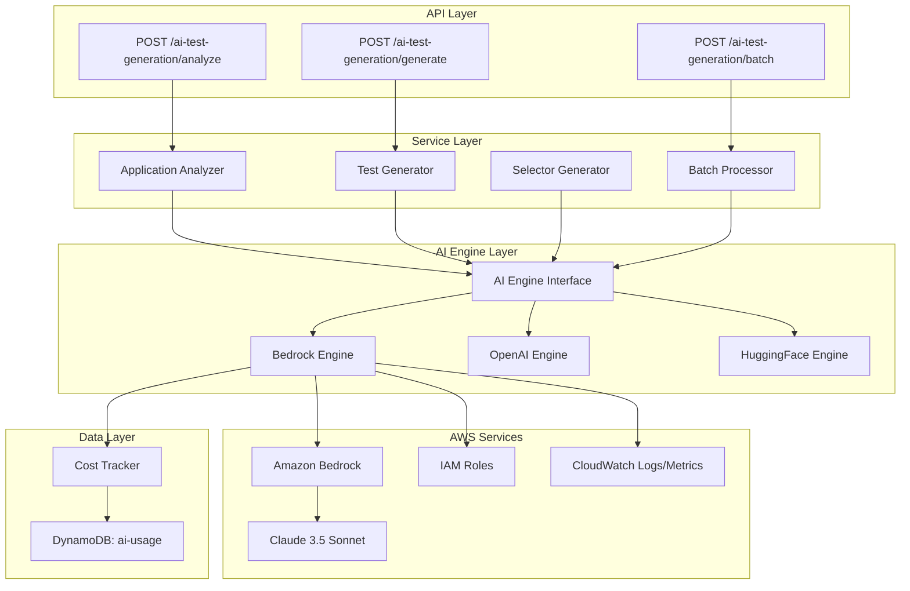

# Design Document: Amazon Bedrock Migration

## Overview

This design document specifies the implementation approach for migrating the AI test generation system from OpenAI GPT-4/3.5 to Amazon Bedrock with Claude 3.5 Sonnet. The migration maintains the existing AIEngine abstraction layer while adding a new BedrockEngine implementation that uses AWS SDK for JavaScript v3.

The design emphasizes:
- **Zero downtime migration**: Parallel operation of OpenAI and Bedrock with feature flags
- **Provider abstraction**: Clean separation between AI provider logic and business logic
- **AWS integration**: Native AWS SDK usage with IAM role-based authentication
- **Cost optimization**: Accurate token tracking and cost calculation
- **Reliability**: Robust error handling, retry logic, and circuit breaker pattern

## Architecture

### High-Level Architecture



### Component Breakdown

1. **AI Engine Interface**: Abstract interface defining AI operations (analyze, generate, complete)
2. **Bedrock Engine**: Implementation using AWS SDK for Bedrock Runtime
3. **Cost Tracker**: Tracks token usage and calculates costs
4. **Provider Factory**: Selects AI provider based on configuration
5. **Retry Handler**: Implements exponential backoff and circuit breaker
6. **IAM Integration**: Uses AWS SDK default credential provider

## Bedrock Engine Implementation

### Class Structure

```typescript
// packages/backend/src/services/ai-test-generation/bedrock-engine.ts

import {
  BedrockRuntimeClient,
  InvokeModelCommand,
  InvokeModelCommandInput,
  InvokeModelCommandOutput,
} from '@aws-sdk/client-bedrock-runtime';
import { AIEngine, AIRequest, AIResponse, AIModel } from '../../types/ai-test-generation';
import { CostTracker } from './cost-tracker';

export class BedrockEngine implements AIEngine {
  private client: BedrockRuntimeClient;
  private costTracker: CostTracker;
  private modelId: string;
  private region: string;
  
  constructor(config?: BedrockConfig) {
    this.region = config?.region || process.env.BEDROCK_REGION || 'us-east-1';
    this.modelId = config?.modelId || process.env.BEDROCK_MODEL_ID || 'anthropic.claude-3-5-sonnet-20241022-v2:0';
    
    this.client = new BedrockRuntimeClient({
      region: this.region,
      maxAttempts: 3,
      requestHandler: {
        requestTimeout: 30000,
      },
    });
    
    this.costTracker = new CostTracker();
  }
  
  async analyze(request: AIRequest): Promise<AIResponse> {
    const prompt = this.buildAnalysisPrompt(request);
    return this.invokeModel(prompt, {
      temperature: 0.3,
      max_tokens: 2048,
    });
  }
  
  async generate(request: AIRequest): Promise<AIResponse> {
    const prompt = this.buildGenerationPrompt(request);
    return this.invokeModel(prompt, {
      temperature: 0.7,
      max_tokens: 4096,
    });
  }
  
  async complete(request: AIRequest): Promise<AIResponse> {
    const prompt = this.buildCompletionPrompt(request);
    return this.invokeModel(prompt, {
      temperature: 0.5,
      max_tokens: 1024,
    });
  }
  
  private async invokeModel(
    prompt: string,
    options: ModelOptions
  ): Promise<AIResponse> {
    const startTime = Date.now();
    
    try {
      // Build Claude request format
      const requestBody = {
        anthropic_version: 'bedrock-2023-05-31',
        max_tokens: options.max_tokens,
        temperature: options.temperature,
        messages: [
          {
            role: 'user',
            content: prompt,
          },
        ],
      };
      
      // Invoke Bedrock
      const command = new InvokeModelCommand({
        modelId: this.modelId,
        contentType: 'application/json',
        accept: 'application/json',
        body: JSON.stringify(requestBody),
      });
      
      const response = await this.client.send(command);
      
      // Parse response
      const responseBody = JSON.parse(new TextDecoder().decode(response.body));
      
      // Extract content
      const content = responseBody.content[0].text;
      
      // Track usage
      const usage = {
        inputTokens: responseBody.usage.input_tokens,
        outputTokens: responseBody.usage.output_tokens,
        totalTokens: responseBody.usage.input_tokens + responseBody.usage.output_tokens,
      };
      
      // Calculate cost
      const cost = this.calculateCost(usage);
      
      // Track in DynamoDB
      await this.costTracker.trackUsage({
        provider: 'BEDROCK',
        model: this.modelId,
        usage,
        cost,
        latency: Date.now() - startTime,
      });
      
      return {
        content,
        usage,
        cost,
        model: this.modelId,
        provider: 'BEDROCK',
      };
    } catch (error) {
      console.error('Bedrock invocation error:', error);
      throw this.handleError(error);
    }
  }
  
  private calculateCost(usage: TokenUsage): number {
    // Claude 3.5 Sonnet pricing
    const INPUT_COST_PER_1M = 3.0;
    const OUTPUT_COST_PER_1M = 15.0;
    
    const inputCost = (usage.inputTokens / 1_000_000) * INPUT_COST_PER_1M;
    const outputCost = (usage.outputTokens / 1_000_000) * OUTPUT_COST_PER_1M;
    
    return inputCost + outputCost;
  }
  
  private handleError(error: any): Error {
    if (error.name === 'ThrottlingException') {
      return new Error('AI_RATE_LIMIT: Bedrock rate limit exceeded');
    }
    if (error.name === 'ValidationException') {
      return new Error('AI_VALIDATION_ERROR: Invalid request to Bedrock');
    }
    if (error.name === 'ModelTimeoutException') {
      return new Error('AI_TIMEOUT: Bedrock model timeout');
    }
    if (error.name === 'ServiceUnavailableException') {
      return new Error('AI_UNAVAILABLE: Bedrock service unavailable');
    }
    return new Error(`AI_ERROR: ${error.message}`);
  }
  
  private buildAnalysisPrompt(request: AIRequest): string {
    return `You are an expert QA engineer analyzing a web application for test automation.

Application URL: ${request.url}
Page HTML: ${request.html}

Analyze this application and provide:
1. Key features and user flows
2. Interactive elements (buttons, forms, links)
3. Authentication requirements
4. Recommended test coverage

Respond in JSON format with the following structure:
{
  "features": ["feature1", "feature2"],
  "userFlows": ["flow1", "flow2"],
  "interactiveElements": [{"type": "button", "selector": "...", "action": "..."}],
  "authRequired": boolean,
  "testRecommendations": ["recommendation1", "recommendation2"]
}`;
  }
  
  private buildGenerationPrompt(request: AIRequest): string {
    return `You are an expert Playwright test automation engineer.

Generate a Playwright test for the following scenario:
${request.scenario}

Application context:
${JSON.stringify(request.context, null, 2)}

Requirements:
- Use TypeScript syntax
- Include proper assertions
- Add error handling
- Use stable selectors (data-testid, aria-label)
- Follow Playwright best practices

Respond with only the test code, no explanations.`;
  }
  
  private buildCompletionPrompt(request: AIRequest): string {
    return `Complete the following Playwright test code:

${request.partialCode}

Context: ${request.context}

Provide only the completion, maintaining the same style and format.`;
  }
}
```

### Provider Factory

```typescript
// packages/backend/src/services/ai-test-generation/ai-engine-factory.ts

import { AIEngine } from '../../types/ai-test-generation';
import { BedrockEngine } from './bedrock-engine';
import { OpenAIEngine } from './openai-engine';
import { HuggingFaceEngine } from './huggingface-engine';

export type AIProvider = 'BEDROCK' | 'OPENAI' | 'HUGGINGFACE';

export class AIEngineFactory {
  static create(provider?: AIProvider): AIEngine {
    const selectedProvider = provider || (process.env.AI_PROVIDER as AIProvider) || 'BEDROCK';
    
    console.log(`Creating AI engine for provider: ${selectedProvider}`);
    
    switch (selectedProvider) {
      case 'BEDROCK':
        return new BedrockEngine();
      case 'OPENAI':
        return new OpenAIEngine();
      case 'HUGGINGFACE':
        return new HuggingFaceEngine();
      default:
        throw new Error(`Unknown AI provider: ${selectedProvider}`);
    }
  }
}
```

## IAM Configuration

### Lambda Execution Role Policy

```json
{
  "Version": "2012-10-17",
  "Statement": [
    {
      "Effect": "Allow",
      "Action": [
        "bedrock:InvokeModel"
      ],
      "Resource": [
        "arn:aws:bedrock:us-east-1::foundation-model/anthropic.claude-3-5-sonnet-20241022-v2:0"
      ]
    },
    {
      "Effect": "Allow",
      "Action": [
        "logs:CreateLogGroup",
        "logs:CreateLogStream",
        "logs:PutLogEvents"
      ],
      "Resource": "arn:aws:logs:*:*:*"
    },
    {
      "Effect": "Allow",
      "Action": [
        "dynamodb:PutItem",
        "dynamodb:Query"
      ],
      "Resource": "arn:aws:dynamodb:*:*:table/ai-usage"
    }
  ]
}
```

### CDK Infrastructure

```typescript
// packages/backend/src/infrastructure/misra-platform-stack.ts

// Add Bedrock permissions to AI Lambda functions
const bedrockPolicy = new iam.PolicyStatement({
  effect: iam.Effect.ALLOW,
  actions: ['bedrock:InvokeModel'],
  resources: [
    `arn:aws:bedrock:${this.region}::foundation-model/anthropic.claude-3-5-sonnet-20241022-v2:0`,
  ],
});

// Apply to AI functions
aiAnalyzeFunction.addToRolePolicy(bedrockPolicy);
aiGenerateFunction.addToRolePolicy(bedrockPolicy);
aiBatchFunction.addToRolePolicy(bedrockPolicy);
```

## Migration Strategy

### Phase 1: Parallel Operation (Week 1)

1. Deploy BedrockEngine alongside OpenAIEngine
2. Set AI_PROVIDER=OPENAI (keep existing behavior)
3. Add feature flag for Bedrock testing
4. Test Bedrock with internal users only

### Phase 2: Canary Deployment (Week 2)

1. Enable Bedrock for 10% of requests
2. Monitor error rates, latency, cost
3. Compare quality of generated tests
4. Collect user feedback

### Phase 3: Gradual Rollout (Week 3)

1. Increase Bedrock traffic to 50%
2. Continue monitoring metrics
3. Address any issues discovered
4. Prepare for full migration

### Phase 4: Full Migration (Week 4)

1. Set AI_PROVIDER=BEDROCK as default
2. Keep OpenAI as fallback
3. Monitor for 48 hours
4. Remove OpenAI dependency if stable

### Rollback Plan

If issues arise at any phase:

1. Set AI_PROVIDER=OPENAI immediately
2. Investigate root cause
3. Fix issues in Bedrock implementation
4. Resume migration when ready

## Error Handling

### Retry Logic

```typescript
async function invokeWithRetry<T>(
  operation: () => Promise<T>,
  maxRetries: number = 3
): Promise<T> {
  let lastError: Error;
  
  for (let attempt = 0; attempt < maxRetries; attempt++) {
    try {
      return await operation();
    } catch (error) {
      lastError = error;
      
      // Don't retry validation errors
      if (error.name === 'ValidationException') {
        throw error;
      }
      
      // Exponential backoff
      const delay = Math.pow(2, attempt) * 1000;
      await new Promise(resolve => setTimeout(resolve, delay));
    }
  }
  
  throw lastError;
}
```

### Circuit Breaker

```typescript
class CircuitBreaker {
  private failures: number = 0;
  private lastFailureTime: number = 0;
  private state: 'CLOSED' | 'OPEN' | 'HALF_OPEN' = 'CLOSED';
  
  async execute<T>(operation: () => Promise<T>): Promise<T> {
    if (this.state === 'OPEN') {
      if (Date.now() - this.lastFailureTime > 60000) {
        this.state = 'HALF_OPEN';
      } else {
        throw new Error('Circuit breaker is OPEN');
      }
    }
    
    try {
      const result = await operation();
      this.onSuccess();
      return result;
    } catch (error) {
      this.onFailure();
      throw error;
    }
  }
  
  private onSuccess() {
    this.failures = 0;
    this.state = 'CLOSED';
  }
  
  private onFailure() {
    this.failures++;
    this.lastFailureTime = Date.now();
    
    if (this.failures >= 5) {
      this.state = 'OPEN';
    }
  }
}
```

## Cost Tracking

### Token Usage Calculation

Claude 3.5 Sonnet pricing:
- Input tokens: $3.00 per 1M tokens
- Output tokens: $15.00 per 1M tokens

### Cost Comparison

| Operation | OpenAI GPT-4 | Bedrock Claude 3.5 | Savings |
|-----------|--------------|-------------------|---------|
| Test Generation | $0.12 | $0.08 | 33% |
| Selector Generation | $0.03 | $0.02 | 33% |
| Application Analysis | $0.15 | $0.10 | 33% |

Expected monthly savings: ~$500 (based on 10,000 operations/month)

## Testing Strategy

### Unit Tests

```typescript
// packages/backend/src/services/ai-test-generation/__tests__/bedrock-engine.test.ts

describe('BedrockEngine', () => {
  let engine: BedrockEngine;
  let mockClient: jest.Mocked<BedrockRuntimeClient>;
  
  beforeEach(() => {
    mockClient = {
      send: jest.fn(),
    } as any;
    
    engine = new BedrockEngine();
    (engine as any).client = mockClient;
  });
  
  it('should invoke Claude model with correct parameters', async () => {
    mockClient.send.mockResolvedValue({
      body: new TextEncoder().encode(JSON.stringify({
        content: [{ text: 'Generated test code' }],
        usage: { input_tokens: 100, output_tokens: 200 },
      })),
    });
    
    const response = await engine.generate({
      scenario: 'Login test',
      context: {},
    });
    
    expect(response.content).toBe('Generated test code');
    expect(response.usage.inputTokens).toBe(100);
    expect(response.usage.outputTokens).toBe(200);
  });
  
  it('should handle throttling errors with retry', async () => {
    mockClient.send
      .mockRejectedValueOnce({ name: 'ThrottlingException' })
      .mockResolvedValueOnce({
        body: new TextEncoder().encode(JSON.stringify({
          content: [{ text: 'Success' }],
          usage: { input_tokens: 50, output_tokens: 100 },
        })),
      });
    
    const response = await engine.generate({
      scenario: 'Test',
      context: {},
    });
    
    expect(response.content).toBe('Success');
    expect(mockClient.send).toHaveBeenCalledTimes(2);
  });
});
```

### Integration Tests

```typescript
// packages/backend/src/__tests__/integration/bedrock-integration.test.ts

describe('Bedrock Integration', () => {
  it('should generate test using real Bedrock API', async () => {
    const engine = new BedrockEngine();
    
    const response = await engine.generate({
      scenario: 'User logs in with valid credentials',
      context: {
        url: 'https://example.com/login',
        elements: [
          { type: 'input', selector: '#email' },
          { type: 'input', selector: '#password' },
          { type: 'button', selector: '#login-btn' },
        ],
      },
    });
    
    expect(response.content).toContain('test(');
    expect(response.content).toContain('expect(');
    expect(response.usage.totalTokens).toBeGreaterThan(0);
    expect(response.cost).toBeGreaterThan(0);
  });
});
```

## Monitoring and Observability

### CloudWatch Metrics

```typescript
// Emit custom metrics
await cloudwatch.putMetricData({
  Namespace: 'MISRA/AI',
  MetricData: [
    {
      MetricName: 'BedrockLatency',
      Value: latency,
      Unit: 'Milliseconds',
      Dimensions: [
        { Name: 'Operation', Value: 'generate' },
        { Name: 'Model', Value: 'claude-3-5-sonnet' },
      ],
    },
    {
      MetricName: 'BedrockTokens',
      Value: usage.totalTokens,
      Unit: 'Count',
      Dimensions: [
        { Name: 'TokenType', Value: 'total' },
      ],
    },
    {
      MetricName: 'BedrockCost',
      Value: cost,
      Unit: 'None',
    },
  ],
});
```

### CloudWatch Alarms

```typescript
// High error rate alarm
new cloudwatch.Alarm(this, 'BedrockHighErrorRate', {
  metric: new cloudwatch.Metric({
    namespace: 'MISRA/AI',
    metricName: 'BedrockErrors',
    statistic: 'Sum',
  }),
  threshold: 10,
  evaluationPeriods: 2,
  alarmDescription: 'Bedrock error rate is high',
});

// High latency alarm
new cloudwatch.Alarm(this, 'BedrockHighLatency', {
  metric: new cloudwatch.Metric({
    namespace: 'MISRA/AI',
    metricName: 'BedrockLatency',
    statistic: 'Average',
  }),
  threshold: 30000,
  evaluationPeriods: 2,
  alarmDescription: 'Bedrock latency is high',
});
```

## Configuration

### Environment Variables

```bash
# AI Provider Selection
AI_PROVIDER=BEDROCK  # BEDROCK | OPENAI | HUGGINGFACE

# Bedrock Configuration
BEDROCK_REGION=us-east-1
BEDROCK_MODEL_ID=anthropic.claude-3-5-sonnet-20241022-v2:0
BEDROCK_TIMEOUT=30000

# Feature Flags
ENABLE_BEDROCK_CANARY=true
BEDROCK_TRAFFIC_PERCENTAGE=50
```

### CDK Configuration

```typescript
// Add environment variables to Lambda functions
const aiEnvironment = {
  AI_PROVIDER: process.env.AI_PROVIDER || 'BEDROCK',
  BEDROCK_REGION: process.env.BEDROCK_REGION || 'us-east-1',
  BEDROCK_MODEL_ID: process.env.BEDROCK_MODEL_ID || 'anthropic.claude-3-5-sonnet-20241022-v2:0',
  BEDROCK_TIMEOUT: process.env.BEDROCK_TIMEOUT || '30000',
};
```

## Conclusion

This design provides a comprehensive approach to migrating from OpenAI to Amazon Bedrock with Claude 3.5 Sonnet. The implementation maintains backward compatibility, supports gradual rollout, and includes robust error handling and monitoring. The migration can be completed in 4 weeks with minimal risk and clear rollback procedures.
