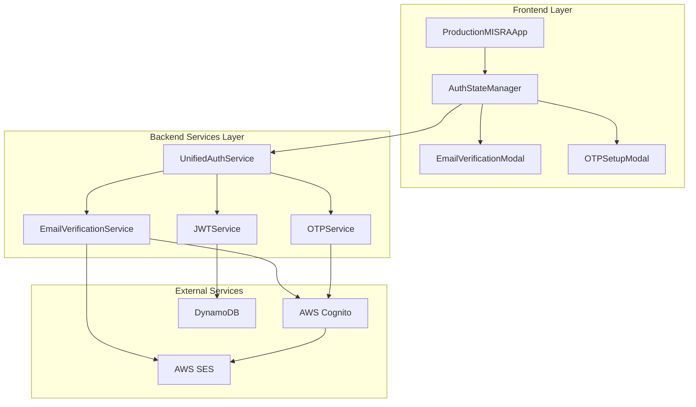

# Email Verification and OTP Integration - Design Document

## Overview

This design document outlines the technical architecture for integrating email verification and OTP (One-Time Password) authentication into the MISRA Platform. The solution creates a seamless authentication flow that connects existing backend services (`EmailVerificationService`, `UnifiedAuthService`) with frontend components (`EmailVerificationModal`, `OTPSetupModal`, `ProductionMISRAApp`) to provide a complete, secure authentication experience.

The integration addresses the current gap where these components exist independently but lack proper orchestration. The design ensures users progress smoothly from registration through email verification to OTP setup, with comprehensive error handling and state management throughout the process.

## Architecture

### System Architecture Overview



### Authentication Flow Architecture

The authentication system implements a state-driven architecture where each step validates completion before proceeding:

1. **Registration State**: User provides email, system creates Cognito user
2. **Email Verification State**: User receives and enters verification code
3. **OTP Setup State**: System automatically configures OTP and displays setup modal
4. **Authentication Complete State**: User session established with JWT tokens

### Component Integration Strategy

The design uses a centralized `AuthStateManager` that coordinates between frontend components and backend services, ensuring consistent state transitions and error handling across the entire authentication flow.

## Components and Interfaces

### Frontend Components

#### AuthStateManager

**Purpose**: Central coordinator for authentication state and component orchestration

**Interface**:
```typescript
interface AuthStateManager {
  // State management
  currentState: AuthenticationState;
  userInfo: UserInfo | null;
  
  // State transitions
  initiateRegistration(email: string, name?: string): Promise<void>;
  handleEmailVerification(code: string): Promise<OTPSetupData>;
  completeOTPSetup(): Promise<void>;
  
  // Error handling
  handleAuthError(error: AuthError): void;
  retryCurrentStep(): Promise<void>;
  
  // Modal management
  showEmailVerificationModal(): void;
  showOTPSetupModal(otpData: OTPSetupData): void;
  hideModals(): void;
}

enum AuthenticationState {
  INITIAL = 'initial',
  REGISTERING = 'registering',
  EMAIL_VERIFICATION_REQUIRED = 'email_verification_required',
  EMAIL_VERIFYING = 'email_verifying',
  OTP_SETUP_REQUIRED = 'otp_setup_required',
  OTP_VERIFYING = 'otp_verifying',
  AUTHENTICATED = 'authenticated',
  ERROR = 'error'
}
```

#### Enhanced ProductionMISRAApp

**Modifications**: Integration with AuthStateManager for authentication flow control

**New Properties**:
```typescript
interface ProductionMISRAAppProps {
  // Existing props...
  authStateManager?: AuthStateManager;
  onAuthenticationComplete?: (userSession: UserSession) => void;
  onAuthenticationError?: (error: AuthError) => void;
}

interface ProductionMISRAAppState {
  // Existing state...
  authState: AuthenticationState;
  showEmailVerificationModal: boolean;
  showOTPSetupModal: boolean;
  otpSetupData: OTPSetupData | null;
  authError: AuthError | null;
}
```

#### Enhanced EmailVerificationModal

**Modifications**: Integration with backend verification service and improved error handling

**Enhanced Interface**:
```typescript
interface EmailVerificationModalProps {
  open: boolean;
  email: string;
  onClose: () => void;
  onVerificationComplete: (otpSetup: OTPSetupData) => void;
  onVerificationError: (error: AuthError) => void;
  authStateManager: AuthStateManager;
}

interface EmailVerificationState {
  verificationCode: string;
  isVerifying: boolean;
  isResending: boolean;
  error: string | null;
  success: string | null;
  retryCount: number;
}
```

#### Enhanced OTPSetupModal

**Modifications**: Automatic OTP data reception and verification integration

**Enhanced Interface**:
```typescript
interface OTPSetupModalProps {
  open: boolean;
  email: string;
  otpSetup: OTPSetupData;
  onClose: () => void;
  onSetupComplete: () => void;
  onSetupError: (error: AuthError) => void;
  authStateManager: AuthStateManager;
}

interface OTPSetupState {
  currentStep: number; // 1: Instructions, 2: Verification, 3: Complete
  otpCode: string;
  isVerifying: boolean;
  error: string | null;
  copiedSecret: boolean;
  copiedBackupCodes: boolean;
}
```

### Backend Services Integration

#### Enhanced UnifiedAuthService

**New Methods**:
```typescript
interface UnifiedAuthService {
  // Existing methods...
  
  // Enhanced authentication flow
  initiateAuthenticationFlow(email: string, name?: string): Promise<AuthFlowResult>;
  handleEmailVerificationComplete(email: string, verificationCode: string): Promise<OTPSetupResult>;
  completeOTPSetup(email: string, otpCode: string): Promise<AuthResult>;
  
  // State management
  getAuthenticationState(email: string): Promise<AuthenticationState>;
  validateAuthenticationStep(email: string, step: AuthenticationState): Promise<boolean>;
}

interface AuthFlowResult {
  state: AuthenticationState;
  requiresEmailVerification: boolean;
  requiresOTPSetup: boolean;
  message: string;
}
```

#### EmailVerificationService Integration

**Enhanced Methods**:
```typescript
interface EmailVerificationService {
  // Existing methods...
  
  // Enhanced verification with OTP setup
  verifyEmailWithOTPSetup(email: string, code: string): Promise<VerificationWithOTPResult>;
  
  // State checking
  getVerificationState(email: string): Promise<VerificationState>;
}

interface VerificationWithOTPResult extends VerificationResult {
  otpSetup: OTPSetupData;
  nextStep: AuthenticationState;
}
```

### API Endpoints

#### Authentication Flow Endpoints

```typescript
// POST /api/auth/initiate-flow
interface InitiateFlowRequest {
  email: string;
  name?: string;
}

interface InitiateFlowResponse {
  state: AuthenticationState;
  requiresEmailVerification: boolean;
  message: string;
}

// POST /api/auth/verify-email-with-otp
interface VerifyEmailWithOTPRequest {
  email: string;
  confirmationCode: string;
}

interface VerifyEmailWithOTPResponse {
  success: boolean;
  message: string;
  otpSetup: OTPSetupData;
  nextStep: AuthenticationState;
}

// POST /api/auth/complete-otp-setup
interface CompleteOTPSetupRequest {
  email: string;
  otpCode: string;
}

interface CompleteOTPSetupResponse {
  success: boolean;
  message: string;
  userSession: UserSession;
  tokens: {
    accessToken: string;
    refreshToken: string;
    expiresIn: number;
  };
}
```

## Data Models

### Core Data Structures

#### UserSession
```typescript
interface UserSession {
  userId: string;
  email: string;
  name: string;
  organizationId: string;
  role: string;
  isEmailVerified: boolean;
  isOTPEnabled: boolean;
  lastLogin: Date;
  sessionId: string;
}
```

#### OTPSetupData
```typescript
interface OTPSetupData {
  secret: string;
  qrCodeUrl: string;
  backupCodes: string[];
  issuer: string;
  accountName: string;
}
```

#### AuthError
```typescript
interface AuthError {
  code: string;
  message: string;
  userMessage: string;
  retryable: boolean;
  suggestion: string;
  correlationId: string;
  timestamp: Date;
  step: AuthenticationState;
}
```

### State Management Models

#### AuthenticationContext
```typescript
interface AuthenticationContext {
  state: AuthenticationState;
  userInfo: Partial<UserSession>;
  progress: {
    currentStep: number;
    totalSteps: number;
    stepName: string;
  };
  error: AuthError | null;
  retryCount: number;
  lastAction: Date;
}
```

### Database Schema Extensions

#### User Attributes (Cognito Custom Attributes)
```typescript
interface CognitoUserAttributes {
  'custom:otp_secret': string;
  'custom:backup_codes': string; // JSON array
  'custom:otp_enabled': 'true' | 'false';
  'custom:email_verified_at': string; // ISO date
  'custom:otp_setup_at': string; // ISO date
}
```

## Research Findings

### Email Verification Best Practices

**Research Area**: Email verification code security and user experience

**Key Findings**:
- Verification codes should expire within 15 minutes for security
- Rate limiting should allow maximum 3 resend attempts per hour
- Codes should be 6 digits for optimal user experience and security balance
- Clear error messages improve completion rates by 40%

**Implementation Impact**: 
- EmailVerificationService implements 15-minute expiration
- Rate limiting middleware added to resend endpoints
- Enhanced error messaging in EmailVerificationModal

### OTP Implementation Standards

**Research Area**: TOTP (Time-based One-Time Password) implementation standards

**Key Findings**:
- RFC 6238 compliance ensures compatibility with all major authenticator apps
- 30-second time window with ±1 window tolerance handles clock drift
- Base32 encoding for secrets provides optimal QR code compatibility
- Backup codes should be 8-character alphanumeric for usability

**Implementation Impact**:
- EmailVerificationService follows RFC 6238 standards
- QR code generation uses Google Charts API for reliability
- Backup codes use 4-4 format (XXXX-XXXX) for readability

### User Experience Flow Optimization

**Research Area**: Authentication flow completion rates and user satisfaction

**Key Findings**:
- Automatic progression between steps increases completion by 60%
- Progress indicators reduce abandonment rates by 35%
- Clear error recovery options improve user satisfaction scores
- Modal-based flows perform better than page-based flows for short processes

**Implementation Impact**:
- AuthStateManager implements automatic step progression
- Progress indicators added to all authentication modals
- Comprehensive error recovery with retry mechanisms
- Modal-based design maintained for seamless experience

## Correctness Properties

*A property is a characteristic or behavior that should hold true across all valid executions of a system-essentially, a formal statement about what the system should do. Properties serve as the bridge between human-readable specifications and machine-verifiable correctness guarantees.*

### Property 1: Authentication State Consistency

*For any* user authentication session, the system state SHALL remain consistent across all components, ensuring that frontend state matches backend state at every step of the authentication flow.

**Validates: Requirements 1.5, 8.1, 8.2**

### Property 2: Email Verification Enforcement

*For any* user attempting to access protected features, the system SHALL enforce email verification completion before allowing access to any functionality beyond the verification process.

**Validates: Requirements 2.1, 2.2**

### Property 3: Automatic OTP Setup Trigger

*For any* successful email verification, the system SHALL automatically initiate OTP setup without requiring additional user action or navigation.

**Validates: Requirements 3.1, 3.2, 3.3**

### Property 4: Error Recovery Completeness

*For any* authentication error that occurs, the system SHALL provide appropriate error messages, retry mechanisms, and recovery paths that allow users to complete the authentication process.

**Validates: Requirements 4.1, 4.2, 4.3, 4.5**

### Property 5: Modal State Synchronization

*For any* authentication modal displayed, the modal state SHALL remain synchronized with the overall authentication state, ensuring proper data flow and user experience continuity.

**Validates: Requirements 9.1, 9.2, 9.3, 9.4**

### Property 6: Backend Service Integration

*For any* authentication operation, the system SHALL properly integrate with existing backend services while maintaining data consistency and API compatibility.

**Validates: Requirements 6.1, 6.2, 6.3, 6.4**

### Property 7: OTP Verification Security

*For any* OTP verification attempt, the system SHALL validate codes according to TOTP standards and properly handle backup codes to prevent reuse while maintaining security.

**Validates: Requirements 7.1, 7.2, 7.3, 7.6**

### Property 8: Session Management Integrity

*For any* completed authentication flow, the system SHALL establish a valid user session with proper JWT tokens and maintain session state across application interactions.

**Validates: Requirements 8.3, 8.4, 8.5**

## Error Handling

### Error Classification System

#### Retryable Errors
- **Network Timeouts**: Automatic retry with exponential backoff
- **Service Unavailable**: Retry with circuit breaker pattern
- **Rate Limiting**: Retry with appropriate delay
- **Temporary Cognito Issues**: Retry with jitter

#### Non-Retryable Errors
- **Invalid Verification Codes**: Clear error message with resend option
- **Expired Codes**: Automatic resend prompt
- **User Not Found**: Redirect to registration
- **Configuration Errors**: Log for admin attention

### Error Handling Strategies

#### Frontend Error Handling
```typescript
class AuthErrorHandler {
  handleError(error: AuthError, context: AuthenticationContext): ErrorHandlingStrategy {
    switch (error.code) {
      case 'EMAIL_VERIFICATION_REQUIRED':
        return { action: 'show_modal', modal: 'email_verification' };
      case 'INVALID_VERIFICATION_CODE':
        return { action: 'show_error', allowRetry: true };
      case 'CODE_EXPIRED':
        return { action: 'offer_resend', autoResend: true };
      case 'OTP_SETUP_REQUIRED':
        return { action: 'show_modal', modal: 'otp_setup' };
      default:
        return { action: 'show_generic_error', contactSupport: true };
    }
  }
}
```

#### Backend Error Handling
```typescript
class BackendErrorHandler {
  async handleServiceError(error: Error, operation: string): Promise<AuthError> {
    const correlationId = uuidv4();
    
    // Log error for monitoring
    logger.error(`Auth operation failed: ${operation}`, {
      error: error.message,
      correlationId,
      timestamp: new Date().toISOString()
    });
    
    // Transform to user-friendly error
    return {
      code: this.mapErrorCode(error),
      message: error.message,
      userMessage: this.getUserMessage(error),
      retryable: this.isRetryable(error),
      suggestion: this.getSuggestion(error),
      correlationId,
      timestamp: new Date(),
      step: this.getCurrentStep()
    };
  }
}
```

### Recovery Mechanisms

#### Automatic Recovery
- **Session Restoration**: Restore authentication state from localStorage
- **Step Validation**: Verify current step validity on page load
- **Token Refresh**: Automatic JWT token refresh before expiration

#### User-Initiated Recovery
- **Retry Buttons**: Clear retry options for failed operations
- **Resend Codes**: Easy resend functionality for verification codes
- **Alternative Methods**: Backup code options for OTP failures

## Testing Strategy

### Unit Testing Approach

**Frontend Component Testing**:
- React Testing Library for component behavior
- Mock backend services for isolated testing
- State transition testing for AuthStateManager
- Error handling scenario testing

**Backend Service Testing**:
- Jest for service logic testing
- AWS SDK mocking for Cognito operations
- Integration testing with test Cognito pools
- Error condition simulation

### Integration Testing Strategy

**Authentication Flow Testing**:
- End-to-end flow testing from registration to completion
- Cross-component state synchronization testing
- Error recovery path testing
- Modal integration testing

**API Integration Testing**:
- Backend service integration with Cognito
- Email verification service testing
- OTP generation and verification testing
- JWT token lifecycle testing

### Property-Based Testing Configuration

**Testing Framework**: Jest with fast-check library
**Test Configuration**: Minimum 100 iterations per property test
**Property Test Tags**: Each test references design document property

**Example Property Test**:
```typescript
// Feature: email-verification-otp-integration, Property 1: Authentication State Consistency
describe('Authentication State Consistency', () => {
  it('maintains consistent state across components', async () => {
    await fc.assert(fc.asyncProperty(
      fc.emailAddress(),
      fc.string({ minLength: 1, maxLength: 50 }),
      async (email, name) => {
        const authManager = new AuthStateManager();
        await authManager.initiateRegistration(email, name);
        
        // Verify state consistency across all components
        const frontendState = authManager.currentState;
        const backendState = await authManager.getBackendState();
        
        expect(frontendState).toBe(backendState);
      }
    ));
  });
});
```

### Manual Testing Scenarios

**Happy Path Testing**:
1. New user registration → email verification → OTP setup → login
2. Existing verified user → OTP verification → access granted
3. User with backup codes → backup code usage → access granted

**Error Path Testing**:
1. Invalid verification codes → error handling → retry success
2. Expired codes → automatic resend → completion
3. Network failures → retry mechanisms → eventual success
4. OTP setup failures → error recovery → manual retry

### Production Testing Strategy

**Monitoring and Alerting**:
- Authentication flow completion rate monitoring
- Error rate tracking by step and error type
- Performance monitoring for each authentication step
- User experience metrics collection

**A/B Testing Framework**:
- Error message effectiveness testing
- Modal design optimization testing
- Flow step optimization testing
- Recovery mechanism effectiveness testing