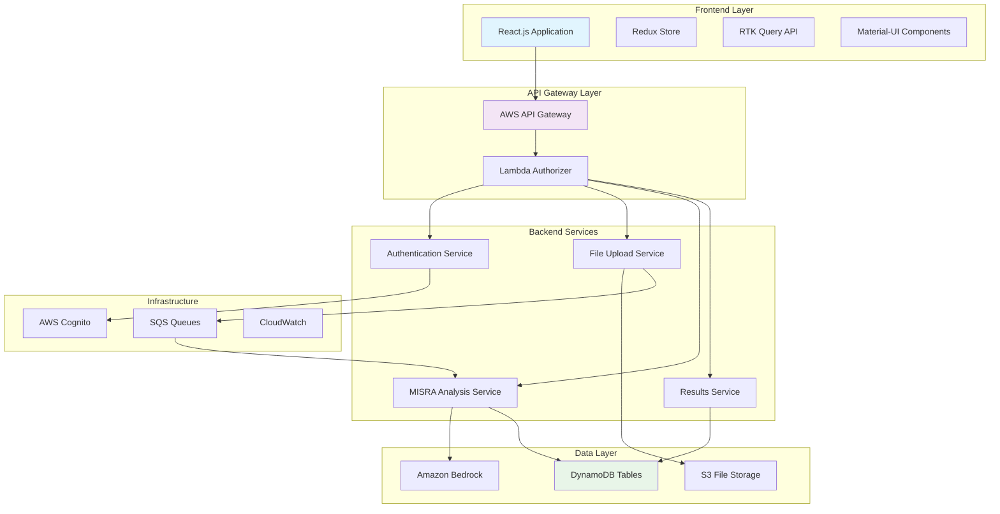

# Design Document: MISRA Compliance React Application

## Overview

This design document outlines the conversion of the existing HTML test page (`test-button.html`) into a production-ready React.js MISRA compliance application. The application will provide a seamless 4-step workflow (Login → Upload → Analyze → Verify) with real backend integration, replacing the current mock data demonstration with actual AWS Lambda/API Gateway connectivity.

The React application will maintain the same user experience as the HTML test page while leveraging the existing AWS infrastructure including Lambda functions, DynamoDB tables, S3 buckets, and Amazon Bedrock AI services.

## Architecture

### High-Level Architecture



### Component Architecture

The React application follows a modular architecture with clear separation of concerns:

1. **Presentation Layer**: React components with Material-UI styling
2. **State Management**: Redux Toolkit with RTK Query for API calls
3. **Service Layer**: API services for backend communication
4. **Configuration Layer**: Environment-specific configuration management

### Technology Stack

- **Frontend Framework**: React 18 with TypeScript
- **State Management**: Redux Toolkit + RTK Query
- **UI Framework**: Material-UI (MUI) v5
- **Build Tool**: Vite
- **Authentication**: JWT tokens with AWS Cognito fallback
- **HTTP Client**: RTK Query (built on fetch)
- **Deployment**: Vercel (frontend) + AWS (backend)

## Components and Interfaces

### Core Components

#### 1. MISRAComplianceApp Component

The main application component that orchestrates the 4-step workflow.

```typescript
interface MISRAComplianceAppProps {
  environment: 'demo' | 'local' | 'development' | 'staging' | 'production';
  onStepChange?: (step: number) => void;
  onComplete?: (results: AnalysisResults) => void;
}

interface MISRAComplianceAppState {
  currentStep: number;
  isRunning: boolean;
  results: AnalysisResults | null;
  error: string | null;
  logs: LogEntry[];
}
```

#### 2. StepIndicator Component

Visual progress indicator matching the HTML test page design.

```typescript
interface StepIndicatorProps {
  steps: StepDefinition[];
  currentStep: number;
  completedSteps: number[];
}

interface StepDefinition {
  id: number;
  label: string;
  status: 'pending' | 'active' | 'completed' | 'error';
}
```

#### 3. EnvironmentSelector Component

Environment configuration selector with validation.

```typescript
interface EnvironmentSelectorProps {
  value: Environment;
  onChange: (env: Environment) => void;
  disabled?: boolean;
}

interface Environment {
  name: string;
  appUrl: string;
  backendUrl: string;
  description: string;
}
```

#### 4. TerminalOutput Component

Terminal-style output display for technical users.

```typescript
interface TerminalOutputProps {
  logs: LogEntry[];
  isRunning: boolean;
  onClear: () => void;
}

interface LogEntry {
  timestamp: Date;
  level: 'info' | 'warn' | 'error' | 'success';
  message: string;
  details?: any;
}
```

#### 5. FileUploadZone Component

Drag-and-drop file upload with validation.

```typescript
interface FileUploadZoneProps {
  onFileSelect: (file: File) => void;
  acceptedTypes: string[];
  maxSize: number;
  disabled?: boolean;
}
```

#### 6. AnalysisResults Component

MISRA compliance results display with detailed violation information.

```typescript
interface AnalysisResultsProps {
  results: AnalysisResults;
  onDownloadReport: () => void;
  onViewDetails: (violation: Violation) => void;
}

interface AnalysisResults {
  analysisId: string;
  fileId: string;
  compliancePercentage: number;
  violationCount: number;
  violations: Violation[];
  summary: AnalysisSummary;
  duration: number;
  timestamp: Date;
}
```

### Service Interfaces

#### 1. Authentication Service

```typescript
interface AuthenticationService {
  login(email: string, password: string): Promise<LoginResponse>;
  logout(): Promise<void>;
  refreshToken(): Promise<string>;
  getCurrentUser(): Promise<UserInfo | null>;
  isAuthenticated(): Promise<boolean>;
}

interface LoginResponse {
  accessToken: string;
  refreshToken: string;
  user: UserInfo;
  expiresIn: number;
}
```

#### 2. File Upload Service

```typescript
interface FileUploadService {
  uploadFile(file: File): Promise<UploadResponse>;
  getUploadProgress(): Observable<UploadProgress>;
  cancelUpload(): void;
}

interface UploadResponse {
  fileId: string;
  uploadUrl: string;
  downloadUrl: string;
  expiresIn: number;
}
```

#### 3. Analysis Service

```typescript
interface AnalysisService {
  triggerAnalysis(fileId: string): Promise<AnalysisJob>;
  getAnalysisStatus(analysisId: string): Promise<AnalysisStatus>;
  getAnalysisResults(analysisId: string): Promise<AnalysisResults>;
  pollAnalysisStatus(analysisId: string): Observable<AnalysisStatus>;
}

interface AnalysisJob {
  analysisId: string;
  status: 'queued' | 'in_progress' | 'completed' | 'failed';
  estimatedDuration: number;
}
```

### API Integration Layer

#### RTK Query API Definitions

```typescript
// Authentication API
export const authApi = api.injectEndpoints({
  endpoints: (builder) => ({
    login: builder.mutation<LoginResponse, LoginRequest>({
      query: (credentials) => ({
        url: '/auth/login',
        method: 'POST',
        body: credentials
      })
    }),
    // ... other auth endpoints
  })
});

// File Upload API
export const fileApi = api.injectEndpoints({
  endpoints: (builder) => ({
    uploadFile: builder.mutation<UploadResponse, FormData>({
      query: (formData) => ({
        url: '/files/upload',
        method: 'POST',
        body: formData
      })
    }),
    // ... other file endpoints
  })
});

// Analysis API
export const analysisApi = api.injectEndpoints({
  endpoints: (builder) => ({
    triggerAnalysis: builder.mutation<AnalysisJob, { fileId: string }>({
      query: ({ fileId }) => ({
        url: '/analysis/trigger',
        method: 'POST',
        body: { fileId }
      })
    }),
    getAnalysisResults: builder.query<AnalysisResults, string>({
      query: (analysisId) => `/analysis/results/${analysisId}`
    }),
    // ... other analysis endpoints
  })
});
```

## Data Models

### Core Data Models

#### User Model
```typescript
interface User {
  userId: string;
  email: string;
  name: string;
  role: 'developer' | 'admin' | 'viewer';
  organizationId: string;
  preferences: UserPreferences;
  createdAt: Date;
  lastLogin?: Date;
}

interface UserPreferences {
  theme: 'light' | 'dark';
  notifications: NotificationSettings;
  defaultMisraRuleSet: 'MISRA_C_2012' | 'MISRA_CPP_2008';
}
```

#### File Metadata Model
```typescript
interface FileMetadata {
  fileId: string;
  filename: string;
  fileType: 'c' | 'cpp' | 'h' | 'hpp';
  fileSize: number;
  userId: string;
  uploadTimestamp: Date;
  analysisStatus: 'pending' | 'in_progress' | 'completed' | 'failed';
  s3Key: string;
  analysisResults?: AnalysisResults;
}
```

#### Analysis Results Model
```typescript
interface AnalysisResults {
  analysisId: string;
  fileId: string;
  userId: string;
  language: 'C' | 'CPP';
  violations: Violation[];
  summary: AnalysisSummary;
  status: 'completed' | 'failed';
  createdAt: Date;
  duration: number;
}

interface Violation {
  ruleId: string;
  ruleName: string;
  severity: 'required' | 'advisory' | 'mandatory';
  category: string;
  description: string;
  lineNumber: number;
  columnNumber: number;
  codeSnippet: string;
  suggestion?: string;
}

interface AnalysisSummary {
  totalRules: number;
  violatedRules: number;
  compliancePercentage: number;
  severityBreakdown: {
    required: number;
    advisory: number;
    mandatory: number;
  };
}
```

### State Management Models

#### Application State
```typescript
interface RootState {
  auth: AuthState;
  workflow: WorkflowState;
  files: FilesState;
  analysis: AnalysisState;
  ui: UIState;
}

interface WorkflowState {
  currentStep: number;
  isRunning: boolean;
  environment: Environment;
  logs: LogEntry[];
  error: string | null;
}

interface AuthState {
  user: User | null;
  token: string | null;
  isAuthenticated: boolean;
  isLoading: boolean;
}
```

## Error Handling

### Error Classification

1. **Authentication Errors**: Invalid credentials, expired tokens, unauthorized access
2. **Validation Errors**: Invalid file types, file size limits, malformed requests
3. **Network Errors**: Connection timeouts, API unavailability, CORS issues
4. **Analysis Errors**: File parsing failures, rule engine errors, timeout errors
5. **System Errors**: Internal server errors, database failures, service unavailability

### Error Handling Strategy

```typescript
interface ErrorHandler {
  handleAuthError(error: AuthError): void;
  handleValidationError(error: ValidationError): void;
  handleNetworkError(error: NetworkError): void;
  handleAnalysisError(error: AnalysisError): void;
  handleSystemError(error: SystemError): void;
}

interface AppError {
  code: string;
  message: string;
  details?: any;
  timestamp: Date;
  recoverable: boolean;
  userMessage: string;
}
```

### Error Recovery Mechanisms

1. **Automatic Retry**: Network errors with exponential backoff
2. **Fallback Services**: Cognito fallback for authentication
3. **Graceful Degradation**: Demo mode when backend unavailable
4. **User Guidance**: Clear error messages with troubleshooting steps
5. **Error Reporting**: Structured logging for debugging

## Testing Strategy

### Testing Approach

The application will use a comprehensive testing strategy combining unit tests, integration tests, and end-to-end tests.

#### Unit Testing
- **Component Testing**: React component behavior and rendering
- **Service Testing**: API service functions and error handling
- **Utility Testing**: Helper functions and data transformations
- **State Management Testing**: Redux reducers and selectors

#### Integration Testing
- **API Integration**: Backend service connectivity and data flow
- **Authentication Flow**: Login, token refresh, and logout processes
- **File Upload Flow**: File validation, upload, and progress tracking
- **Analysis Workflow**: End-to-end analysis process

#### End-to-End Testing
- **User Workflows**: Complete 4-step process automation
- **Cross-Browser Testing**: Chrome, Firefox, Safari, Edge compatibility
- **Responsive Testing**: Mobile and desktop layouts
- **Performance Testing**: Load times and resource usage

### Test Configuration

```typescript
// Jest configuration for unit tests
export default {
  testEnvironment: 'jsdom',
  setupFilesAfterEnv: ['<rootDir>/src/test/setup.ts'],
  moduleNameMapping: {
    '^@/(.*)$': '<rootDir>/src/$1'
  },
  collectCoverageFrom: [
    'src/**/*.{ts,tsx}',
    '!src/**/*.d.ts',
    '!src/test/**/*'
  ],
  coverageThreshold: {
    global: {
      branches: 80,
      functions: 80,
      lines: 80,
      statements: 80
    }
  }
};

// Cypress configuration for E2E tests
export default {
  e2e: {
    baseUrl: 'http://localhost:3000',
    supportFile: 'cypress/support/e2e.ts',
    specPattern: 'cypress/e2e/**/*.cy.{js,jsx,ts,tsx}',
    video: true,
    screenshotOnRunFailure: true
  }
};
```

### Test Data Management

```typescript
// Test data factories
export const createMockUser = (overrides?: Partial<User>): User => ({
  userId: 'test-user-id',
  email: 'test@example.com',
  name: 'Test User',
  role: 'developer',
  organizationId: 'test-org',
  preferences: {
    theme: 'light',
    notifications: { email: true, webhook: false },
    defaultMisraRuleSet: 'MISRA_C_2012'
  },
  createdAt: new Date(),
  ...overrides
});

export const createMockAnalysisResults = (overrides?: Partial<AnalysisResults>): AnalysisResults => ({
  analysisId: 'test-analysis-id',
  fileId: 'test-file-id',
  userId: 'test-user-id',
  language: 'C',
  violations: [],
  summary: {
    totalRules: 100,
    violatedRules: 8,
    compliancePercentage: 92,
    severityBreakdown: { required: 3, advisory: 3, mandatory: 2 }
  },
  status: 'completed',
  createdAt: new Date(),
  duration: 2500,
  ...overrides
});
```

## Deployment Strategy

### Build Configuration

#### Development Build
```typescript
// vite.config.ts
export default defineConfig({
  plugins: [react()],
  define: {
    __DEV__: true,
    __API_URL__: JSON.stringify('http://localhost:3001')
  },
  server: {
    port: 3000,
    proxy: {
      '/api': {
        target: 'http://localhost:3001',
        changeOrigin: true,
        rewrite: (path) => path.replace(/^\/api/, '')
      }
    }
  }
});
```

#### Production Build
```typescript
// vite.config.prod.ts
export default defineConfig({
  plugins: [react()],
  define: {
    __DEV__: false,
    __API_URL__: JSON.stringify(process.env.VITE_API_URL)
  },
  build: {
    outDir: 'dist',
    sourcemap: false,
    minify: 'terser',
    rollupOptions: {
      output: {
        manualChunks: {
          vendor: ['react', 'react-dom'],
          mui: ['@mui/material', '@mui/icons-material'],
          redux: ['@reduxjs/toolkit', 'react-redux']
        }
      }
    }
  }
});
```

### Environment Configuration

```typescript
// Environment configuration
interface EnvironmentConfig {
  name: string;
  apiUrl: string;
  cognitoUserPoolId: string;
  cognitoClientId: string;
  enableAnalytics: boolean;
  logLevel: 'debug' | 'info' | 'warn' | 'error';
}

const environments: Record<string, EnvironmentConfig> = {
  local: {
    name: 'Local Development',
    apiUrl: 'http://localhost:3001',
    cognitoUserPoolId: 'us-east-1_yTX8thfy9',
    cognitoClientId: '7ltt7flg73m2or3lfq534fbmee',
    enableAnalytics: false,
    logLevel: 'debug'
  },
  development: {
    name: 'Development',
    apiUrl: 'https://api-dev.misra.digitransolutions.in',
    cognitoUserPoolId: process.env.VITE_COGNITO_USER_POOL_ID!,
    cognitoClientId: process.env.VITE_COGNITO_CLIENT_ID!,
    enableAnalytics: true,
    logLevel: 'info'
  },
  production: {
    name: 'Production',
    apiUrl: 'https://api.misra.digitransolutions.in',
    cognitoUserPoolId: process.env.VITE_COGNITO_USER_POOL_ID!,
    cognitoClientId: process.env.VITE_COGNITO_CLIENT_ID!,
    enableAnalytics: true,
    logLevel: 'warn'
  }
};
```

### Deployment Pipeline

#### Vercel Deployment Configuration
```json
{
  "version": 2,
  "builds": [
    {
      "src": "package.json",
      "use": "@vercel/static-build",
      "config": {
        "distDir": "dist"
      }
    }
  ],
  "routes": [
    {
      "src": "/(.*)",
      "dest": "/index.html"
    }
  ],
  "env": {
    "VITE_API_URL": "@api-url",
    "VITE_COGNITO_USER_POOL_ID": "@cognito-user-pool-id",
    "VITE_COGNITO_CLIENT_ID": "@cognito-client-id"
  }
}
```

#### CI/CD Pipeline
```yaml
# .github/workflows/deploy.yml
name: Deploy React App
on:
  push:
    branches: [main]
  pull_request:
    branches: [main]

jobs:
  test:
    runs-on: ubuntu-latest
    steps:
      - uses: actions/checkout@v3
      - uses: actions/setup-node@v3
        with:
          node-version: '18'
          cache: 'npm'
      - run: npm ci
      - run: npm run test
      - run: npm run build

  deploy:
    needs: test
    runs-on: ubuntu-latest
    if: github.ref == 'refs/heads/main'
    steps:
      - uses: actions/checkout@v3
      - uses: amondnet/vercel-action@v20
        with:
          vercel-token: ${{ secrets.VERCEL_TOKEN }}
          vercel-org-id: ${{ secrets.ORG_ID }}
          vercel-project-id: ${{ secrets.PROJECT_ID }}
          vercel-args: '--prod'
```

### Performance Optimization

#### Code Splitting Strategy
```typescript
// Lazy loading for route components
const DashboardPage = lazy(() => import('./pages/DashboardPage'));
const AnalysisPage = lazy(() => import('./pages/AnalysisPage'));
const MISRAAnalysisPage = lazy(() => import('./pages/MISRAAnalysisPage'));

// Component-level code splitting
const HeavyComponent = lazy(() => import('./components/HeavyComponent'));

// Route-based splitting
const AppRoutes = () => (
  <Suspense fallback={<LoadingSpinner />}>
    <Routes>
      <Route path="/dashboard" element={<DashboardPage />} />
      <Route path="/analysis" element={<AnalysisPage />} />
      <Route path="/misra-analysis" element={<MISRAAnalysisPage />} />
    </Routes>
  </Suspense>
);
```

#### Bundle Optimization
- **Tree Shaking**: Remove unused code from final bundle
- **Chunk Splitting**: Separate vendor and application code
- **Asset Optimization**: Compress images and optimize fonts
- **Service Worker**: Cache static assets and API responses
- **CDN Integration**: Serve static assets from CloudFront

## Security Considerations

### Authentication Security
- **JWT Token Management**: Secure storage in httpOnly cookies
- **Token Refresh**: Automatic refresh before expiration
- **CSRF Protection**: SameSite cookie attributes
- **XSS Prevention**: Content Security Policy headers

### API Security
- **HTTPS Only**: All API communications over TLS
- **CORS Configuration**: Restricted origin policies
- **Rate Limiting**: Prevent API abuse
- **Input Validation**: Client and server-side validation

### Data Protection
- **Sensitive Data**: No sensitive data in localStorage
- **File Upload Security**: Type and size validation
- **Error Handling**: No sensitive information in error messages
- **Audit Logging**: Track user actions and system events

## Monitoring and Observability

### Application Monitoring
```typescript
// Error tracking
import * as Sentry from '@sentry/react';

Sentry.init({
  dsn: process.env.VITE_SENTRY_DSN,
  environment: process.env.NODE_ENV,
  integrations: [
    new Sentry.BrowserTracing(),
  ],
  tracesSampleRate: 1.0,
});

// Performance monitoring
import { getCLS, getFID, getFCP, getLCP, getTTFB } from 'web-vitals';

getCLS(console.log);
getFID(console.log);
getFCP(console.log);
getLCP(console.log);
getTTFB(console.log);
```

### Analytics Integration
```typescript
// Google Analytics 4
import { gtag } from 'ga-gtag';

gtag('config', 'GA_MEASUREMENT_ID', {
  page_title: document.title,
  page_location: window.location.href,
});

// Custom event tracking
const trackAnalysisComplete = (results: AnalysisResults) => {
  gtag('event', 'analysis_complete', {
    event_category: 'misra_analysis',
    event_label: results.language,
    value: results.summary.compliancePercentage
  });
};
```

### Health Checks
```typescript
// Application health check
export const healthCheck = async (): Promise<HealthStatus> => {
  const checks = await Promise.allSettled([
    checkAPIConnectivity(),
    checkAuthService(),
    checkFileUploadService(),
    checkAnalysisService()
  ]);

  return {
    status: checks.every(check => check.status === 'fulfilled') ? 'healthy' : 'degraded',
    checks: checks.map((check, index) => ({
      name: ['api', 'auth', 'upload', 'analysis'][index],
      status: check.status === 'fulfilled' ? 'up' : 'down',
      error: check.status === 'rejected' ? check.reason : null
    })),
    timestamp: new Date()
  };
};
```

## Correctness Properties

*A property is a characteristic or behavior that should hold true across all valid executions of a system-essentially, a formal statement about what the system should do. Properties serve as the bridge between human-readable specifications and machine-verifiable correctness guarantees.*

### Property 1: UI Consistency and Workflow Interface

*For any* workflow state and viewport dimensions, the rendered 4-step interface should contain all required elements (step indicators, buttons, progress display) with consistent styling, responsive layout, and visual design matching the original HTML test page.

**Validates: Requirements 1.1, 1.2, 1.5, 9.1, 9.2, 9.3**

### Property 2: Terminal Output Formatting

*For any* log entry with level and message content, the terminal-style output should format and display the entry with appropriate styling, timestamps, color coding, and maintain debugging functionality for technical users.

**Validates: Requirements 1.3, 7.5, 9.4**

### Property 3: Environment Configuration Management

*For any* valid environment configuration (demo, local, development, staging, production), the application should correctly apply API endpoints, authentication settings, feature flags, and validate configuration before API calls.

**Validates: Requirements 1.4, 6.1, 6.2, 6.3, 6.5, 8.3**

### Property 4: Authentication State Management

*For any* authentication state change (login, logout, token refresh), the application should correctly update routing, store tokens securely, maintain session state, and redirect unauthenticated users to login.

**Validates: Requirements 2.1, 2.4**

### Property 5: File Validation and Upload Handling

*For any* file input with type, size, and content properties, the validation system should correctly accept or reject the file based on MISRA compliance requirements, track upload progress, and handle upload errors appropriately.

**Validates: Requirements 3.2, 3.5**

### Property 6: Analysis Workflow Automation

*For any* successful file upload completion event, the application should automatically trigger the analysis engine, transition to the analysis step, and poll for analysis status with real-time progress updates.

**Validates: Requirements 4.1, 4.3**

### Property 7: Comprehensive Error Handling

*For any* error scenario (authentication, validation, network, analysis, system), the application should generate appropriate user-friendly error messages, log detailed information to console, provide troubleshooting guidance, and handle network connectivity issues gracefully.

**Validates: Requirements 2.5, 4.4, 7.1, 7.2, 7.3, 7.4**

### Property 8: Analysis Results Display

*For any* analysis results with compliance data and violations, the display should include all required information (percentage, count, detailed violations, rule references, duration, metadata) in the correct format and provide downloadable compliance reports.

**Validates: Requirements 4.5, 5.1, 5.2, 5.3, 5.5**

### Property 9: Analysis History Persistence

*For any* authenticated user with analysis history, the application should correctly store, retrieve, and display historical analysis data with proper user association.

**Validates: Requirements 5.4**

### Property 10: Keyboard Interaction Support

*For any* keyboard event (Enter key, navigation keys), the application should respond appropriately with correct focus management and action execution.

**Validates: Requirements 9.5**

This design document provides a comprehensive blueprint for converting the HTML test page into a production-ready React.js MISRA compliance application while maintaining the existing user experience and leveraging the robust AWS infrastructure already in place.