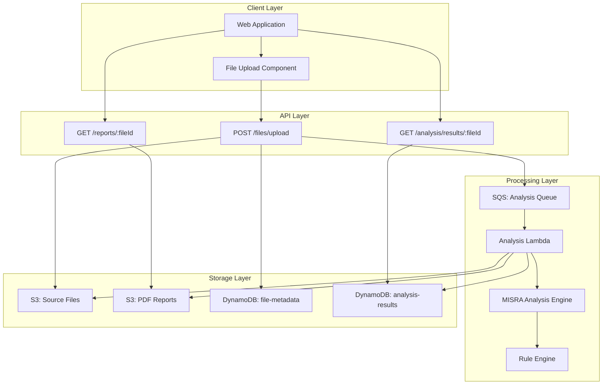
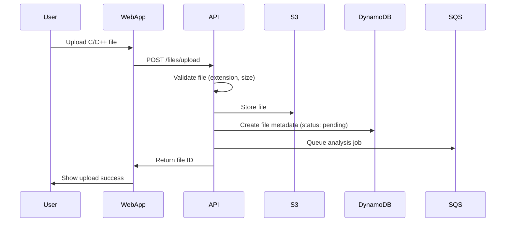
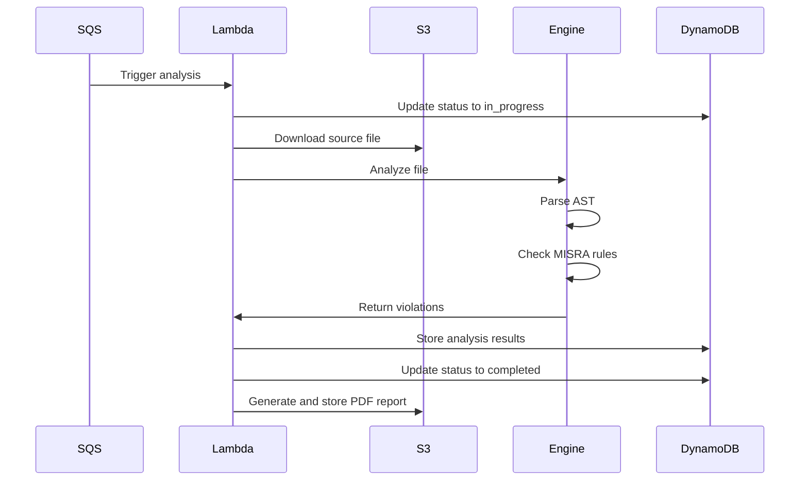

# Design Document: MISRA C/C++ Code Compliance Analyzer

## Overview

This design document specifies the implementation of a MISRA C/C++ Code Compliance Analyzer for the MISRA Platform SaaS product. The analyzer performs static code analysis on uploaded C/C++ source files to detect violations of MISRA coding standards (MISRA C:2012 and MISRA C++:2008).

The design emphasizes:
- **Accurate violation detection**: Comprehensive rule implementation with AST-based analysis
- **Integration with existing platform**: Reuses file upload, authentication, and storage infrastructure
- **Scalable architecture**: Lambda-based analysis with SQS queuing for high load
- **User-friendly reporting**: Clear violation reports with code context and fix recommendations
- **Performance**: Analysis completes within 60 seconds for files up to 10MB

## Architecture

### High-Level Architecture



## Component Design

### 1. Analysis Engine

The core component that orchestrates MISRA analysis.


```typescript
// packages/backend/src/services/misra-analysis/analysis-engine.ts

export class MISRAAnalysisEngine {
  private ruleEngine: RuleEngine;
  private parser: CodeParser;
  
  constructor() {
    this.ruleEngine = new RuleEngine();
    this.parser = new CodeParser();
  }
  
  async analyzeFile(fileContent: string, language: 'C' | 'CPP'): Promise<AnalysisResult> {
    // Parse source code into AST
    const ast = await this.parser.parse(fileContent, language);
    
    // Get applicable rules for language
    const rules = this.ruleEngine.getRulesForLanguage(language);
    
    // Check each rule
    const violations: Violation[] = [];
    for (const rule of rules) {
      const ruleViolations = await rule.check(ast, fileContent);
      violations.push(...ruleViolations);
    }
    
    // Calculate compliance
    const compliance = this.calculateCompliance(rules.length, violations.length);
    
    return {
      violations,
      compliance,
      rulesChecked: rules.length,
      violationCount: violations.length,
    };
  }
  
  private calculateCompliance(totalRules: number, violationCount: number): number {
    return ((totalRules - violationCount) / totalRules) * 100;
  }
}
```

### 2. Rule Engine

Manages MISRA rule implementations and execution.

```typescript
// packages/backend/src/services/misra-analysis/rule-engine.ts

export class RuleEngine {
  private rules: Map<string, MISRARule> = new Map();
  
  constructor() {
    this.loadRules();
  }
  
  private loadRules() {
    // Load MISRA C:2012 rules
    this.rules.set('MISRA-C-1.1', new Rule_C_1_1());
    this.rules.set('MISRA-C-1.2', new Rule_C_1_2());
    // ... load all 168 MISRA C rules
    
    // Load MISRA C++:2008 rules
    this.rules.set('MISRA-CPP-0-1-1', new Rule_CPP_0_1_1());
    // ... load all 228 MISRA C++ rules
  }
  
  getRulesForLanguage(language: 'C' | 'CPP'): MISRARule[] {
    const prefix = language === 'C' ? 'MISRA-C-' : 'MISRA-CPP-';
    return Array.from(this.rules.values())
      .filter(rule => rule.id.startsWith(prefix));
  }
  
  getRule(ruleId: string): MISRARule | undefined {
    return this.rules.get(ruleId);
  }
}
```

### 3. Code Parser

Parses C/C++ source code into Abstract Syntax Trees.

```typescript
// packages/backend/src/services/misra-analysis/code-parser.ts

import { exec } from 'child_process';
import { promisify } from 'util';

const execAsync = promisify(exec);

export class CodeParser {
  async parse(sourceCode: string, language: 'C' | 'CPP'): Promise<AST> {
    // Write source to temp file
    const tempFile = `/tmp/${Date.now()}.${language === 'C' ? 'c' : 'cpp'}`;
    await fs.writeFile(tempFile, sourceCode);
    
    try {
      // Use Clang to generate AST dump
      const { stdout } = await execAsync(
        `clang -Xclang -ast-dump=json -fsyntax-only ${tempFile}`
      );
      
      const ast = JSON.parse(stdout);
      return ast;
    } finally {
      // Clean up temp file
      await fs.unlink(tempFile);
    }
  }
}
```

### 4. MISRA Rule Base Class

Abstract base class for all MISRA rule implementations.

```typescript
// packages/backend/src/services/misra-analysis/rules/misra-rule.ts

export abstract class MISRARule {
  abstract id: string;
  abstract description: string;
  abstract severity: 'mandatory' | 'required' | 'advisory';
  abstract category: string;
  
  abstract check(ast: AST, sourceCode: string): Promise<Violation[]>;
  
  protected createViolation(
    lineNumber: number,
    columnNumber: number,
    message: string,
    codeSnippet: string
  ): Violation {
    return {
      ruleId: this.id,
      description: this.description,
      severity: this.severity,
      lineNumber,
      columnNumber,
      message,
      codeSnippet,
    };
  }
}
```

### 5. Example Rule Implementation

Example implementation of MISRA C Rule 1.1.

```typescript
// packages/backend/src/services/misra-analysis/rules/c/rule-1-1.ts

export class Rule_C_1_1 extends MISRARule {
  id = 'MISRA-C-1.1';
  description = 'All code shall conform to ISO 9899:2011';
  severity = 'mandatory' as const;
  category = 'Language compliance';
  
  async check(ast: AST, sourceCode: string): Promise<Violation[]> {
    const violations: Violation[] = [];
    
    // Check for non-standard extensions
    this.traverseAST(ast, (node) => {
      if (this.isNonStandardExtension(node)) {
        violations.push(this.createViolation(
          node.loc.start.line,
          node.loc.start.column,
          'Non-standard language extension detected',
          this.getCodeSnippet(sourceCode, node.loc)
        ));
      }
    });
    
    return violations;
  }
  
  private isNonStandardExtension(node: ASTNode): boolean {
    // Implementation specific to rule
    return false;
  }
}
```

## Data Models

### File Metadata

```typescript
interface FileMetadata {
  file_id: string;
  user_id: string;
  organization_id: string;
  filename: string;
  file_type: 'c' | 'cpp' | 'h' | 'hpp';
  file_size: number;
  upload_timestamp: number;
  analysis_status: 'pending' | 'in_progress' | 'completed' | 'failed';
  s3_key: string;
  created_at: number;
  updated_at: number;
}
```

### Analysis Result

```typescript
interface AnalysisResult {
  analysisId: string;
  fileId: string;
  userId: string;
  organizationId: string;
  language: 'C' | 'CPP';
  standard: 'MISRA-C:2012' | 'MISRA-C++:2008';
  violations: Violation[];
  violationCount: number;
  rulesChecked: number;
  compliance: number;
  duration: number;
  completionTimestamp: number;
  created_at: number;
}
```

### Violation

```typescript
interface Violation {
  ruleId: string;
  description: string;
  severity: 'mandatory' | 'required' | 'advisory';
  lineNumber: number;
  columnNumber: number;
  message: string;
  codeSnippet: string;
  recommendation?: string;
}
```

## Analysis Workflow

### File Upload and Analysis Trigger



### Analysis Execution



## MISRA Rule Implementation Strategy

### Phase 1: Core Rules (Weeks 1-2)
Implement 20 most common/critical rules:
- MISRA C: Rules 1.1, 2.1, 8.1, 8.2, 8.4, 9.1, 10.1, 10.3, 11.1, 11.3
- MISRA C++: Rules 0-1-1, 2-10-1, 5-0-1, 5-2-1, 6-2-1, 7-1-1, 8-5-1, 9-3-1

### Phase 2: Extended Rules (Weeks 3-4)
Implement 50 additional high-priority rules

### Phase 3: Complete Coverage (Weeks 5-6)
Implement remaining rules for full coverage

### Rule Priority Matrix

| Priority | MISRA C | MISRA C++ | Rationale |
|----------|---------|-----------|-----------|
| P1 (Critical) | 20 rules | 15 rules | Safety-critical, common violations |
| P2 (High) | 50 rules | 40 rules | Important for compliance |
| P3 (Medium) | 60 rules | 100 rules | Good practice |
| P4 (Low) | 38 rules | 73 rules | Edge cases |

## Performance Optimization

### Caching Strategy

```typescript
class AnalysisCache {
  async getCachedResult(fileHash: string): Promise<AnalysisResult | null> {
    // Check if identical file was analyzed before
    const cached = await dynamoDB.query({
      TableName: 'analysis-cache',
      KeyConditionExpression: 'fileHash = :hash',
      ExpressionAttributeValues: { ':hash': fileHash },
    });
    
    if (cached.Items.length > 0) {
      return cached.Items[0];
    }
    
    return null;
  }
}
```

### Parallel Rule Checking

```typescript
async analyzeFile(ast: AST, sourceCode: string): Promise<AnalysisResult> {
  const rules = this.ruleEngine.getRulesForLanguage(language);
  
  // Check rules in parallel
  const violationPromises = rules.map(rule => rule.check(ast, sourceCode));
  const violationArrays = await Promise.all(violationPromises);
  
  const violations = violationArrays.flat();
  
  return {
    violations,
    compliance: this.calculateCompliance(rules.length, violations.length),
  };
}
```

## Report Generation

### PDF Report Structure

1. **Executive Summary**
   - Compliance percentage
   - Total violations by severity
   - Overall assessment

2. **Detailed Violations**
   - Grouped by severity
   - Line number and code snippet
   - Rule description and recommendation

3. **Appendix**
   - Full rule reference
   - Glossary of terms

### Report Generation Implementation

```typescript
// packages/backend/src/services/misra-analysis/report-generator.ts

import PDFDocument from 'pdfkit';

export class ReportGenerator {
  async generatePDF(analysisResult: AnalysisResult): Promise<Buffer> {
    const doc = new PDFDocument();
    const chunks: Buffer[] = [];
    
    doc.on('data', chunk => chunks.push(chunk));
    
    // Title page
    doc.fontSize(24).text('MISRA Compliance Report', { align: 'center' });
    doc.moveDown();
    
    // Executive summary
    doc.fontSize(16).text('Executive Summary');
    doc.fontSize(12).text(`Compliance: ${analysisResult.compliance.toFixed(2)}%`);
    doc.text(`Total Violations: ${analysisResult.violationCount}`);
    
    // Violations by severity
    const bySeverity = this.groupBySeverity(analysisResult.violations);
    doc.text(`Mandatory: ${bySeverity.mandatory.length}`);
    doc.text(`Required: ${bySeverity.required.length}`);
    doc.text(`Advisory: ${bySeverity.advisory.length}`);
    
    // Detailed violations
    doc.addPage();
    doc.fontSize(16).text('Detailed Violations');
    
    for (const violation of analysisResult.violations) {
      doc.fontSize(12).text(`Rule ${violation.ruleId}: ${violation.description}`);
      doc.fontSize(10).text(`Line ${violation.lineNumber}: ${violation.message}`);
      doc.font('Courier').text(violation.codeSnippet);
      doc.moveDown();
    }
    
    doc.end();
    
    return new Promise((resolve) => {
      doc.on('end', () => resolve(Buffer.concat(chunks)));
    });
  }
}
```

## Testing Strategy

### Unit Tests

Test each MISRA rule implementation with known violations:

```typescript
describe('Rule_C_1_1', () => {
  it('should detect non-standard extensions', async () => {
    const sourceCode = `
      int main() {
        typeof(int) x = 5;  // GNU extension
        return 0;
      }
    `;
    
    const ast = await parser.parse(sourceCode, 'C');
    const rule = new Rule_C_1_1();
    const violations = await rule.check(ast, sourceCode);
    
    expect(violations).toHaveLength(1);
    expect(violations[0].ruleId).toBe('MISRA-C-1.1');
  });
});
```

### Integration Tests

Test complete analysis workflow:

```typescript
describe('MISRA Analysis Integration', () => {
  it('should analyze C file and return violations', async () => {
    const fileContent = fs.readFileSync('test-files/violations.c', 'utf-8');
    
    const engine = new MISRAAnalysisEngine();
    const result = await engine.analyzeFile(fileContent, 'C');
    
    expect(result.violations.length).toBeGreaterThan(0);
    expect(result.compliance).toBeLessThan(100);
  });
});
```

## Security Considerations

1. **Input Validation**: Validate file extensions and content before analysis
2. **Sandboxing**: Run analysis in isolated Lambda environment
3. **Resource Limits**: Set memory and timeout limits to prevent abuse
4. **Code Privacy**: Never log source code content
5. **Access Control**: Enforce user/organization isolation

## Cost Estimation

### Per-Analysis Cost

- Lambda execution (1GB, 30s): $0.0005
- S3 storage (10MB): $0.00023/month
- DynamoDB writes (2 items): $0.0000025
- **Total per analysis**: ~$0.001

### Monthly Cost (10,000 analyses)

- Lambda: $5
- S3: $2.30
- DynamoDB: $0.025
- **Total**: ~$7.50/month

## Conclusion

This design provides a comprehensive approach to implementing MISRA C/C++ code compliance analysis. The architecture integrates seamlessly with the existing platform while providing accurate, scalable, and user-friendly MISRA violation detection and reporting.
