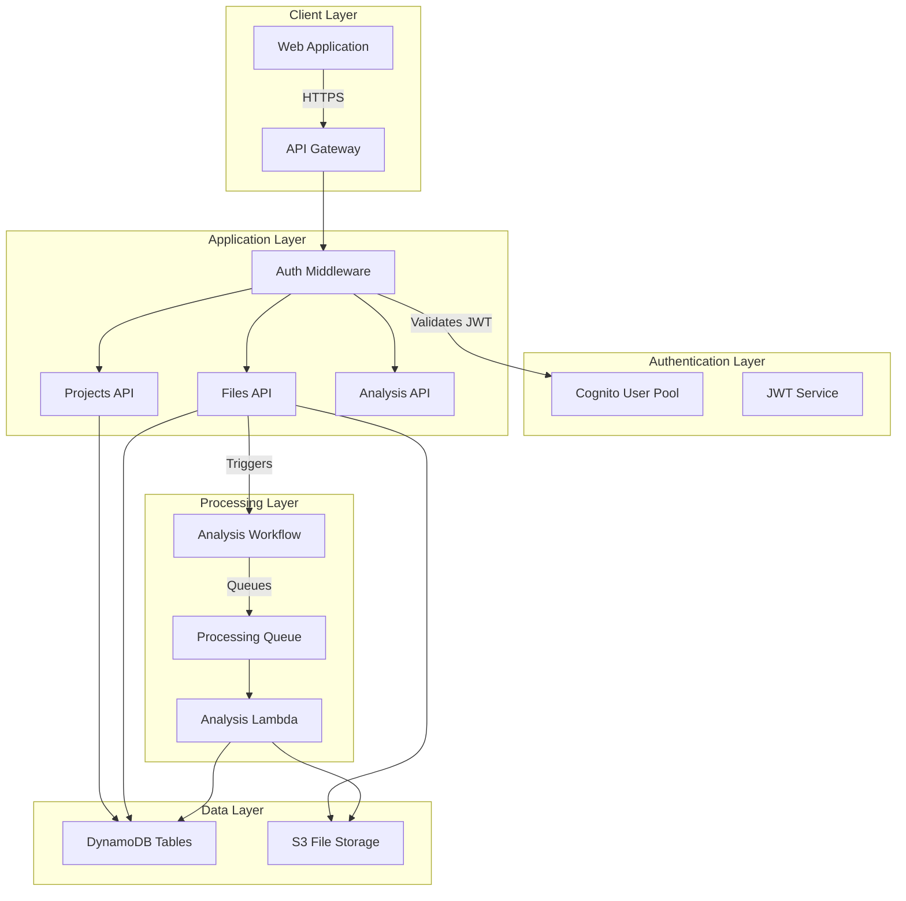
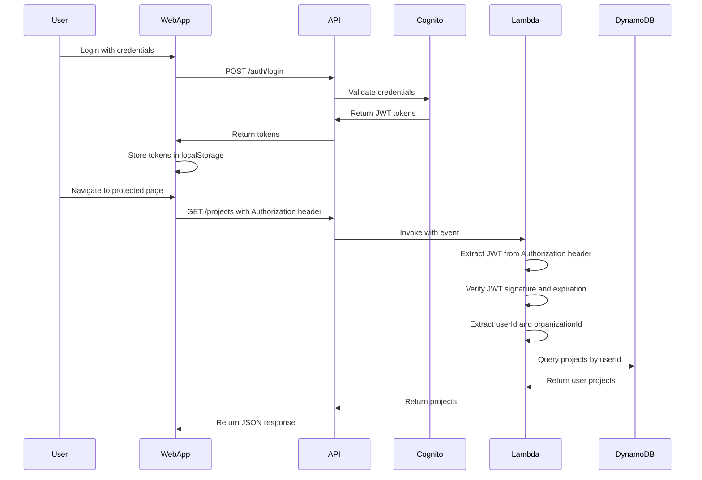
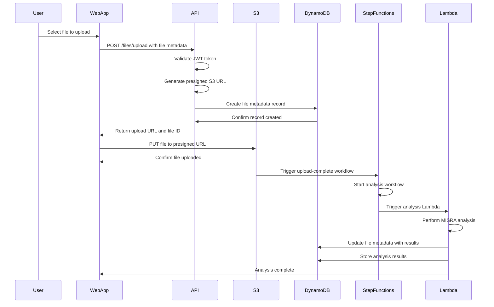
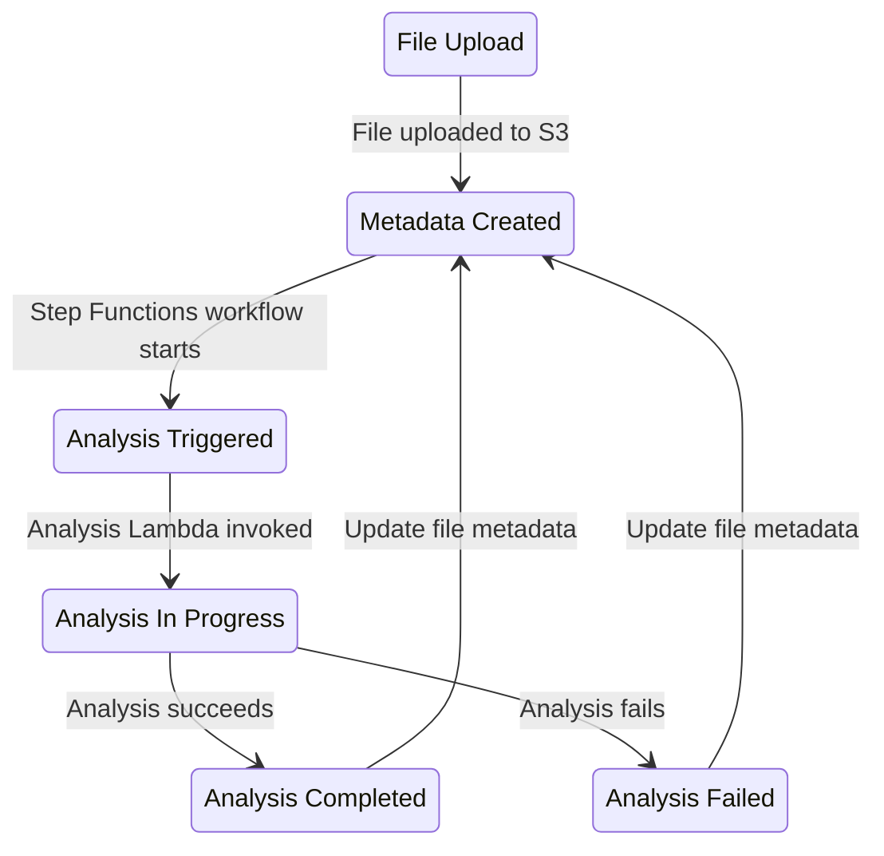
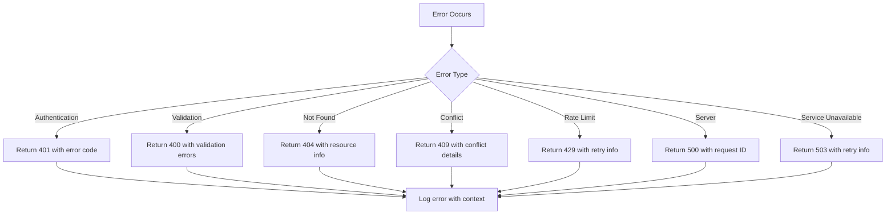

# Design Document: MISRA Platform SaaS Product

## Overview

The MISRA Platform is a SaaS product for MISRA compliance testing of C/C++ code. This design document outlines the architecture and implementation approach for building a production-ready platform that addresses the following issues:

1. **Projects**: The `get-projects` endpoint returns demo data instead of real user projects. The `create-project` function doesn't save to DynamoDB.
2. **File Uploads**: The upload function creates metadata but the file metadata service has complex validation that may be failing.
3. **AI Analysis**: The analysis functionality needs to be connected properly to the file upload flow.
4. **Real-time Data**: Need to remove demo data and connect to real DynamoDB tables.

This design addresses all these issues while maintaining security, scalability, and reliability.

## Architecture

### High-Level Architecture



### Component Breakdown

1. **Authentication Layer**
   - Cognito User Pool for user management
   - JWT-based authentication with access and refresh tokens
   - API Gateway with Lambda authorizer

2. **API Layer**
   - RESTful API endpoints for projects, files, and analysis
   - Centralized error handling
   - Request validation

3. **Data Layer**
   - DynamoDB for structured data (projects, files, analysis results)
   - S3 for file storage with presigned URLs
   - Global Secondary Indexes for efficient querying

4. **Processing Layer**
   - Step Functions for analysis orchestration
   - SQS for async processing
   - Lambda functions for analysis execution

## Database Schema

### Projects Table

| Attribute | Type | Description |
|-----------|------|-------------|
| projectId | String | Primary key - UUID v4 |
| userId | String | User identifier from JWT |
| organizationId | String | Organization identifier |
| name | String | Project name |
| description | String | Project description |
| targetUrl | String | Target URL for testing |
| environment | String | Environment (dev/staging/production) |
| createdAt | Number | Unix timestamp |
| updatedAt | Number | Unix timestamp |
| deleted | Boolean | Soft delete flag |

**Global Secondary Indexes:**
- `UserIndex`: Partition key on `userId`, sort key on `createdAt`
- `OrganizationIndex`: Partition key on `organizationId`, sort key on `createdAt`

### File Metadata Table

| Attribute | Type | Description |
|-----------|------|-------------|
| file_id | String | Primary key - UUID v4 |
| user_id | String | User identifier from JWT |
| organization_id | String | Organization identifier |
| filename | String | Original filename |
| file_type | String | File type (c/cpp/h/hpp) |
| file_size | Number | File size in bytes |
| upload_timestamp | Number | Unix timestamp |
| analysis_status | String | Analysis status (pending/in_progress/completed/failed) |
| analysis_results | Map | Analysis results (optional) |
| s3_key | String | S3 object key |
| created_at | Number | Record creation timestamp |
| updated_at | Number | Last modification timestamp |

**Global Secondary Indexes:**
- `UserIndex`: Partition key on `user_id`, sort key on `upload_timestamp`
- `StatusIndex`: Partition key on `analysis_status`, sort key on `upload_timestamp`
- `UserStatusIndex`: Partition key on `user_id`, sort key on `analysis_status`

### Analysis Results Table

| Attribute | Type | Description |
|-----------|------|-------------|
| analysisId | String | Primary key - UUID v4 |
| fileId | String | File identifier |
| userId | String | User identifier |
| organizationId | String | Organization identifier |
| violations_count | Number | Number of violations found |
| rules_checked | List | List of MISRA rules checked |
| completion_timestamp | Number | Analysis completion timestamp |
| error_message | String | Error message (if failed) |
| violations | List | Detailed violation records |
| report | Map | Analysis report (summary, recommendations) |
| created_at | Number | Record creation timestamp |

**Global Secondary Indexes:**
- `FileIndex`: Partition key on `fileId`, sort key on `created_at`
- `UserIndex`: Partition key on `userId`, sort key on `created_at`
- `OrganizationIndex`: Partition key on `organizationId`, sort key on `created_at`

## API Design

### Authentication Endpoints

#### POST /auth/login
Authenticates a user and returns JWT tokens.

**Request Body:**
```json
{
  "email": "user@example.com",
  "password": "securePassword123"
}
```

**Response (200 OK):**
```json
{
  "user": {
    "userId": "uuid",
    "email": "user@example.com",
    "name": "User Name",
    "role": "developer",
    "organizationId": "org-uuid"
  },
  "accessToken": "jwt-token",
  "refreshToken": "refresh-jwt-token",
  "expiresIn": 900
}
```

#### POST /auth/refresh
Refreshes an expired access token.

**Request Body:**
```json
{
  "refreshToken": "refresh-jwt-token"
}
```

**Response (200 OK):**
```json
{
  "accessToken": "new-jwt-token",
  "refreshToken": "new-refresh-jwt-token",
  "expiresIn": 900
}
```

### Project Management Endpoints

#### POST /projects
Creates a new project.

**Request Body:**
```json
{
  "name": "My Project",
  "description": "Project description",
  "targetUrl": "https://example.com",
  "environment": "dev"
}
```

**Response (201 Created):**
```json
{
  "projectId": "uuid",
  "userId": "user-uuid",
  "organizationId": "org-uuid",
  "name": "My Project",
  "description": "Project description",
  "targetUrl": "https://example.com",
  "environment": "dev",
  "createdAt": 1234567890,
  "updatedAt": 1234567890
}
```

#### GET /projects
Lists all projects for the authenticated user.

**Response (200 OK):**
```json
{
  "projects": [
    {
      "projectId": "uuid",
      "userId": "user-uuid",
      "name": "My Project",
      "description": "Project description",
      "targetUrl": "https://example.com",
      "environment": "dev",
      "createdAt": 1234567890,
      "updatedAt": 1234567890
    }
  ]
}
```

#### PUT /projects/{projectId}
Updates an existing project.

**Request Body:**
```json
{
  "name": "Updated Project",
  "description": "Updated description"
}
```

**Response (200 OK):**
```json
{
  "projectId": "uuid",
  "userId": "user-uuid",
  "name": "Updated Project",
  "description": "Updated description",
  "targetUrl": "https://example.com",
  "environment": "dev",
  "createdAt": 1234567890,
  "updatedAt": 1234567890
}
```

### File Upload Endpoints

#### POST /files/upload
Requests a presigned S3 URL for file upload.

**Request Body:**
```json
{
  "fileName": "app.c",
  "fileSize": 1024,
  "contentType": "text/x-c"
}
```

**Response (200 OK):**
```json
{
  "fileId": "uuid",
  "uploadUrl": "https://s3.amazonaws.com/bucket/key?X-Amz-Algorithm=...",
  "downloadUrl": "https://s3.amazonaws.com/bucket/key?X-Amz-Algorithm=...",
  "expiresIn": 3600
}
```

#### GET /files
Lists all files for the authenticated user.

**Response (200 OK):**
```json
{
  "files": [
    {
      "file_id": "uuid",
      "user_id": "user-uuid",
      "filename": "app.c",
      "file_type": "c",
      "file_size": 1024,
      "upload_timestamp": 1234567890,
      "analysis_status": "completed",
      "s3_key": "uploads/org/user/timestamp-fileid-filename",
      "created_at": 1234567890,
      "updated_at": 1234567890
    }
  ]
}
```

### Analysis Endpoints

#### GET /analysis/results/{fileId}
Retrieves analysis results for a file.

**Response (200 OK):**
```json
{
  "analysisId": "uuid",
  "fileId": "file-uuid",
  "userId": "user-uuid",
  "violations_count": 5,
  "rules_checked": ["MISRA-C:2004 Rule 1.1", "MISRA-C:2004 Rule 2.1"],
  "completion_timestamp": 1234567890,
  "violations": [...],
  "report": {...}
}
```

## Authentication Flow



## File Upload Flow



## AI Analysis Workflow



## Error Handling Strategy

### Error Response Format

All error responses follow a consistent format:

```json
{
  "error": {
    "code": "ERROR_CODE",
    "message": "Descriptive error message",
    "timestamp": "2024-01-01T00:00:00.000Z",
    "requestId": "unique-request-id"
  }
}
```

### Error Codes

| Code | HTTP Status | Description |
|------|-------------|-------------|
| `UNAUTHORIZED` | 401 | Authentication required or token invalid |
| `FORBIDDEN` | 403 | Insufficient permissions |
| `VALIDATION_ERROR` | 400 | Request validation failed |
| `NOT_FOUND` | 404 | Resource not found |
| `CONFLICT` | 409 | Resource already exists |
| `RATE_LIMIT_EXCEEDED` | 429 | Rate limit exceeded |
| `INTERNAL_ERROR` | 500 | Internal server error |
| `SERVICE_UNAVAILABLE` | 503 | Service temporarily unavailable |

### Error Handling Flow



### Retry Strategy

- **Database errors**: Retry with exponential backoff (1s, 2s, 4s, 8s)
- **Network errors**: Retry up to 5 times with 2s base delay
- **Rate limit errors**: Respect retry-after header
- **Validation errors**: No retry (client error)

## Testing Strategy

### Dual Testing Approach

1. **Unit Tests**
   - Verify specific examples and edge cases
   - Test error conditions and validation
   - Focus on integration points between components

2. **Property-Based Tests**
   - Verify universal properties across all inputs
   - Test data isolation and security
   - Validate API contract compliance

### Property-Based Testing Configuration

- **Library**: fast-check (Node.js)
- **Iterations**: Minimum 100 per property test
- **Tags**: **Feature: misra-platform-saas, Property {number}**

### Test Coverage

| Requirement | Test Type | Coverage |
|-------------|-----------|----------|
| Authentication | Property | JWT validation, token expiration |
| Project CRUD | Property | Create, read, update, delete |
| File Upload | Property | Presigned URL generation, metadata creation |
| Analysis | Property | Status updates, result storage |
| Error Handling | Example | Error responses, validation errors |
| Data Isolation | Property | User-specific data access |

## Implementation Tasks

### Phase 1: Infrastructure Setup
1. Deploy DynamoDB tables with proper indexes
2. Configure S3 bucket with security settings
3. Set up Cognito user pool and client
4. Configure API Gateway with authentication

### Phase 2: Authentication
1. Implement JWT service for token generation/verification
2. Create auth middleware for Lambda functions
3. Implement login and refresh endpoints

### Phase 3: Project Management
1. Update `create-project` to save to DynamoDB
2. Update `get-projects` to query DynamoDB
3. Implement project update and delete endpoints

### Phase 4: File Upload
1. Fix file metadata service validation
2. Ensure presigned URL generation works
3. Implement file metadata creation on upload

### Phase 5: Analysis Integration
1. Connect analysis workflow to file upload
2. Implement analysis status updates
3. Store and retrieve analysis results

### Phase 6: Testing
1. Write unit tests for all services
2. Write property-based tests for key properties
3. Integration testing for end-to-end flows

## Security Considerations

1. **Authentication**: JWT tokens with short expiration (15 minutes)
2. **Authorization**: Role-based access control (RBAC)
3. **Data Isolation**: User-specific queries with userId filtering
4. **File Security**: S3 bucket policies with SSL enforcement
5. **Secrets Management**: JWT secret stored in AWS Secrets Manager
6. **Input Validation**: Comprehensive validation on all endpoints
7. **Error Handling**: No sensitive information in error messages

## Performance Considerations

1. **DynamoDB**: On-demand billing for scalability
2. **Caching**: Consider Redis for frequently accessed data
3. **Async Processing**: SQS for analysis queue
4. **Lambda**: Memory and timeout configured for analysis workload
5. **S3**: Presigned URLs for direct client-to-S3 uploads

## Monitoring and Logging

1. **CloudWatch Logs**: All Lambda functions log to CloudWatch
2. **X-Ray Tracing**: Enabled for debugging distributed systems
3. **Alarms**: DLQ depth, error rates, latency
4. **Metrics**: API request counts, error rates, latency percentiles

## Deployment Strategy

1. **Infrastructure**: CDK for IaC
2. **CI/CD**: GitHub Actions for automated deployment
3. **Environments**: dev, staging, production
4. **Rollback**: Versioned Lambda functions with aliases

## Conclusion

This design provides a comprehensive approach to building a production-ready MISRA Platform SaaS product. The architecture emphasizes security, scalability, and maintainability while addressing all the issues identified in the requirements document.

## Correctness Properties

*A property is a characteristic or behavior that should hold true across all valid executions of a system-essentially, a formal statement about what the system should do. Properties serve as the bridge between human-readable specifications and machine-verifiable correctness guarantees.*

### Property Reflection

After analyzing all acceptance criteria, the following properties were identified as testable:

**Testable Properties:**
- Authentication: JWT validation, token expiration, user extraction
- Project CRUD: Create, read, update, delete operations
- File Upload: Presigned URL generation, metadata creation, S3 key format
- Analysis: Status updates, result storage, data isolation
- Error Handling: Error responses, validation errors
- Data Isolation: User-specific data access

**Non-Testable Criteria:**
- Infrastructure deployment verification (requires manual testing)
- UI-specific behavior (requires UI testing)

### Property 1: JWT Token Validation

*For any* JWT token, if the token is valid (properly signed, not expired, correct issuer/audience), then the system shall successfully extract the userId and organizationId from the token payload.

*For any* JWT token, if the token is invalid (expired, malformed, wrong signature), then the system shall return a 401 Unauthorized response.

**Validates: Requirements 1.1, 1.2, 1.3, 1.4**

### Property 2: Authentication Enforcement

*For any* protected API endpoint, if a request is made without a valid JWT token, then the system shall return a 401 Unauthorized response.

*For any* protected API endpoint, if a request is made with a valid JWT token, then the system shall process the request and return the appropriate response.

**Validates: Requirements 1.5**

### Property 3: Project Creation

*For any* authenticated user, when creating a project with valid data, the system shall:
- Generate a unique projectId (UUID v4)
- Associate the project with the user's userId
- Store the project in DynamoDB
- Return the created project with its ID

**Validates: Requirements 2.1, 2.5**

### Property 4: Project Data Isolation

*For any* user, when listing projects, the system shall return only projects that belong to that user (matching userId).

*For any* two different users, the projects returned for each user shall be disjoint (no overlap).

**Validates: Requirements 2.2**

### Property 5: Project Update and Delete

*For any* existing project, when updating it with valid data, the system shall:
- Update the project in DynamoDB
- Update the updatedAt timestamp
- Return the updated project

*For any* existing project, when deleting it, the system shall:
- Mark the project as deleted in DynamoDB
- Return a successful response

**Validates: Requirements 2.3, 2.4**

### Property 6: Project Error Handling

*For any* project creation request missing required fields, the system shall return a 400 Bad Request response with specific validation errors.

*For any* project update request referencing a non-existent project, the system shall return a 404 Not Found response.

*For any* project deletion request referencing a non-existent project, the system shall return a 404 Not Found response.

**Validates: Requirements 2.6, 2.7, 2.8**

### Property 7: File Upload URL Generation

*For any* file upload request with valid metadata, the system shall:
- Generate a presigned S3 URL with correct permissions
- Include the file metadata in S3 object metadata
- Return the upload URL with a 1-hour expiration

**Validates: Requirements 3.1**

### Property 8: File Upload S3 Key Format

*For any* file upload, the S3 key shall follow the format: `uploads/{organizationId}/{userId}/{timestamp}-{fileId}-{fileName}`

**Validates: Requirements 3.6**

### Property 9: File Metadata Creation

*For any* file upload, when the file is uploaded to S3, the system shall:
- Create a file metadata record in DynamoDB
- Set the analysis_status to PENDING
- Generate a unique file_id (UUID v4)
- Set created_at and updated_at timestamps

**Validates: Requirements 3.2, 3.3, 3.7**

### Property 10: File Metadata Validation

*For any* file metadata creation request with invalid data, the system shall return a 400 Bad Request response with specific validation errors.

*For any* file metadata update request with invalid data, the system shall return a 400 Bad Request response with specific validation errors.

**Validates: Requirements 3.4, 3.5, 4.1, 4.2, 4.5**

### Property 11: File Metadata Timestamps

*For any* file metadata record, when created, the system shall set both created_at and updated_at timestamps.

*For any* file metadata record, when updated, the system shall update the updated_at timestamp while keeping created_at unchanged.

**Validates: Requirements 4.6, 4.7**

### Property 12: File Data Isolation

*For any* user, when listing files, the system shall return only files that belong to that user (matching user_id).

*For any* two different users, the files returned for each user shall be disjoint (no overlap).

**Validates: Requirements 4.4**

### Property 13: Analysis Status Transitions

*For any* file upload, the analysis_status shall transition through the following states:
1. PENDING (initial state)
2. IN_PROGRESS (when analysis starts)
3. COMPLETED (when analysis succeeds) or FAILED (when analysis fails)

**Validates: Requirements 5.2, 5.3, 5.4**

### Property 14: Analysis Result Storage

*For any* completed analysis, the system shall:
- Store analysis results in DynamoDB
- Include all MISRA violations found
- Include the rules_checked list
- Set completion_timestamp

**Validates: Requirements 5.5, 5.8**

### Property 15: Analysis Result Retrieval

*For any* file with completed analysis, when requesting analysis results, the system shall return the complete results from DynamoDB.

*For any* file without analysis results, when requesting results, the system shall return a 404 Not Found response.

**Validates: Requirements 5.6, 5.7**

### Property 16: Real Data Access

*For any* user, when listing projects, the system shall query DynamoDB and return real user projects (not demo data).

*For any* user, when listing files, the system shall query DynamoDB and return real user files (not demo data).

*For any* user, when requesting analysis results, the system shall query DynamoDB and return real results (not demo data).

**Validates: Requirements 6.1, 6.2, 6.3**

### Property 17: Empty Result Handling

*For any* user with no projects, when listing projects, the system shall return an empty array.

*For any* user with no files, when listing files, the system shall return an empty array.

**Validates: Requirement 6.4**

### Property 18: Error Logging

*For any* error that occurs, the system shall log the error with sufficient context for debugging (errorId, timestamp, stack trace, context).

**Validates: Requirements 7.1**

### Property 19: Error Response Format

*For any* error that occurs, the system shall return a descriptive error message to the user in a consistent format with error code, message, timestamp, and requestId.

**Validates: Requirements 7.2**

### Property 20: Database Retry Logic

*For any* database operation that fails due to a retryable error (throttling, connection issues), the system shall retry the operation with exponential backoff.

**Validates: Requirements 7.3**

### Property 21: Service Unavailable Handling

*For any* request when a service is temporarily unavailable, the system shall return a 503 Service Unavailable response.

**Validates: Requirements 7.4**

### Property 22: API Response Status Codes

*For any* successful API request, the system shall return the appropriate status code (200 OK, 201 Created).

*For any* validation error, the system shall return a 400 Bad Request response.

*For any* authentication error, the system shall return a 401 Unauthorized response.

*For any* resource not found, the system shall return a 404 Not Found response.

*For any* server error, the system shall return a 500 Internal Server Error response.

*For any* service unavailable, the system shall return a 503 Service Unavailable response.

**Validates: Requirements 8.1, 8.2, 8.3, 8.4, 8.5, 8.6, 8.7**

### Property 23: Request ID Inclusion

*For any* error response, the system shall include a unique requestId for tracking.

**Validates: Requirement 8.8**

### Property 24: CORS Configuration

*For any* CORS preflight request, the system shall respond with the appropriate CORS headers (Access-Control-Allow-Origin, Access-Control-Allow-Headers, Access-Control-Allow-Methods).

*For any* request to the API, the system shall include the Access-Control-Allow-Origin header in the response.

**Validates: Requirements 9.1, 9.2, 9.3, 9.4**

### Property 25: Infrastructure Deployment

*For any* infrastructure deployment, the system shall:
- Create all required DynamoDB tables with proper indexes
- Create an S3 bucket for file storage
- Configure Cognito for user authentication
- Configure API Gateway with proper authentication
- Set up CloudWatch logging for all Lambda functions
- Configure proper IAM roles and policies
- Enable X-Ray tracing for debugging
- Set up proper error monitoring and alerting

**Validates: Requirements 10.1, 10.2, 10.3, 10.4, 10.5, 10.6, 10.7, 10.8**

## Testing Strategy

### Dual Testing Approach

**Unit Tests:**
- Verify specific examples and edge cases
- Test error conditions and validation
- Focus on integration points between components

**Property-Based Tests:**
- Verify universal properties across all inputs
- Test data isolation and security
- Validate API contract compliance

Both unit tests and property tests are complementary and necessary for comprehensive coverage.

### Property-Based Testing Configuration

- **Library**: fast-check (Node.js)
- **Iterations**: Minimum 100 per property test (due to randomization)
- **Tags**: **Feature: misra-platform-saas, Property {number}**

Each correctness property MUST be implemented by a SINGLE property-based test.

### Unit Testing Balance

Unit tests are helpful for specific examples and edge cases. Avoid writing too many unit tests - property-based tests handle covering lots of inputs. Unit tests should focus on:
- Specific examples that demonstrate correct behavior
- Integration points between components
- Edge cases and error conditions

Property tests should focus on:
- Universal properties that hold for all inputs
- Comprehensive input coverage through randomization

### Test Coverage

| Requirement | Test Type | Coverage |
|-------------|-----------|----------|
| Authentication | Property | JWT validation, token expiration, user extraction |
| Project CRUD | Property | Create, read, update, delete operations |
| File Upload | Property | Presigned URL generation, metadata creation, S3 key format |
| Analysis | Property | Status transitions, result storage, data isolation |
| Error Handling | Example | Error responses, validation errors, retry logic |
| Data Isolation | Property | User-specific data access, empty result handling |
| API Consistency | Property | Status codes, response format, request ID |
| CORS | Property | Header configuration, preflight handling |
| Infrastructure | Property | Table creation, bucket setup, configuration |

### Property Test Examples

```typescript
// Property 1: JWT Token Validation
property("JWT validation returns user data for valid tokens", [genValidJwt(), genInvalidJwt()], async (token) => {
  const result = await jwtService.verifyAccessToken(token);
  if (isValid(token)) {
    expect(result.userId).toBeDefined();
    expect(result.organizationId).toBeDefined();
  } else {
    expect(result).toThrowError('Token verification failed');
  }
});

// Property 3: Project Creation
property("Project creation stores in DynamoDB", [genProjectData()], async (projectData) => {
  const project = await projectService.createProject(userId, projectData);
  const stored = await dynamoDB.get(project.projectId);
  expect(stored).toEqual(project);
});

// Property 4: Project Data Isolation
property("Users only see their own projects", [genUserId(), genUserId()], async (userId1, userId2) => {
  await createProject(userId1, { name: 'Project 1' });
  await createProject(userId2, { name: 'Project 2' });
  
  const projects1 = await getProjects(userId1);
  const projects2 = await getProjects(userId2);
  
  expect(projects1).toHaveLength(1);
  expect(projects1[0].userId).toBe(userId1);
  expect(projects2).toHaveLength(1);
  expect(projects2[0].userId).toBe(userId2);
});
```
