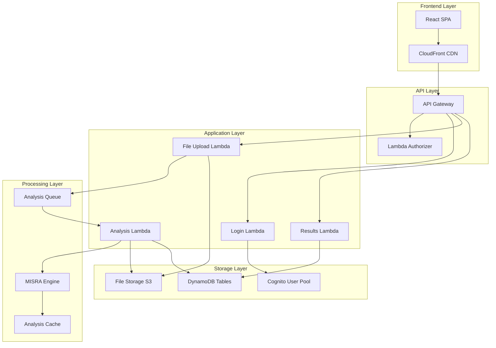

# Design Document: MISRA Production SaaS Platform

## Overview

The MISRA Production SaaS Platform transforms the existing test-button.html automated workflow into a production-ready service for real users. The system replicates the exact seamless experience of the test system (Login → Upload → Analyze → Verify) while leveraging the comprehensive AWS backend infrastructure already deployed.

### Key Design Principles

1. **Experience Consistency**: Maintain the exact same 4-step automated workflow as the test system
2. **Infrastructure Reuse**: Leverage existing AWS Lambda functions, API Gateway, S3, and DynamoDB resources
3. **Production Scalability**: Support 100+ concurrent users with 99.9% uptime
4. **Security First**: Enterprise-grade security for sensitive source code
5. **Real-time Feedback**: Live progress updates throughout the analysis workflow

### Target User Journey

The production system provides the same fully automated experience as the test system:
- **Step 1**: Automatic user registration/login (no manual steps)
- **Step 2**: Automatic file upload using predefined sample C files (no file selection required)
- **Step 3**: Automatic MISRA analysis with live progress updates
- **Step 4**: Immediate results display with compliance scores and downloadable reports

**Key Automation**: Users only click one "Start MISRA Analysis" button - everything else is completely automatic, including file selection and upload.

## Architecture

### High-Level Architecture



### Component Architecture

The system leverages existing infrastructure components:

1. **Frontend**: React SPA with Material-UI components (existing)
2. **CDN**: CloudFront distribution for global delivery (existing)
3. **API Gateway**: HTTP API with CORS and JWT authorization (existing)
4. **Authentication**: Cognito User Pool + Lambda Authorizer (existing)
5. **File Processing**: S3 storage + Lambda functions (existing)
6. **MISRA Analysis**: Comprehensive rule engine with 50+ rules (existing)
7. **Data Storage**: DynamoDB tables for metadata and results (existing)

## Components and Interfaces

### 1. Production Frontend Component

**Purpose**: Replicate the test-button.html experience in a production React application

**Key Features**:
- Same visual design and step indicators as test system
- Real-time terminal-style output showing progress
- Automatic workflow execution (Login → Upload → Analyze → Verify)
- Professional UI with Material-UI components

**Interface**:
```typescript
interface ProductionMISRAApp {
  // Core workflow methods
  runAutomatedWorkflow(): Promise<AnalysisResults>
  handleQuickRegistration(email: string, name?: string): Promise<UserInfo>
  uploadFileToS3(file: File, uploadUrl: string): Promise<void>
  pollAnalysisStatus(analysisId: string): Promise<AnalysisResults>
  
  // UI state management
  updateStepStatus(step: number, status: 'active' | 'completed' | 'failed'): void
  displayRealTimeProgress(progress: number, message: string): void
  showResults(results: AnalysisResults): void
}

interface AnalysisResults {
  analysisId: string
  complianceScore: number
  violations: ViolationDetail[]
  success: boolean
  duration: number
  timestamp: Date
  reportUrl?: string
  fileInfo: {
    name: string
    size: number
    type: string
  }
}
```

### 2. Quick Registration Service

**Purpose**: Enable automatic user registration and authentication without manual intervention

**Implementation**: Extends existing Cognito + Lambda authentication system

**Interface**:
```typescript
interface QuickRegistrationService {
  quickRegister(email: string, name?: string): Promise<AuthResult>
  autoLogin(credentials: UserCredentials): Promise<AuthResult>
  generateSessionToken(user: UserInfo): Promise<string>
}

interface AuthResult {
  accessToken: string
  refreshToken: string
  user: UserInfo
  expiresIn: number
}
```

**Flow**:
1. User provides email address
2. System checks if user exists in Cognito
3. If new user: Auto-create account with temporary password
4. Generate JWT tokens for immediate access
5. Return session tokens for API calls

### 3. Automatic File Upload Service

**Purpose**: Provide fully automatic file upload without any user file selection

**Implementation**: Uses predefined sample C/C++ files stored in the system

**Interface**:
```typescript
interface AutomaticFileUploadService {
  getRandomSampleFile(): Promise<SampleFile>
  uploadSampleFileToS3(sampleFile: SampleFile): Promise<UploadResponse>
  trackUploadProgress(fileId: string): Promise<UploadProgress>
  getSampleFileLibrary(): SampleFile[]
}

interface SampleFile {
  id: string
  name: string
  content: string
  language: 'C' | 'CPP'
  description: string
  expectedViolations: number
  size: number
}

interface UploadProgress {
  fileId: string
  bytesUploaded: number
  totalBytes: number
  percentage: number
  status: 'uploading' | 'completed' | 'failed'
}
```

**Sample File Library**:
The system includes a curated library of sample C/C++ files with known MISRA violations:

```typescript
const sampleFiles: SampleFile[] = [
  {
    id: 'sample-c-basic',
    name: 'basic_violations.c',
    content: `
#include <stdio.h>
#include <stdlib.h>

// MISRA C 2012 Rule 8.4 violation - function not declared
int undeclared_function(int x) {
    return x * 2;
}

int main() {
    int result;
    int unused_var; // MISRA C 2012 Rule 2.2 violation
    
    result = undeclared_function(5);
    printf("Result: %d\\n", result);
    
    return 0;
}`,
    language: 'C',
    description: 'Basic C file with common MISRA violations',
    expectedViolations: 3,
    size: 456
  },
  {
    id: 'sample-cpp-advanced',
    name: 'advanced_violations.cpp',
    content: `
#include <iostream>
using namespace std; // MISRA C++ 2008 Rule 7-3-6 violation

class TestClass {
public:
    int getValue() { return value; } // MISRA C++ 2008 Rule 9-3-1 violation
private:
    int value;
};

int main() {
    TestClass obj;
    cout << obj.getValue() << endl;
    return 0;
}`,
    language: 'CPP',
    description: 'C++ file with namespace and class violations',
    expectedViolations: 2,
    size: 312
  }
];
```

**Automatic Upload Flow**:
1. System randomly selects a sample file from the library
2. Creates a temporary file with realistic metadata
3. Uploads to S3 using existing infrastructure
4. Returns file ID for analysis
5. Displays selected file info to user for transparency

### 4. Real-Time Analysis Monitor

**Purpose**: Provide live progress updates during MISRA analysis

**Implementation**: WebSocket-like polling mechanism using existing Lambda functions

**Interface**:
```typescript
interface AnalysisMonitor {
  startMonitoring(analysisId: string): Promise<void>
  getAnalysisProgress(analysisId: string): Promise<AnalysisProgress>
  subscribeToUpdates(callback: (progress: AnalysisProgress) => void): void
  stopMonitoring(analysisId: string): void
}

interface AnalysisProgress {
  analysisId: string
  status: 'queued' | 'running' | 'completed' | 'failed'
  progress: number // 0-100
  currentStep: string
  estimatedTimeRemaining: number
  rulesProcessed: number
  totalRules: number
}
```

**Implementation Strategy**:
- Poll analysis status every 2 seconds during active analysis
- Use existing DynamoDB tables to track progress
- Leverage existing SQS + Lambda analysis pipeline
- Cache progress updates to minimize API calls

### 5. Results Display Service

**Purpose**: Present analysis results with the same format as test system

**Leverages**: Existing analysis results storage and retrieval

**Interface**:
```typescript
interface ResultsDisplayService {
  formatComplianceResults(results: AnalysisResults): FormattedResults
  generateDownloadableReport(analysisId: string): Promise<string>
  categorizeViolations(violations: ViolationDetail[]): CategorizedViolations
  calculateComplianceMetrics(results: AnalysisResults): ComplianceMetrics
}

interface FormattedResults {
  complianceScore: number
  violationSummary: {
    total: number
    byCategory: Record<string, number>
    bySeverity: Record<string, number>
  }
  detailedViolations: ViolationDetail[]
  recommendations: string[]
  reportDownloadUrl: string
}
```

## Data Models

### User Data Model

**Storage**: Cognito User Pool + DynamoDB Users Table

```typescript
interface UserProfile {
  userId: string
  email: string
  name?: string
  organizationId: string
  role: 'developer' | 'admin'
  preferences: {
    theme: 'light' | 'dark'
    notifications: {
      email: boolean
      webhook: boolean
    }
    defaultMisraRuleSet: 'MISRA_C_2012' | 'MISRA_CPP_2008'
  }
  createdAt: string
  lastLoginAt: string
  isActive: boolean
}
```

**Sample File Storage**: DynamoDB SampleFiles Table

```typescript
interface SampleFile {
  sample_id: string
  filename: string
  file_content: string // Base64 encoded content
  language: 'C' | 'CPP'
  description: string
  expected_violations: number
  file_size: number
  difficulty_level: 'basic' | 'intermediate' | 'advanced'
  created_at: number
  updated_at: number
  
  // Metadata for educational purposes
  violation_categories: string[] // ['declarations', 'expressions', 'statements']
  learning_objectives: string[]
  estimated_analysis_time: number // seconds
}

### File Metadata Model

**Storage**: DynamoDB FileMetadata Table

```typescript
interface FileMetadata {
  file_id: string
  filename: string
  file_type: 'c' | 'cpp'
  file_size: number
  user_id: string
  upload_timestamp: number
  analysis_status: 'pending' | 'in_progress' | 'completed' | 'failed'
  s3_key: string
  created_at: number
  updated_at: number
  
  // Sample file metadata (for automatic uploads)
  is_sample_file: boolean
  sample_id?: string
  sample_description?: string
  expected_violations?: number
  
  // Analysis results (populated after completion)
  violations_count?: number
  compliance_percentage?: number
  analysis_duration?: number
  error_message?: string
}
```

### Analysis Results Model

**Storage**: DynamoDB AnalysisResults Table

```typescript
interface AnalysisResult {
  analysisId: string
  fileId: string
  userId: string
  organizationId: string
  language: 'C' | 'CPP'
  violations: ViolationDetail[]
  summary: AnalysisSummary
  status: 'COMPLETED' | 'FAILED'
  createdAt: string
  timestamp: number
  
  // Performance metrics
  processingTime: number
  rulesEvaluated: number
  cacheHit: boolean
}

interface ViolationDetail {
  ruleId: string
  ruleName: string
  severity: 'mandatory' | 'required' | 'advisory'
  line: number
  column: number
  message: string
  suggestion?: string
  category: string
}

interface AnalysisSummary {
  totalViolations: number
  criticalCount: number
  majorCount: number
  minorCount: number
  compliancePercentage: number
}
```

### Analysis Cache Model

**Storage**: DynamoDB AnalysisCache Table

```typescript
interface AnalysisCache {
  fileHash: string // SHA-256 of file content
  analysisResult: AnalysisResult
  userId: string
  language: 'C' | 'CPP'
  createdAt: string
  expiresAt: number // TTL for cache expiration
  hitCount: number
  lastAccessedAt: string
}
```

## API Design

### Authentication Endpoints

**Base URL**: `https://api.misra.digitransolutions.in`

#### Quick Registration
```http
POST /auth/quick-register
Content-Type: application/json

{
  "email": "user@example.com",
  "name": "John Doe" // optional
}

Response:
{
  "accessToken": "jwt-token",
  "refreshToken": "refresh-token",
  "user": {
    "userId": "user-id",
    "email": "user@example.com",
    "name": "John Doe",
    "isRegistered": true
  },
  "expiresIn": 3600
}
```

#### Standard Login
```http
POST /auth/login
Content-Type: application/json

{
  "email": "user@example.com",
  "password": "password"
}

Response: Same as quick-register
```

### File Upload Endpoints

#### Automatic File Upload
```http
POST /files/upload-sample
Authorization: Bearer {jwt-token}
Content-Type: application/json

{
  "userEmail": "user@example.com",
  "preferredLanguage": "C" // optional: "C" or "CPP"
}

Response:
{
  "fileId": "file-uuid",
  "fileName": "basic_violations.c",
  "fileSize": 456,
  "language": "C",
  "description": "Basic C file with common MISRA violations",
  "expectedViolations": 3,
  "uploadStatus": "completed",
  "s3Key": "samples/basic_violations_uuid.c"
}
```

#### Get Sample File Library
```http
GET /files/samples
Authorization: Bearer {jwt-token}

Response:
{
  "samples": [
    {
      "id": "sample-c-basic",
      "name": "basic_violations.c",
      "language": "C",
      "description": "Basic C file with common MISRA violations",
      "expectedViolations": 3,
      "size": 456
    },
    {
      "id": "sample-cpp-advanced", 
      "name": "advanced_violations.cpp",
      "language": "CPP",
      "description": "C++ file with namespace and class violations",
      "expectedViolations": 2,
      "size": 312
    }
  ]
}
```

### Analysis Endpoints

#### Get Analysis Status
```http
GET /analysis/{analysisId}/status
Authorization: Bearer {jwt-token}

Response:
{
  "analysisId": "analysis-uuid",
  "status": "running",
  "progress": 75,
  "currentStep": "Evaluating MISRA C rules",
  "estimatedTimeRemaining": 30,
  "rulesProcessed": 38,
  "totalRules": 50
}
```

#### Get Analysis Results
```http
GET /analysis/{analysisId}/results
Authorization: Bearer {jwt-token}

Response:
{
  "analysisId": "analysis-uuid",
  "complianceScore": 92.5,
  "violations": [
    {
      "ruleId": "MISRA-C-2012-1.1",
      "ruleName": "All code shall conform to ISO 9899:1990",
      "severity": "mandatory",
      "line": 15,
      "column": 8,
      "message": "Non-standard language extension used",
      "suggestion": "Use standard C syntax"
    }
  ],
  "summary": {
    "totalViolations": 3,
    "criticalCount": 1,
    "majorCount": 2,
    "minorCount": 0,
    "compliancePercentage": 92.5
  },
  "reportDownloadUrl": "https://s3-report-url",
  "processingTime": 2340,
  "timestamp": "2024-01-01T00:00:00Z"
}
```

### Report Generation Endpoints

#### Generate PDF Report
```http
POST /reports/generate
Authorization: Bearer {jwt-token}
Content-Type: application/json

{
  "analysisId": "analysis-uuid",
  "format": "pdf",
  "includeRecommendations": true
}

Response:
{
  "reportId": "report-uuid",
  "downloadUrl": "https://s3-report-url",
  "expiresAt": "2024-01-01T00:00:00Z"
}
```

## User Interface Design

### Main Application Layout

The production UI maintains the exact visual design of the test-button.html system with fully automated workflow:

```typescript
// Main application component structure
const ProductionMISRAApp = () => {
  return (
    <Box sx={{ 
      minHeight: '100vh',
      background: 'linear-gradient(135deg, #667eea 0%, #764ba2 100%)',
      display: 'flex',
      alignItems: 'center',
      justifyContent: 'center',
      p: 2.5
    }}>
      <Container maxWidth="md">
        <Paper sx={{ borderRadius: 3, boxShadow: '0 20px 60px rgba(0, 0, 0, 0.3)', p: 5 }}>
          <Header />
          <AutomatedQuickStartForm />
          <StepIndicator steps={steps} currentStep={currentStep} />
          <ProgressDisplay />
          <ActionButtons />
          <TerminalOutput />
          <ResultsDisplay />
        </Paper>
      </Container>
    </Box>
  )
}
```

### Automated Quick Start Form

Simplified form that only requires email - no file selection needed:

```typescript
const AutomatedQuickStartForm = () => {
  const [email, setEmail] = useState('')
  const [name, setName] = useState('')
  
  return (
    <Paper sx={{ backgroundColor: '#f8f9fa', borderRadius: 2, p: 3, mb: 3 }}>
      <Typography variant="h6" sx={{ mb: 2, color: '#333' }}>
        📋 Quick Start - Fully Automated Analysis
      </Typography>
      
      <Grid container spacing={2}>
        <Grid item xs={12} sm={6}>
          <TextField
            fullWidth
            label="Email Address"
            type="email"
            value={email}
            onChange={(e) => setEmail(e.target.value)}
            size="small"
            required
          />
        </Grid>
        <Grid item xs={12} sm={6}>
          <TextField
            fullWidth
            label="Name (Optional)"
            value={name}
            onChange={(e) => setName(e.target.value)}
            size="small"
          />
        </Grid>
      </Grid>

      <Alert severity="info" sx={{ mt: 2 }}>
        <Typography variant="body2">
          🚀 <strong>Fully Automated:</strong> Click "Start Analysis" and we'll automatically:
          <br />• Register/login your account
          <br />• Select a sample C/C++ file with known MISRA violations
          <br />• Upload and analyze the file
          <br />• Display detailed compliance results
        </Typography>
      </Alert>
    </Paper>
  )
}
```

### Step Indicator Component

Replicates the exact 4-step process from the test system:

```typescript
interface StepDefinition {
  id: number
  label: string
  status: 'pending' | 'active' | 'completed' | 'failed'
}

const steps: StepDefinition[] = [
  { id: 1, label: '1. Login', status: 'pending' },
  { id: 2, label: '2. Upload', status: 'pending' },
  { id: 3, label: '3. Analyze', status: 'pending' },
  { id: 4, label: '4. Verify', status: 'pending' }
]
```

### Terminal Output Component

Provides real-time logging exactly like the test system, showing automatic file selection:

```typescript
const TerminalOutput = ({ logs, isRunning, visible }) => {
  return (
    <Box sx={{ 
      display: visible ? 'block' : 'none',
      backgroundColor: '#1e1e1e',
      borderRadius: 2,
      p: 2,
      mb: 3
    }}>
      <Box sx={{ 
        color: '#00ff00',
        fontFamily: 'Monaco, Menlo, Ubuntu Mono, monospace',
        fontSize: '12px',
        lineHeight: 1.5,
        maxHeight: '300px',
        overflowY: 'auto',
        whiteSpace: 'pre-wrap'
      }}>
        {/* Example automated log output */}
        {logs.map((log, index) => (
          <div key={index} style={{ color: getLogColor(log.level) }}>
            {log.message}
          </div>
        ))}
        {/* Sample automated workflow logs:
        [STEP 1] 🔐 User Authentication...
        [AUTH] ✓ Quick registration successful
        [STEP 2] 📤 Selecting sample file automatically...
        [FILE] Selected: basic_violations.c (456 bytes)
        [FILE] ✓ Sample file uploaded successfully
        [STEP 3] 🔍 Starting MISRA compliance analysis...
        [ANALYSIS] ✓ Analysis completed
        [STEP 4] ✅ Results verified and ready
        */}
      </Box>
    </Box>
  )
}
```

### Results Display Component

Shows compliance results with the same format as test system:

```typescript
const ResultsDisplay = ({ results }) => {
  if (!results) return null
  
  return (
    <Card sx={{ mb: 3, backgroundColor: '#f0f8ff' }}>
      <CardContent>
        <Typography variant="h6" sx={{ mb: 2 }}>
          📊 Analysis Results
        </Typography>
        
        <Grid container spacing={2}>
          <Grid item xs={4}>
            <Box sx={{ textAlign: 'center' }}>
              <Typography variant="h3" sx={{ 
                color: results.complianceScore >= 80 ? '#4caf50' : '#ff9800',
                fontWeight: 'bold'
              }}>
                {results.complianceScore}%
              </Typography>
              <Typography variant="body2" color="textSecondary">
                Compliance Score
              </Typography>
            </Box>
          </Grid>
          
          <Grid item xs={4}>
            <Box sx={{ textAlign: 'center' }}>
              <Typography variant="h3" sx={{ color: '#f44336', fontWeight: 'bold' }}>
                {results.violations.length}
              </Typography>
              <Typography variant="body2" color="textSecondary">
                Violations Found
              </Typography>
            </Box>
          </Grid>
          
          <Grid item xs={4}>
            <Box sx={{ textAlign: 'center' }}>
              <Typography variant="h3" sx={{ color: '#2196f3', fontWeight: 'bold' }}>
                {Math.round(results.duration / 1000)}s
              </Typography>
              <Typography variant="body2" color="textSecondary">
                Analysis Time
              </Typography>
            </Box>
          </Grid>
        </Grid>
        
        <Box sx={{ mt: 2, textAlign: 'center' }}>
          <Button
            variant="contained"
            startIcon={<DownloadIcon />}
            onClick={() => window.open(results.reportUrl, '_blank')}
          >
            Download Detailed Report
          </Button>
        </Box>
      </CardContent>
    </Card>
  )
}
```

## Deployment Architecture

### Production Environment Setup

**Domain**: `misra.digitransolutions.in`
**API Domain**: `api.misra.digitransolutions.in`

### Infrastructure Components

1. **CloudFront Distribution**
   - Global CDN for frontend delivery
   - Custom domain with SSL certificate
   - Caching optimized for SPA routing

2. **API Gateway**
   - HTTP API with custom domain
   - JWT authorization for protected endpoints
   - CORS configuration for frontend domain
   - Request/response logging enabled

3. **Lambda Functions**
   - All existing functions deployed and configured
   - Environment variables set for production
   - CloudWatch logging and monitoring enabled
   - Reserved concurrency configured for critical functions

4. **DynamoDB Tables**
   - Production tables with appropriate read/write capacity
   - Global Secondary Indexes for efficient querying
   - Point-in-time recovery enabled
   - Encryption at rest enabled

5. **S3 Buckets**
   - File storage bucket with versioning
   - Frontend hosting bucket with static website hosting
   - Server-side encryption enabled
   - Lifecycle policies for cost optimization

6. **Cognito User Pool**
   - Production user pool with email verification
   - Password policies enforced
   - MFA optional for enhanced security
   - Custom attributes for organization management

### Deployment Pipeline

```yaml
# Simplified deployment flow
stages:
  - name: Build
    steps:
      - Build React frontend
      - Bundle Lambda functions
      - Run tests
      
  - name: Deploy Infrastructure
    steps:
      - Deploy CDK stack
      - Update Lambda functions
      - Configure API Gateway
      
  - name: Deploy Frontend
    steps:
      - Upload to S3
      - Invalidate CloudFront cache
      - Update environment variables
      
  - name: Verify
    steps:
      - Run health checks
      - Test critical workflows
      - Monitor metrics
```

### Monitoring and Alerting

**CloudWatch Dashboards**:
- API Gateway metrics (latency, errors, requests)
- Lambda function performance (duration, errors, throttles)
- DynamoDB metrics (read/write capacity, throttles)
- S3 metrics (requests, errors, data transfer)

**CloudWatch Alarms**:
- High error rates (>5% in 5 minutes)
- High latency (>2 seconds average)
- Lambda function failures
- DynamoDB throttling events
- S3 upload failures

**Log Aggregation**:
- Centralized logging via CloudWatch Logs
- Structured logging with correlation IDs
- Log retention policies (30 days for application logs)
- Error tracking and alerting

### Security Configuration

**Network Security**:
- All traffic encrypted in transit (HTTPS/TLS)
- API Gateway with WAF protection
- VPC endpoints for internal AWS service communication

**Data Security**:
- S3 server-side encryption (SSE-S3)
- DynamoDB encryption at rest
- Secrets Manager for sensitive configuration

**Access Control**:
- IAM roles with least privilege principle
- Lambda execution roles with minimal permissions
- S3 bucket policies restricting public access
- API Gateway authorization on all protected endpoints

**Compliance**:
- Data retention policies
- Audit logging for all user actions
- GDPR compliance for user data handling
- SOC 2 Type II controls implementation

## Error Handling

### Error Classification

1. **User Errors** (4xx)
   - Invalid file format
   - File too large
   - Missing authentication
   - Invalid request parameters

2. **System Errors** (5xx)
   - Lambda function timeouts
   - DynamoDB throttling
   - S3 service unavailable
   - Analysis engine failures

3. **Network Errors**
   - Connection timeouts
   - DNS resolution failures
   - SSL/TLS handshake errors

### Error Recovery Strategies

**Automatic Retry**:
- Exponential backoff for transient failures
- Circuit breaker pattern for downstream services
- Dead letter queues for failed messages

**User-Friendly Messages**:
```typescript
const errorMessages = {
  'FILE_TOO_LARGE': 'File size exceeds 10MB limit. Please select a smaller file.',
  'INVALID_FILE_TYPE': 'Only C/C++ files (.c, .cpp, .h, .hpp) are supported.',
  'ANALYSIS_TIMEOUT': 'Analysis is taking longer than expected. Please try again.',
  'NETWORK_ERROR': 'Connection issue detected. Please check your internet connection.',
  'SERVICE_UNAVAILABLE': 'Service temporarily unavailable. Please try again in a few minutes.'
}
```

**Graceful Degradation**:
- Show cached results when real-time data unavailable
- Provide offline mode for basic functionality
- Queue operations for retry when service restored

### Monitoring and Alerting

**Error Tracking**:
- Real-time error monitoring with CloudWatch
- Error rate thresholds with automatic alerting
- Correlation IDs for request tracing

**Performance Monitoring**:
- Response time percentiles (P50, P95, P99)
- Throughput monitoring (requests per second)
- Resource utilization tracking

## Testing Strategy

### Unit Testing
- **Coverage Target**: 90% code coverage
- **Framework**: Jest for JavaScript/TypeScript
- **Focus Areas**: Business logic, data transformations, validation functions

### Integration Testing
- **API Testing**: Automated tests for all endpoints
- **Database Testing**: DynamoDB integration tests
- **S3 Testing**: File upload/download workflows
- **Authentication Testing**: Cognito integration flows

### End-to-End Testing
- **User Journey Testing**: Complete workflow automation
- **Browser Testing**: Cross-browser compatibility
- **Performance Testing**: Load testing with realistic user scenarios
- **Security Testing**: Penetration testing and vulnerability scanning

### Property-Based Testing

Property-based testing is not applicable to this feature as it primarily involves:
- Infrastructure as Code (CDK deployment)
- UI rendering and user interactions
- External service integrations (AWS services)
- Configuration and deployment workflows

These components are better tested through:
- **Snapshot tests** for CDK infrastructure definitions
- **Integration tests** for AWS service interactions
- **End-to-end tests** for complete user workflows
- **Manual testing** for UI/UX validation

The system focuses on orchestrating existing, well-tested components rather than implementing new algorithmic logic that would benefit from property-based testing.

### Testing Environments

**Development**:
- Local testing with mocked AWS services
- Unit and integration test execution
- Code quality checks and linting

**Staging**:
- Full AWS environment mirroring production
- End-to-end testing with real services
- Performance and load testing
- Security scanning and compliance checks

**Production**:
- Synthetic monitoring and health checks
- Real user monitoring (RUM)
- A/B testing for feature rollouts
- Continuous security monitoring

This comprehensive design ensures the MISRA Production SaaS Platform delivers the exact same seamless experience as the test system while providing enterprise-grade reliability, security, and scalability for production users.