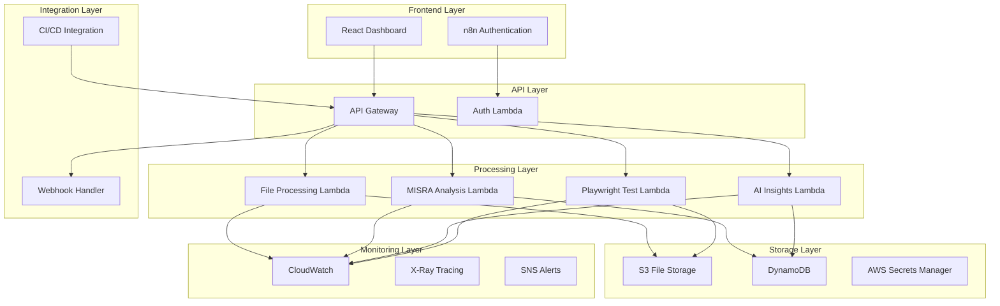
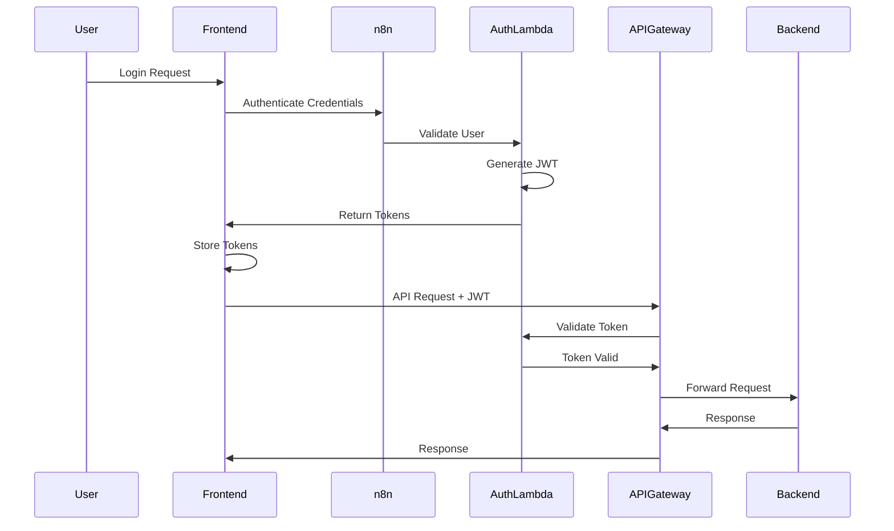
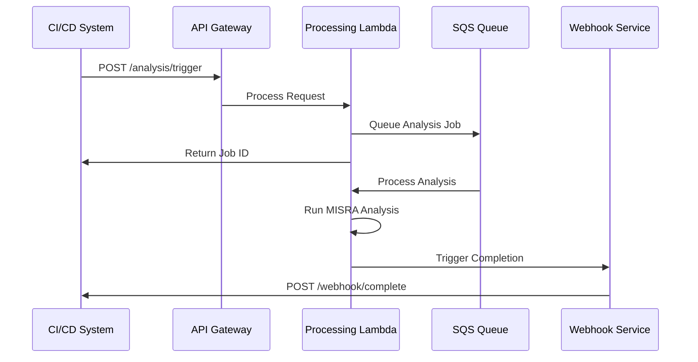

# Design Document: MISRA Web Testing Platform

## Overview

The MISRA Web Testing Platform is a cloud-native SaaS solution built on AWS serverless architecture that provides automated MISRA compliance analysis and UI regression testing. The platform leverages AI-powered insights to help development teams achieve faster releases with higher quality code.

The system follows a microservices architecture with clear separation of concerns, utilizing AWS Lambda for compute, S3 for storage, DynamoDB for data persistence, and API Gateway for request routing. The frontend is built with React, providing an intuitive dashboard for users to interact with analysis results and testing metrics.

## Architecture

### High-Level System Architecture



### Component Interactions

The system operates through the following interaction patterns:

1. **Authentication Flow**: Users authenticate through n8n, which validates credentials and issues JWT tokens
2. **File Processing Flow**: Uploaded files trigger Lambda functions for MISRA analysis and storage
3. **Analysis Flow**: MISRA analysis results are processed by AI engine for insights generation
4. **Testing Flow**: CI/CD systems trigger Playwright tests through API Gateway
5. **Notification Flow**: Webhooks notify external systems of completion status

## Components and Interfaces

### Frontend Components

#### React Dashboard
- **Purpose**: Primary user interface for viewing analysis results and managing projects
- **Key Features**: 
  - Real-time data visualization
  - File upload interface
  - MISRA violation reporting
  - Test result dashboards
  - Export functionality
- **Technology**: React 18, TypeScript, Material-UI
- **State Management**: Redux Toolkit with RTK Query

#### Authentication Integration
- **Purpose**: Secure user authentication and session management
- **Integration**: n8n workflow-based authentication
- **Token Management**: JWT with refresh token rotation
- **Security**: HTTPS-only, secure cookie storage

### Backend Components

#### API Gateway
- **Purpose**: Central entry point for all API requests
- **Features**:
  - Request routing and load balancing
  - Authentication middleware
  - Rate limiting and throttling
  - CORS handling
  - Request/response transformation
- **Configuration**: AWS API Gateway v2 with Lambda proxy integration

#### File Processing Service
- **Purpose**: Handle file uploads and initial processing
- **Implementation**: AWS Lambda (Node.js 18)
- **Responsibilities**:
  - File validation and sanitization
  - S3 upload coordination
  - Metadata extraction
  - Processing pipeline initiation
- **Scaling**: Auto-scaling based on queue depth

#### MISRA Analysis Service
- **Purpose**: Perform MISRA compliance analysis on uploaded code
- **Implementation**: AWS Lambda (Python 3.9)
- **Analysis Engine**: Custom MISRA rule engine with configurable rule sets
- **Output**: Structured violation reports with severity levels
- **Performance**: Parallel processing for large codebases

#### AI Insights Service
- **Purpose**: Generate intelligent recommendations and trend analysis
- **Implementation**: AWS Lambda (Python 3.9)
- **ML Framework**: scikit-learn for pattern recognition
- **Features**:
  - Code quality scoring
  - Trend analysis across projects
  - Personalized recommendations
  - Learning from user feedback

#### Test Runner Service
- **Purpose**: Execute automated UI regression tests
- **Implementation**: AWS Lambda (Node.js 18) with Playwright
- **Capabilities**:
  - Multi-browser testing (Chrome, Firefox, Safari)
  - Screenshot comparison
  - Performance metrics collection
  - Parallel test execution

### Data Layer Components

#### File Storage (S3)
- **Bucket Structure**:
  - `uploads/`: Raw uploaded files
  - `processed/`: Analyzed code files
  - `reports/`: Generated analysis reports
  - `screenshots/`: Test execution screenshots
- **Security**: Server-side encryption, versioning enabled
- **Lifecycle**: Automated archival and deletion policies

#### Database (DynamoDB)
- **Tables**:
  - `Users`: User profiles and preferences
  - `Projects`: Project metadata and configurations
  - `Analyses`: MISRA analysis results and history
  - `TestRuns`: Test execution results and metrics
  - `AIInsights`: Generated recommendations and trends
- **Indexing**: Global secondary indexes for efficient querying
- **Backup**: Point-in-time recovery enabled

## Data Models

### Core Data Structures

```typescript
interface User {
  userId: string;
  email: string;
  organizationId: string;
  role: 'admin' | 'developer' | 'viewer';
  preferences: UserPreferences;
  createdAt: Date;
  lastLoginAt: Date;
}

interface Project {
  projectId: string;
  name: string;
  description: string;
  organizationId: string;
  misraRuleSet: 'MISRA_C_2004' | 'MISRA_C_2012' | 'MISRA_CPP_2008';
  settings: ProjectSettings;
  createdAt: Date;
  updatedAt: Date;
}

interface MISRAAnalysis {
  analysisId: string;
  projectId: string;
  fileId: string;
  violations: MISRAViolation[];
  summary: AnalysisSummary;
  status: 'pending' | 'completed' | 'failed';
  createdAt: Date;
  completedAt?: Date;
}

interface MISRAViolation {
  ruleId: string;
  severity: 'error' | 'warning' | 'info';
  lineNumber: number;
  columnNumber: number;
  message: string;
  suggestion?: string;
}

interface TestRun {
  testRunId: string;
  projectId: string;
  triggerSource: 'manual' | 'ci_cd' | 'scheduled';
  results: TestResult[];
  summary: TestSummary;
  status: 'running' | 'completed' | 'failed';
  createdAt: Date;
  completedAt?: Date;
}

interface TestResult {
  testId: string;
  name: string;
  status: 'passed' | 'failed' | 'skipped';
  duration: number;
  browser: string;
  screenshots: string[];
  errorMessage?: string;
}
```

### API Specifications

#### Authentication Endpoints

```typescript
// POST /auth/login
interface LoginRequest {
  email: string;
  password: string;
}

interface LoginResponse {
  accessToken: string;
  refreshToken: string;
  user: User;
  expiresIn: number;
}

// POST /auth/refresh
interface RefreshRequest {
  refreshToken: string;
}

interface RefreshResponse {
  accessToken: string;
  expiresIn: number;
}
```

#### File Management Endpoints

```typescript
// POST /files/upload
interface FileUploadRequest {
  projectId: string;
  files: File[];
  analysisType: 'misra' | 'regression' | 'both';
}

interface FileUploadResponse {
  uploadId: string;
  files: UploadedFile[];
  status: 'uploaded' | 'processing';
}

// GET /files/{fileId}/analysis
interface AnalysisResponse {
  analysis: MISRAAnalysis;
  downloadUrl?: string;
}
```

#### Testing Endpoints

```typescript
// POST /tests/run
interface TestRunRequest {
  projectId: string;
  testSuite?: string;
  browsers: string[];
  environment: 'staging' | 'production';
}

interface TestRunResponse {
  testRunId: string;
  status: 'queued' | 'running';
  estimatedDuration: number;
}

// GET /tests/{testRunId}/results
interface TestResultsResponse {
  testRun: TestRun;
  downloadUrl?: string;
}
```

## Technology Stack

### Frontend Stack
- **Framework**: React 18 with TypeScript
- **UI Library**: Material-UI v5
- **State Management**: Redux Toolkit with RTK Query
- **Build Tool**: Vite
- **Testing**: Jest, React Testing Library, Playwright
- **Deployment**: AWS CloudFront + S3

### Backend Stack
- **Runtime**: AWS Lambda (Node.js 18, Python 3.9)
- **API Gateway**: AWS API Gateway v2
- **Authentication**: n8n workflows with JWT
- **File Storage**: AWS S3 with CloudFront CDN
- **Database**: AWS DynamoDB
- **Message Queue**: AWS SQS for async processing
- **Monitoring**: AWS CloudWatch, X-Ray

### Development and CI/CD
- **Version Control**: Git with GitHub/GitLab
- **CI/CD**: GitHub Actions or GitLab CI
- **Infrastructure**: AWS CDK (TypeScript)
- **Testing**: Jest, Playwright, AWS SAM Local
- **Code Quality**: ESLint, Prettier, SonarQube

### Third-Party Integrations
- **Authentication**: n8n workflow engine
- **Testing**: Playwright for browser automation
- **MISRA Analysis**: Custom engine with PC-lint integration
- **AI/ML**: AWS SageMaker for advanced analytics
- **Notifications**: AWS SNS/SES for alerts

## Security and Authentication Flows

### Authentication Architecture



### Security Measures

#### Data Encryption
- **At Rest**: AES-256 encryption for S3 and DynamoDB
- **In Transit**: TLS 1.3 for all API communications
- **Key Management**: AWS KMS for encryption key rotation

#### Access Control
- **Authentication**: JWT tokens with 15-minute expiration
- **Authorization**: Role-based access control (RBAC)
- **API Security**: Rate limiting, request validation, CORS policies
- **Network Security**: VPC isolation, security groups, NACLs

#### Compliance and Auditing
- **Audit Logging**: CloudTrail for all AWS API calls
- **Data Retention**: Configurable retention policies
- **Privacy**: GDPR compliance with data anonymization
- **Security Scanning**: Regular vulnerability assessments

## Database Schemas and Data Flow

### DynamoDB Table Designs

#### Users Table
```
Partition Key: userId (String)
Attributes:
- email (String)
- organizationId (String) - GSI
- role (String)
- preferences (Map)
- createdAt (Number)
- lastLoginAt (Number)
```

#### Projects Table
```
Partition Key: projectId (String)
Sort Key: organizationId (String)
Attributes:
- name (String)
- description (String)
- misraRuleSet (String)
- settings (Map)
- createdAt (Number)
- updatedAt (Number)

GSI: organizationId-createdAt-index
```

#### Analyses Table
```
Partition Key: analysisId (String)
Sort Key: projectId (String)
Attributes:
- fileId (String)
- violations (List)
- summary (Map)
- status (String)
- createdAt (Number)
- completedAt (Number)

GSI: projectId-createdAt-index
GSI: status-createdAt-index
```

### Data Flow Patterns

#### File Processing Flow
1. User uploads file → S3 trigger → Lambda function
2. Lambda validates file → Stores metadata in DynamoDB
3. Lambda queues analysis job → SQS message
4. Analysis Lambda processes → Updates DynamoDB
5. Completion triggers webhook → Notifies frontend

#### Real-time Updates
- DynamoDB Streams trigger Lambda functions
- Lambda publishes to WebSocket API
- Frontend receives real-time updates
- Optimistic UI updates with rollback capability

## Integration Patterns for CI/CD

### Webhook Integration



### API Integration Patterns

#### Synchronous Integration
- Real-time analysis for small files
- Immediate feedback for CI/CD gates
- Timeout handling with fallback to async

#### Asynchronous Integration
- Large file processing
- Batch analysis operations
- Webhook notifications for completion

#### Polling Integration
- Status endpoint for job monitoring
- Exponential backoff for polling
- Rate limiting protection

### CI/CD Platform Support

#### GitHub Actions Integration
```yaml
- name: MISRA Analysis
  uses: misra-platform/github-action@v1
  with:
    api-key: ${{ secrets.MISRA_API_KEY }}
    project-id: ${{ vars.PROJECT_ID }}
    files: 'src/**/*.c'
    fail-on-violations: true
```

#### Jenkins Pipeline Integration
```groovy
pipeline {
    stages {
        stage('MISRA Analysis') {
            steps {
                misraAnalysis(
                    apiKey: env.MISRA_API_KEY,
                    projectId: env.PROJECT_ID,
                    sourceFiles: 'src/**/*.c'
                )
            }
        }
    }
}
```

## Scalability and Performance Considerations

### Auto-Scaling Architecture

#### Lambda Scaling
- **Concurrent Executions**: 1000 per region by default
- **Reserved Concurrency**: Critical functions get guaranteed capacity
- **Provisioned Concurrency**: Pre-warmed instances for low latency
- **Memory Optimization**: Right-sized memory allocation

#### Database Scaling
- **DynamoDB On-Demand**: Automatic scaling based on traffic
- **Read Replicas**: Global tables for multi-region deployment
- **Caching**: ElastiCache for frequently accessed data
- **Connection Pooling**: RDS Proxy for database connections

#### Storage Scaling
- **S3 Auto-Scaling**: Unlimited storage capacity
- **CloudFront CDN**: Global content delivery
- **Transfer Acceleration**: Faster uploads for global users
- **Intelligent Tiering**: Cost optimization for storage

### Performance Optimization

#### Frontend Performance
- **Code Splitting**: Lazy loading of components
- **Bundle Optimization**: Tree shaking and minification
- **Caching Strategy**: Service worker for offline capability
- **CDN Distribution**: Global content delivery

#### Backend Performance
- **Cold Start Optimization**: Provisioned concurrency for critical paths
- **Database Optimization**: Efficient query patterns and indexing
- **Caching Layers**: Multi-level caching strategy
- **Async Processing**: Non-blocking operations where possible

#### Monitoring and Alerting
- **Performance Metrics**: Response time, throughput, error rates
- **Custom Dashboards**: Real-time system health monitoring
- **Automated Scaling**: Proactive scaling based on metrics
- **Cost Optimization**: Right-sizing resources based on usage patterns

### Load Testing and Capacity Planning

#### Performance Targets
- **API Response Time**: < 200ms for 95th percentile
- **File Upload**: Support up to 100MB files
- **Concurrent Users**: 1000+ simultaneous users
- **Analysis Throughput**: 100+ files per minute

#### Scaling Strategies
- **Horizontal Scaling**: Add more Lambda instances
- **Vertical Scaling**: Increase memory allocation
- **Geographic Scaling**: Multi-region deployment
- **Queue Management**: SQS for handling traffic spikes

## Correctness Properties

*A property is a characteristic or behavior that should hold true across all valid executions of a system—essentially, a formal statement about what the system should do. Properties serve as the bridge between human-readable specifications and machine-verifiable correctness guarantees.*

### Authentication and Authorization Properties

**Property 1: Valid credentials always return JWT tokens**
*For any* valid user credentials, authentication through n8n should always return a valid JWT token with appropriate claims
**Validates: Requirements 1.1**

**Property 2: Invalid credentials are consistently rejected**
*For any* invalid credential combination, the authentication service should reject the attempt and return an appropriate error message
**Validates: Requirements 1.2**

**Property 3: JWT token validation gates protected resources**
*For any* protected API endpoint and any JWT token, access should be granted if and only if the token is valid and not expired
**Validates: Requirements 1.3**

**Property 4: Expired tokens require re-authentication**
*For any* expired JWT token and any API endpoint, the system should reject the request and require re-authentication
**Validates: Requirements 1.4**

**Property 5: Role-based access control is consistently enforced**
*For any* user role and any resource, access should be granted if and only if the role has appropriate permissions for that resource
**Validates: Requirements 1.5**

### File Processing Properties

**Property 6: Valid files are always stored securely**
*For any* valid code file upload, the system should store it in S3 with proper encryption and generate appropriate metadata
**Validates: Requirements 2.1**

**Property 7: Invalid file types are consistently rejected**
*For any* file that is not a supported code file type, the upload should be rejected with a clear error message
**Validates: Requirements 2.2**

**Property 8: File identifiers are always unique**
*For any* set of file uploads, all generated file identifiers should be unique across the entire system
**Validates: Requirements 2.3**

**Property 9: All supported file formats are accepted**
*For any* file with a supported format (C, C++, header files), the system should accept and process the upload
**Validates: Requirements 2.4**

**Property 10: File uploads trigger processing workflows**
*For any* successfully uploaded file, the system should automatically trigger the appropriate processing workflow
**Validates: Requirements 2.5**

### MISRA Analysis Properties

**Property 11: Code files are analyzed against MISRA standards**
*For any* valid code file, the File_Processor should perform MISRA compliance analysis using the configured rule set
**Validates: Requirements 3.1**

**Property 12: Violation reports contain required details**
*For any* code file with MISRA violations, the generated report should include line numbers, descriptions, and severity levels for all violations
**Validates: Requirements 3.2**

**Property 13: Analysis results are persisted**
*For any* completed MISRA analysis, the results should be stored in DynamoDB with proper indexing for retrieval
**Validates: Requirements 3.3**

**Property 14: All MISRA rule sets are supported**
*For any* supported MISRA rule set configuration (C 2004, C 2012, C++ 2008), the analysis should apply the correct rules
**Validates: Requirements 3.4**

**Property 15: Processing failures are handled gracefully**
*For any* file processing failure, the system should log the error and notify the user with appropriate error information
**Validates: Requirements 3.5**

### AI Engine Properties

**Property 16: Analysis data generates insights**
*For any* available analysis data, the AI_Engine should generate quality insights and actionable recommendations
**Validates: Requirements 4.1**

**Property 17: Patterns across analyses are identified**
*For any* set of multiple analyses containing detectable patterns, the AI_Engine should identify trends and suggest optimizations
**Validates: Requirements 4.2**

**Property 18: Insights are presented in actionable format**
*For any* set of AI-generated insights, the Dashboard should present them in a format that enables user action
**Validates: Requirements 4.3**

**Property 19: User feedback improves recommendations**
*For any* user feedback on recommendations, the AI_Engine should incorporate it to improve future recommendation accuracy
**Validates: Requirements 4.4**

**Property 20: Baseline recommendations are provided when data is insufficient**
*For any* scenario with insufficient analysis data, the AI_Engine should provide baseline recommendations based on industry standards
**Validates: Requirements 4.5**

### Testing and CI/CD Properties

**Property 21: Code changes trigger automated tests**
*For any* detected code change in a monitored repository, the CI/CD pipeline should automatically trigger Playwright tests
**Validates: Requirements 5.1**

**Property 22: Passing tests allow deployment**
*For any* test run where all regression tests pass, the CI/CD pipeline should allow deployment to proceed
**Validates: Requirements 5.2**

**Property 23: Failing tests block deployment**
*For any* test run with one or more failing tests, the CI/CD pipeline should block deployment and notify stakeholders
**Validates: Requirements 5.3**

**Property 24: Tests execute across all supported browsers**
*For any* test suite execution, the Test_Runner should run comprehensive tests across all configured browsers
**Validates: Requirements 5.4**

**Property 25: Test completion generates detailed reports**
*For any* completed test run, the Test_Runner should generate reports containing screenshots, logs, and execution details
**Validates: Requirements 5.5**

### Dashboard and Reporting Properties

**Property 26: Dashboard displays current system state**
*For any* user accessing the dashboard, it should display the most current analysis results and testing status
**Validates: Requirements 6.1**

**Property 27: MISRA violations support filtering and sorting**
*For any* set of MISRA violations displayed on the dashboard, users should be able to filter and sort them by various criteria
**Validates: Requirements 6.2**

**Property 28: Test results include visual status indicators**
*For any* test results displayed on the dashboard, they should include clear visual indicators for pass/fail status and trends
**Validates: Requirements 6.3**

**Property 29: Reports support multiple export formats**
*For any* report data, the system should support exporting in PDF, CSV, and JSON formats
**Validates: Requirements 6.4**

**Property 30: Data updates trigger dashboard refresh**
*For any* data update in the system, the dashboard should automatically refresh to display the current information
**Validates: Requirements 6.5**

### Integration Properties

**Property 31: API requests are properly authenticated**
*For any* CI/CD pipeline API request, the API_Gateway should authenticate it using valid API keys or service tokens
**Validates: Requirements 7.1**

**Property 32: Operations trigger webhook notifications**
*For any* completed analysis or testing operation, the system should send webhook notifications with completion status
**Validates: Requirements 7.2**

**Property 33: Integration failures return appropriate responses**
*For any* integration failure, the system should return appropriate HTTP status codes and descriptive error messages
**Validates: Requirements 7.3**

**Property 34: All supported CI/CD platforms are compatible**
*For any* supported CI/CD platform (Jenkins, GitHub Actions, GitLab CI), the integration should work correctly
**Validates: Requirements 7.4**

**Property 35: Rate limiting is enforced with clear responses**
*For any* API request pattern that exceeds configured limits, the API_Gateway should enforce rate limiting with clear error responses
**Validates: Requirements 7.5**

### Scalability Properties

**Property 36: Load increases trigger automatic scaling**
*For any* increase in processing load, the Cloud_Backend should automatically scale Lambda functions to handle the demand
**Validates: Requirements 8.1**

**Property 37: Storage capacity expands automatically**
*For any* growth in storage requirements, the Cloud_Backend should automatically expand S3 and DynamoDB capacity
**Validates: Requirements 8.2**

**Property 38: Response times are maintained under load**
*For any* API traffic spike, the system should maintain response times under 2 seconds for 95% of requests
**Validates: Requirements 8.3**

**Property 39: Auto-scaling reduces costs during low usage**
*For any* period of low usage, the Cloud_Backend should implement auto-scaling policies to reduce operational costs
**Validates: Requirements 8.4**

**Property 40: Capacity limits trigger request queuing**
*For any* scenario where system resources reach capacity limits, the Cloud_Backend should queue requests rather than failing them
**Validates: Requirements 8.5**

### Security Properties

**Property 41: Data is encrypted at rest and in transit**
*For any* data stored or transmitted by the system, it should be encrypted using industry-standard encryption methods
**Validates: Requirements 9.1**

**Property 42: Data isolation is maintained between users**
*For any* code file processing, the File_Processor should ensure complete data isolation between different users and organizations
**Validates: Requirements 9.2**

**Property 43: All activities are audit logged**
*For any* system access or modification activity, the platform should create appropriate audit log entries
**Validates: Requirements 9.3**

**Property 44: Data retention policies are automatically enforced**
*For any* data subject to retention policies, the system should automatically purge expired data according to configured schedules
**Validates: Requirements 9.5**

### Monitoring Properties

**Property 45: Threshold breaches generate alerts**
*For any* system metric that exceeds configured thresholds, the Cloud_Backend should generate appropriate alerts and notifications
**Validates: Requirements 10.1**

**Property 46: Service failures trigger automatic failover**
*For any* service that becomes unavailable, the Cloud_Backend should implement automatic failover and recovery procedures
**Validates: Requirements 10.2**

**Property 47: Performance issues provide detailed metrics**
*For any* performance degradation, the Cloud_Backend should provide detailed metrics and logging for troubleshooting
**Validates: Requirements 10.3**

**Property 48: Health checks maintain system availability**
*For any* time period, the Cloud_Backend should maintain 99.9% uptime availability through automated health checks
**Validates: Requirements 10.4**

**Property 49: Critical errors trigger immediate escalation**
*For any* critical error occurrence, the Cloud_Backend should escalate alerts to on-call personnel immediately
**Validates: Requirements 10.5**

## Error Handling

### Error Classification and Response Strategy

The system implements a comprehensive error handling strategy that categorizes errors by severity and provides appropriate responses for each category.

#### Error Categories

**Client Errors (4xx)**
- **Authentication Errors (401)**: Invalid or expired tokens, missing credentials
- **Authorization Errors (403)**: Insufficient permissions for requested resource
- **Validation Errors (400)**: Invalid input data, malformed requests
- **Not Found Errors (404)**: Requested resource does not exist
- **Rate Limiting Errors (429)**: API rate limits exceeded

**Server Errors (5xx)**
- **Processing Errors (500)**: MISRA analysis failures, file processing issues
- **Service Unavailable (503)**: Temporary service outages, maintenance mode
- **Timeout Errors (504)**: Long-running operations that exceed time limits
- **Dependency Errors (502)**: External service failures (n8n, AWS services)

#### Error Response Format

All API errors follow a consistent JSON structure:

```json
{
  "error": {
    "code": "MISRA_ANALYSIS_FAILED",
    "message": "Failed to analyze file due to unsupported syntax",
    "details": {
      "fileId": "file-123",
      "lineNumber": 45,
      "suggestion": "Check file encoding and syntax"
    },
    "timestamp": "2024-01-15T10:30:00Z",
    "requestId": "req-abc123"
  }
}
```

#### Retry and Circuit Breaker Patterns

**Exponential Backoff Retry**
- Automatic retry for transient failures
- Maximum 3 retry attempts with exponential backoff
- Jitter added to prevent thundering herd

**Circuit Breaker Implementation**
- Circuit opens after 5 consecutive failures
- Half-open state allows limited traffic for testing
- Automatic recovery when success rate improves

#### Error Monitoring and Alerting

**Error Tracking**
- All errors logged to CloudWatch with structured logging
- Error rates monitored with automated alerting
- Error correlation across distributed components

**Alert Thresholds**
- Error rate > 5% triggers warning alerts
- Error rate > 10% triggers critical alerts
- Service unavailability triggers immediate escalation

### Graceful Degradation Strategies

**Partial Functionality Mode**
- Core features remain available during partial outages
- Non-critical features disabled with user notification
- Cached data served when real-time data unavailable

**Queue-Based Processing**
- Failed operations queued for retry
- Dead letter queues for persistent failures
- Manual intervention workflows for complex failures

## Testing Strategy

### Dual Testing Approach

The platform employs a comprehensive testing strategy that combines unit testing for specific scenarios with property-based testing for universal correctness validation. This dual approach ensures both concrete bug detection and general system correctness.

#### Unit Testing Strategy

**Scope and Focus**
- Specific examples demonstrating correct behavior
- Edge cases and boundary conditions
- Error handling scenarios
- Integration points between components
- Mock external dependencies for isolated testing

**Testing Frameworks**
- **Frontend**: Jest with React Testing Library for component testing
- **Backend**: Jest for Lambda functions, AWS SDK mocks for AWS services
- **Integration**: Supertest for API endpoint testing
- **E2E**: Playwright for full user journey testing

**Unit Test Categories**
- **Component Tests**: Individual React components with various props
- **Service Tests**: Lambda functions with different input scenarios
- **Integration Tests**: API endpoints with authentication and validation
- **Database Tests**: DynamoDB operations with various data states

#### Property-Based Testing Strategy

**Framework Selection**
- **Frontend**: fast-check for TypeScript/JavaScript property testing
- **Backend**: Hypothesis for Python Lambda functions, fast-check for Node.js
- **Configuration**: Minimum 100 iterations per property test
- **Tagging**: Each test tagged with feature and property reference

**Property Test Implementation**
Each correctness property from the design document must be implemented as a property-based test with the following format:

```typescript
// Example property test
describe('Authentication Properties', () => {
  test('Property 1: Valid credentials always return JWT tokens', async () => {
    await fc.assert(fc.asyncProperty(
      validCredentialsGenerator(),
      async (credentials) => {
        const result = await authenticateUser(credentials);
        expect(result).toHaveProperty('accessToken');
        expect(result).toHaveProperty('refreshToken');
        expect(result.accessToken).toMatch(/^[A-Za-z0-9-_]+\.[A-Za-z0-9-_]+\.[A-Za-z0-9-_]+$/);
      }
    ), { numRuns: 100 });
  });
  // Tag: Feature: misra-web-testing-platform, Property 1: Valid credentials always return JWT tokens
});
```

**Property Test Coverage**
- All 49 correctness properties must have corresponding property tests
- Each test validates the universal behavior described in the property
- Tests use generators to create diverse input scenarios
- Failures provide counterexamples for debugging

#### Test Data Management

**Test Data Generation**
- Factories for creating test objects with realistic data
- Generators for property-based testing with edge cases
- Seed data for consistent test environments
- Cleanup procedures for test isolation

**Mock and Stub Strategy**
- AWS services mocked using aws-sdk-mock
- External APIs stubbed with configurable responses
- Database operations use local DynamoDB for testing
- File operations use temporary directories

#### Continuous Integration Testing

**Test Pipeline Stages**
1. **Lint and Format**: ESLint, Prettier validation
2. **Unit Tests**: Fast feedback on individual components
3. **Integration Tests**: API and service interaction validation
4. **Property Tests**: Universal correctness validation
5. **E2E Tests**: Full user journey validation
6. **Performance Tests**: Load testing for critical paths

**Test Environment Management**
- Isolated test environments for each PR
- Automated setup and teardown of test infrastructure
- Test data seeding and cleanup automation
- Parallel test execution for faster feedback

#### Performance and Load Testing

**Load Testing Strategy**
- Artillery.js for API load testing
- Playwright for UI performance testing
- AWS Load Testing solution for infrastructure testing
- Continuous performance monitoring in CI/CD

**Performance Benchmarks**
- API response times under various load conditions
- File processing throughput measurements
- Database query performance validation
- Frontend rendering performance metrics

#### Test Reporting and Metrics

**Test Coverage Requirements**
- Unit test coverage: minimum 80% line coverage
- Property test coverage: all 49 properties implemented
- Integration test coverage: all API endpoints tested
- E2E test coverage: critical user journeys validated

**Test Reporting**
- Coverage reports integrated into CI/CD pipeline
- Property test failure analysis with counterexamples
- Performance test results with trend analysis
- Test execution time monitoring and optimization

**Quality Gates**
- All tests must pass before deployment
- Coverage thresholds must be maintained
- Performance benchmarks must be met
- Security scans must pass without critical issues

This comprehensive testing strategy ensures that the MISRA Web Testing Platform maintains high quality and reliability while supporting rapid development and deployment cycles.