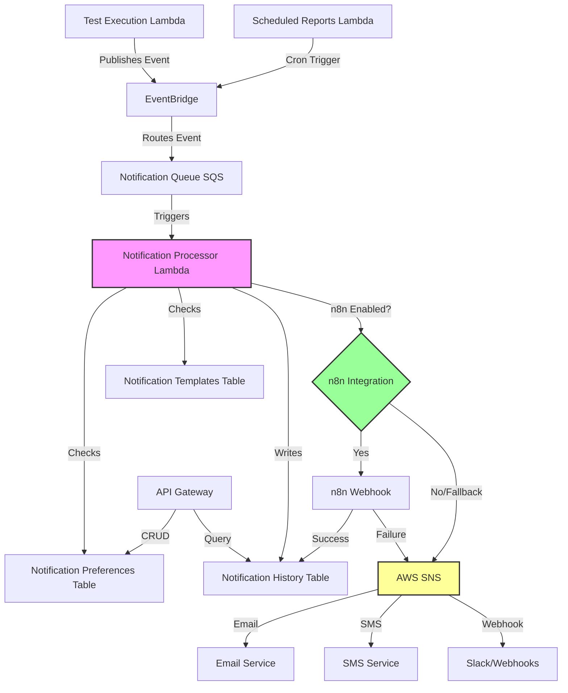
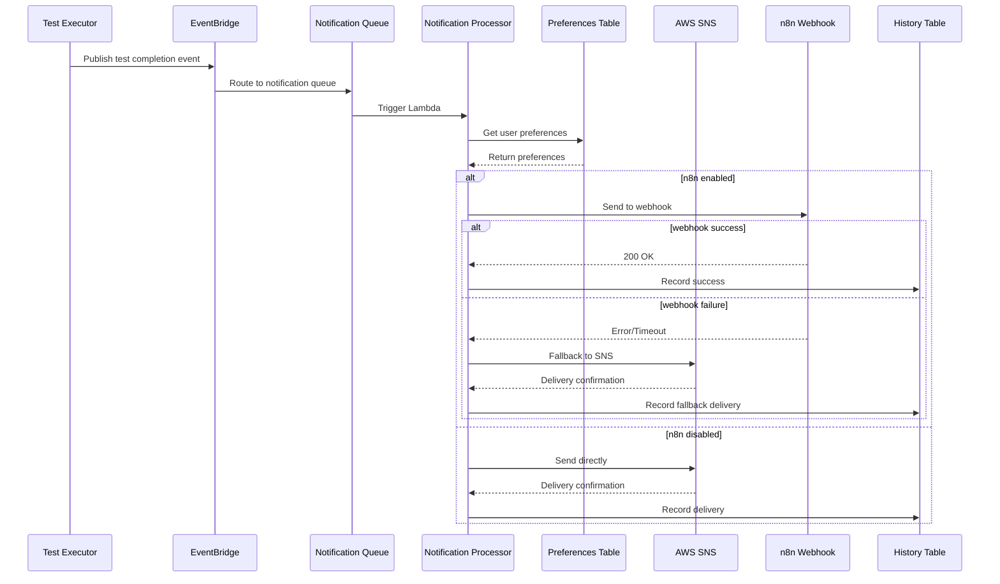

# Design Document: Notification System

## Overview

The Notification System is a real-time alerting and reporting service that integrates with the AI-Based Test System (AIBTS) to deliver timely notifications about test execution events. The system leverages AWS SNS for reliable multi-channel message delivery (email, SMS, webhooks) and optionally integrates with n8n for advanced workflow automation.

The system operates asynchronously to avoid blocking test execution, uses SQS for message buffering during high load, and provides comprehensive notification preferences and history tracking. It supports multiple notification types including test completion alerts, critical failure notifications, and scheduled summary reports.

### Key Design Principles

1. **Asynchronous Processing**: Notifications are processed asynchronously to prevent blocking test execution
2. **Reliability**: At-least-once delivery guarantee for critical notifications with retry logic
3. **Scalability**: Event-driven architecture using SQS and Lambda for horizontal scaling
4. **Flexibility**: Support for multiple channels (email, SMS, Slack, webhooks) and optional n8n integration
5. **User Control**: Comprehensive preference management including quiet hours and frequency limits

## Architecture

### High-Level Architecture



### Event Flow

1. **Event Generation**: Test execution completes and publishes event to EventBridge
2. **Event Routing**: EventBridge routes notification events to SQS queue
3. **Event Processing**: Notification Processor Lambda consumes messages from queue
4. **Preference Check**: System checks user notification preferences and filters
5. **Template Rendering**: System renders notification using appropriate template
6. **Delivery Routing**: 
   - If n8n enabled: Send to n8n webhook first
   - If n8n disabled or fails: Send directly to SNS
7. **Channel Delivery**: SNS delivers to configured channels (email, SMS, Slack)
8. **History Recording**: System records delivery attempt and status

### Component Interaction



## Components and Interfaces

### 1. Notification Processor Lambda

**Purpose**: Core component that processes notification events, applies user preferences, renders templates, and routes to delivery channels.

**Handler**: `functions/notifications/processor.handler`

**Environment Variables**:
- `NOTIFICATION_PREFERENCES_TABLE`: DynamoDB table for user preferences
- `NOTIFICATION_TEMPLATES_TABLE`: DynamoDB table for templates
- `NOTIFICATION_HISTORY_TABLE`: DynamoDB table for history
- `SNS_TOPIC_ARN_EMAIL`: SNS topic for email notifications
- `SNS_TOPIC_ARN_SMS`: SNS topic for SMS notifications
- `SNS_TOPIC_ARN_WEBHOOK`: SNS topic for webhook notifications
- `N8N_WEBHOOK_URL`: Optional n8n webhook URL
- `N8N_API_KEY`: Optional n8n API key
- `N8N_ENABLED`: Boolean flag for n8n integration

**Timeout**: 30 seconds  
**Memory**: 512 MB  
**Concurrency**: 100 (reserved)

**Interface**:
```typescript
interface NotificationEvent {
  eventType: 'test_completion' | 'test_failure' | 'critical_alert' | 'summary_report';
  eventId: string;
  timestamp: string;
  payload: {
    executionId?: string;
    testCaseId?: string;
    testSuiteId?: string;
    projectId: string;
    status?: ExecutionStatus;
    result?: ExecutionResult;
    duration?: number;
    errorMessage?: string;
    screenshots?: string[];
    triggeredBy: string;
    // For summary reports
    reportData?: SummaryReportData;
  };
}

interface ProcessorResult {
  notificationId: string;
  status: 'sent' | 'failed' | 'filtered';
  deliveryChannel?: string;
  deliveryMethod: 'sns' | 'n8n' | 'fallback';
  errorMessage?: string;
}
```

### 2. Scheduled Reports Lambda

**Purpose**: Generates and sends scheduled summary reports (daily, weekly, monthly).

**Handler**: `functions/notifications/scheduled-reports.handler`

**Trigger**: EventBridge cron rules
- Daily: `cron(0 9 * * ? *)` - 09:00 UTC daily
- Weekly: `cron(0 9 ? * MON *)` - 09:00 UTC every Monday
- Monthly: `cron(0 9 1 * ? *)` - 09:00 UTC first day of month

**Environment Variables**:
- `TEST_EXECUTIONS_TABLE`: DynamoDB table for test executions
- `NOTIFICATION_QUEUE_URL`: SQS queue URL for notification events

**Interface**:
```typescript
interface SummaryReportData {
  reportType: 'daily' | 'weekly' | 'monthly';
  period: {
    startDate: string;
    endDate: string;
  };
  stats: {
    totalExecutions: number;
    passRate: number;
    failRate: number;
    errorRate: number;
    averageDuration: number;
  };
  topFailingTests: Array<{
    testCaseId: string;
    testName: string;
    failureCount: number;
    lastFailure: string;
  }>;
  trends: {
    executionChange: number; // Percentage change from previous period
    passRateChange: number;
  };
}
```

### 3. Notification Preferences Service

**Purpose**: Manages user notification preferences including channels, event types, quiet hours, and frequency limits.

**File**: `services/notification-preferences-service.ts`

**Interface**:
```typescript
interface NotificationPreferences {
  userId: string;
  preferences: {
    testCompletion: {
      enabled: boolean;
      channels: NotificationChannel[];
    };
    testFailure: {
      enabled: boolean;
      channels: NotificationChannel[];
    };
    criticalAlert: {
      enabled: boolean;
      channels: NotificationChannel[]; // Always includes all channels
    };
    summaryReport: {
      enabled: boolean;
      frequency: 'daily' | 'weekly' | 'monthly' | 'disabled';
      channels: NotificationChannel[];
    };
  };
  quietHours?: {
    enabled: boolean;
    startTime: string; // HH:mm format
    endTime: string; // HH:mm format
    timezone: string; // IANA timezone
  };
  frequencyLimit?: {
    enabled: boolean;
    maxPerHour: number;
  };
  slackWebhooks?: Array<{
    webhookUrl: string;
    channel: string;
    eventTypes: string[];
  }>;
  createdAt: string;
  updatedAt: string;
}

type NotificationChannel = 'email' | 'sms' | 'slack' | 'webhook';

class NotificationPreferencesService {
  async getPreferences(userId: string): Promise<NotificationPreferences>;
  async updatePreferences(userId: string, preferences: Partial<NotificationPreferences>): Promise<NotificationPreferences>;
  async shouldSendNotification(userId: string, eventType: string): Promise<boolean>;
  async getDeliveryChannels(userId: string, eventType: string): Promise<NotificationChannel[]>;
  async isInQuietHours(userId: string): Promise<boolean>;
  async checkFrequencyLimit(userId: string): Promise<boolean>;
}
```

### 4. SNS Delivery Service

**Purpose**: Handles message delivery through AWS SNS to email, SMS, and webhook channels.

**File**: `services/sns-delivery-service.ts`

**Interface**:
```typescript
interface SNSDeliveryOptions {
  channel: NotificationChannel;
  recipient: string; // Email address, phone number, or webhook URL
  subject?: string;
  message: string;
  messageAttributes?: Record<string, string>;
}

interface SNSDeliveryResult {
  messageId: string;
  channel: NotificationChannel;
  status: 'sent' | 'failed';
  errorMessage?: string;
}

class SNSDeliveryService {
  async sendEmail(recipient: string, subject: string, body: string): Promise<SNSDeliveryResult>;
  async sendSMS(phoneNumber: string, message: string): Promise<SNSDeliveryResult>;
  async sendWebhook(webhookUrl: string, payload: object): Promise<SNSDeliveryResult>;
  async sendToSlack(webhookUrl: string, blocks: SlackBlock[]): Promise<SNSDeliveryResult>;
  async publishToTopic(topicArn: string, message: string, attributes?: Record<string, string>): Promise<SNSDeliveryResult>;
}
```

### 5. n8n Integration Service

**Purpose**: Handles optional integration with n8n workflow automation platform.

**File**: `services/n8n-integration-service.ts`

**Interface**:
```typescript
interface N8NWebhookPayload {
  eventType: string;
  eventId: string;
  timestamp: string;
  data: object;
  metadata: {
    source: 'aibts';
    version: string;
  };
}

interface N8NDeliveryResult {
  success: boolean;
  statusCode?: number;
  responseBody?: string;
  errorMessage?: string;
  duration: number;
}

class N8NIntegrationService {
  async sendToWebhook(payload: N8NWebhookPayload): Promise<N8NDeliveryResult>;
  async isEnabled(): Promise<boolean>;
  async validateConfiguration(): Promise<boolean>;
}
```

### 6. Notification Template Service

**Purpose**: Manages notification templates with variable substitution for different event types and channels.

**File**: `services/notification-template-service.ts`

**Interface**:
```typescript
interface NotificationTemplate {
  templateId: string;
  eventType: string;
  channel: NotificationChannel;
  format: 'html' | 'text' | 'slack_blocks';
  subject?: string; // For email
  body: string; // Template with {{variable}} placeholders
  variables: string[]; // List of required variables
  createdAt: string;
  updatedAt: string;
}

interface TemplateRenderContext {
  testName?: string;
  testCaseId?: string;
  executionId?: string;
  status?: string;
  result?: string;
  duration?: string;
  timestamp?: string;
  errorMessage?: string;
  screenshotUrls?: string[];
  userName?: string;
  projectName?: string;
  // For summary reports
  reportData?: SummaryReportData;
}

class NotificationTemplateService {
  async getTemplate(eventType: string, channel: NotificationChannel): Promise<NotificationTemplate>;
  async renderTemplate(template: NotificationTemplate, context: TemplateRenderContext): Promise<string>;
  async createTemplate(template: Omit<NotificationTemplate, 'templateId' | 'createdAt' | 'updatedAt'>): Promise<NotificationTemplate>;
  async updateTemplate(templateId: string, updates: Partial<NotificationTemplate>): Promise<NotificationTemplate>;
  async validateTemplate(template: NotificationTemplate): Promise<boolean>;
}
```

### 7. Notification History Service

**Purpose**: Persists and queries notification delivery history for audit and debugging.

**File**: `services/notification-history-service.ts`

**Interface**:
```typescript
interface NotificationHistoryRecord {
  notificationId: string; // Partition key: UUID
  userId: string; // GSI partition key
  eventType: string;
  eventId: string;
  channel: NotificationChannel;
  deliveryMethod: 'sns' | 'n8n' | 'fallback';
  deliveryStatus: 'pending' | 'sent' | 'delivered' | 'failed';
  recipient: string; // Email, phone, or webhook URL
  messageId?: string; // SNS message ID
  errorMessage?: string;
  retryCount: number;
  sentAt: string; // ISO timestamp, GSI sort key
  deliveredAt?: string; // ISO timestamp
  metadata: {
    executionId?: string;
    testCaseId?: string;
    projectId?: string;
  };
}

interface NotificationHistoryQuery {
  userId?: string;
  startDate?: string;
  endDate?: string;
  eventType?: string;
  channel?: NotificationChannel;
  deliveryStatus?: string;
  limit?: number;
  nextToken?: string;
}

class NotificationHistoryService {
  async recordNotification(record: Omit<NotificationHistoryRecord, 'notificationId' | 'sentAt'>): Promise<NotificationHistoryRecord>;
  async updateDeliveryStatus(notificationId: string, status: string, deliveredAt?: string): Promise<void>;
  async queryHistory(query: NotificationHistoryQuery): Promise<{ records: NotificationHistoryRecord[]; nextToken?: string }>;
  async getNotificationById(notificationId: string): Promise<NotificationHistoryRecord | null>;
  async archiveOldRecords(olderThanDays: number): Promise<number>;
}
```

### 8. Retry Handler Service

**Purpose**: Implements exponential backoff retry logic for failed notification deliveries.

**File**: `services/retry-handler-service.ts`

**Interface**:
```typescript
interface RetryConfig {
  maxRetries: number;
  initialDelayMs: number;
  maxDelayMs: number;
  backoffMultiplier: number;
}

interface RetryResult<T> {
  success: boolean;
  result?: T;
  error?: Error;
  attemptCount: number;
}

class RetryHandlerService {
  async executeWithRetry<T>(
    operation: () => Promise<T>,
    config: RetryConfig
  ): Promise<RetryResult<T>>;
  
  calculateBackoffDelay(attemptNumber: number, config: RetryConfig): number;
}
```

## Data Models

### DynamoDB Tables

#### 1. NotificationPreferences Table

**Table Name**: `NotificationPreferences`

**Keys**:
- Partition Key: `userId` (String)

**Attributes**:
- `userId`: String
- `preferences`: Map (nested structure for event-specific preferences)
- `quietHours`: Map (optional)
- `frequencyLimit`: Map (optional)
- `slackWebhooks`: List (optional)
- `createdAt`: String (ISO timestamp)
- `updatedAt`: String (ISO timestamp)

**Indexes**: None required (single-item lookups by userId)

#### 2. NotificationTemplates Table

**Table Name**: `NotificationTemplates`

**Keys**:
- Partition Key: `templateId` (String)

**GSI1**: EventTypeChannelIndex
- Partition Key: `eventType` (String)
- Sort Key: `channel` (String)

**Attributes**:
- `templateId`: String (UUID)
- `eventType`: String
- `channel`: String
- `format`: String
- `subject`: String (optional)
- `body`: String
- `variables`: List of Strings
- `createdAt`: String (ISO timestamp)
- `updatedAt`: String (ISO timestamp)

#### 3. NotificationHistory Table

**Table Name**: `NotificationHistory`

**Keys**:
- Partition Key: `notificationId` (String - UUID)

**GSI1**: UserTimeIndex
- Partition Key: `userId` (String)
- Sort Key: `sentAt` (String - ISO timestamp)

**GSI2**: EventTypeTimeIndex
- Partition Key: `eventType` (String)
- Sort Key: `sentAt` (String - ISO timestamp)

**Attributes**:
- `notificationId`: String (UUID)
- `userId`: String
- `eventType`: String
- `eventId`: String
- `channel`: String
- `deliveryMethod`: String
- `deliveryStatus`: String
- `recipient`: String
- `messageId`: String (optional)
- `errorMessage`: String (optional)
- `retryCount`: Number
- `sentAt`: String (ISO timestamp)
- `deliveredAt`: String (ISO timestamp, optional)
- `metadata`: Map
- `ttl`: Number (Unix timestamp for automatic deletion after 90 days)

### SNS Topics

#### 1. Email Notifications Topic

**Topic Name**: `aibts-notifications-email`

**Subscriptions**: User email addresses (dynamically subscribed based on preferences)

**Message Format**: JSON with subject and body

#### 2. SMS Notifications Topic

**Topic Name**: `aibts-notifications-sms`

**Subscriptions**: User phone numbers (dynamically subscribed based on preferences)

**Message Format**: Plain text (160 characters max)

#### 3. Webhook Notifications Topic

**Topic Name**: `aibts-notifications-webhook`

**Subscriptions**: HTTPS endpoints (Slack webhooks, custom webhooks)

**Message Format**: JSON payload

### SQS Queues

#### 1. Notification Queue

**Queue Name**: `aibts-notification-queue`

**Configuration**:
- Visibility Timeout: 30 seconds (matches Lambda timeout)
- Message Retention: 4 days
- Receive Message Wait Time: 20 seconds (long polling)
- Dead Letter Queue: `aibts-notification-dlq`
- Max Receive Count: 3

**Message Format**:
```typescript
interface NotificationQueueMessage {
  eventType: string;
  eventId: string;
  timestamp: string;
  payload: object;
}
```

#### 2. Notification Dead Letter Queue

**Queue Name**: `aibts-notification-dlq`

**Configuration**:
- Message Retention: 14 days
- Purpose: Store failed notifications for manual investigation

### EventBridge Rules

#### 1. Test Completion Events

**Rule Name**: `test-execution-completion`

**Event Pattern**:
```json
{
  "source": ["aibts.test-execution"],
  "detail-type": ["Test Execution Completed"]
}
```

**Target**: Notification Queue (SQS)

#### 2. Daily Report Schedule

**Rule Name**: `daily-summary-report`

**Schedule**: `cron(0 9 * * ? *)` - 09:00 UTC daily

**Target**: Scheduled Reports Lambda

#### 3. Weekly Report Schedule

**Rule Name**: `weekly-summary-report`

**Schedule**: `cron(0 9 ? * MON *)` - 09:00 UTC every Monday

**Target**: Scheduled Reports Lambda

## Correctness Properties


*A property is a characteristic or behavior that should hold true across all valid executions of a system—essentially, a formal statement about what the system should do. Properties serve as the bridge between human-readable specifications and machine-verifiable correctness guarantees.*

### Property 1: Test Event Notification Generation

*For any* test execution event (passed, failed, or error status), the Notification System should generate a corresponding notification with the correct event type.

**Validates: Requirements 2.1, 2.2, 2.3**

### Property 2: SNS Message Publishing

*For any* notification event, when processed, the system should publish a message to the appropriate SNS topic based on the configured delivery channels.

**Validates: Requirements 1.2**

### Property 3: Retry with Exponential Backoff

*For any* failed SNS publish operation, the system should retry up to 3 times with exponentially increasing delays (1s, 2s, 4s, 8s, 16s).

**Validates: Requirements 1.3, 9.1**

### Property 4: SNS Topic Management

*For any* notification channel (email, SMS, webhook), the system should be able to route messages to the correct SNS topic, creating the topic if it doesn't exist.

**Validates: Requirements 1.4, 1.5**

### Property 5: Payload Size Validation

*For any* notification payload, if the size exceeds 256 KB, the system should reject it before attempting to publish to SNS.

**Validates: Requirements 1.6**

### Property 6: Required Notification Fields

*For any* test result notification, the rendered message should contain test execution ID, test name, status, duration, and timestamp.

**Validates: Requirements 2.4**

### Property 7: Conditional Screenshot Inclusion

*For any* test execution event with screenshots, the notification should include screenshot URLs; for events without screenshots, no URLs should be present.

**Validates: Requirements 2.5**

### Property 8: Recipient Authorization Filtering

*For any* test result notification, only users who own the test or have subscribed to the test suite should receive the notification.

**Validates: Requirements 2.6**

### Property 9: Critical Alert Generation

*For any* test execution event with severity "critical", the system should generate an immediate alert marked with priority "high".

**Validates: Requirements 3.1, 3.6**

### Property 10: Suite Failure Threshold Alert

*For any* test suite execution where the failure rate exceeds 50%, the system should generate a critical alert.

**Validates: Requirements 3.2**

### Property 11: Consecutive Failure Escalation

*For any* test case that fails 3 consecutive times, the system should escalate to a critical alert on the third failure.

**Validates: Requirements 3.3**

### Property 12: Critical Alert Content Completeness

*For any* critical alert, the notification should include failure reason, stack trace (if available), and affected test details.

**Validates: Requirements 3.4**

### Property 13: Critical Alert Preference Override

*For any* critical alert, the notification should be sent to all configured emergency channels regardless of user notification preferences.

**Validates: Requirements 3.5**

### Property 14: Daily Report Time Range

*For any* daily summary report generated, it should include all test executions from the previous 24-hour period.

**Validates: Requirements 4.1**

### Property 15: Weekly Report Time Range

*For any* weekly summary report generated, it should include all test executions from the previous 7-day period.

**Validates: Requirements 4.2**

### Property 16: Summary Report Content Completeness

*For any* summary report, it should include total tests executed, pass rate, fail rate, average execution time, and top failing tests.

**Validates: Requirements 4.3**

### Property 17: Trend Comparison Calculation

*For any* summary report, the trend comparisons should accurately reflect the percentage change from the previous period.

**Validates: Requirements 4.4**

### Property 18: Report Frequency Configuration

*For any* user with configured report frequency (daily, weekly, monthly, or disabled), reports should only be sent according to that frequency setting.

**Validates: Requirements 4.6**

### Property 19: n8n Webhook Delivery

*For any* notification event when n8n integration is enabled, the system should send the event to the configured n8n webhook URL with event type, payload, and metadata.

**Validates: Requirements 5.1, 5.2**

### Property 20: n8n Success Status Update

*For any* n8n webhook request that receives a 2xx status code, the notification should be marked as successfully delivered.

**Validates: Requirements 5.3**

### Property 21: n8n Fallback to SNS

*For any* n8n webhook request that fails or times out after 10 seconds, the system should fall back to direct SNS delivery.

**Validates: Requirements 5.4**

### Property 22: n8n Authentication Headers

*For any* n8n webhook request when authentication is configured, the request should include the appropriate authentication headers (API key or bearer token).

**Validates: Requirements 5.5**

### Property 23: Direct SNS Delivery When n8n Disabled

*For any* notification event when n8n integration is disabled, the system should deliver notifications directly through SNS without making webhook calls.

**Validates: Requirements 5.6**

### Property 24: Preference-Based Event Filtering

*For any* notification event, if the user has disabled notifications for that event type, no notification should be sent to that user.

**Validates: Requirements 6.1, 6.2**

### Property 25: Quiet Hours Suppression

*For any* non-critical notification during a user's configured quiet hours, the notification should be suppressed.

**Validates: Requirements 6.3**

### Property 26: Default Preferences Application

*For any* user without configured preferences, the system should apply default preferences (email enabled for failures and critical alerts).

**Validates: Requirements 6.4**

### Property 27: Contact Information Validation

*For any* email address or phone number in notification preferences, invalid formats should be rejected before saving.

**Validates: Requirements 6.5**

### Property 28: Frequency Limit Batching

*For any* user whose notification frequency exceeds their configured limit, subsequent notifications should be batched into a single summary message.

**Validates: Requirements 6.6, 6.7**

### Property 29: History Persistence Completeness

*For any* notification attempt (successful or failed), a history record should be created with notification ID, user ID, event type, channel, delivery status, timestamp, and metadata.

**Validates: Requirements 7.1, 7.4**

### Property 30: History TTL Configuration

*For any* notification history record, it should have a TTL value set to 90 days from creation.

**Validates: Requirements 7.2**

### Property 31: History Query Filtering

*For any* notification history query with filters (date range, event type, channel, status), only records matching all specified filters should be returned.

**Validates: Requirements 7.3**

### Property 32: Delivery Status Updates

*For any* notification that receives a delivery confirmation from SNS, the history record's delivery status should be updated accordingly.

**Validates: Requirements 7.5**

### Property 33: History Pagination

*For any* notification history query with pagination parameters, the results should be correctly paginated with a next token when more results exist.

**Validates: Requirements 7.6**

### Property 34: Template Event Type Mapping

*For any* event type, there should be a corresponding notification template for each supported channel.

**Validates: Requirements 8.1**

### Property 35: Template Variable Substitution

*For any* notification template with variables, all variables present in the context should be correctly substituted with their actual values.

**Validates: Requirements 8.2**

### Property 36: Channel-Specific Template Formats

*For any* notification, the template format used should match the delivery channel (HTML for email, plain text for SMS, Slack blocks for Slack).

**Validates: Requirements 8.3**

### Property 37: Template Update Persistence

*For any* template update by an administrator, the updated template should be persisted and used for subsequent notifications.

**Validates: Requirements 8.4**

### Property 38: Missing Variable Graceful Handling

*For any* template with variables, if a variable is missing from the context, it should be substituted with an empty string or default value without causing rendering failure.

**Validates: Requirements 8.5**

### Property 39: Template Syntax Validation

*For any* template being saved, invalid syntax should be detected and rejected before persistence.

**Validates: Requirements 8.6**

### Property 40: Retry Exhaustion Failure Marking

*For any* notification where all retry attempts fail, the notification should be marked as "failed" in the history.

**Validates: Requirements 9.2**

### Property 41: Queue Depth Alert Threshold

*For any* time when the notification queue depth exceeds 1000 messages, an alert should be triggered to administrators.

**Validates: Requirements 9.5**

### Property 42: Slack Block Kit Formatting

*For any* notification delivered to Slack, the message should be formatted using Slack Block Kit structure.

**Validates: Requirements 10.2**

### Property 43: Slack Action Buttons

*For any* Slack notification, it should include action buttons for quick access (view test, view logs, re-run test).

**Validates: Requirements 10.3**

### Property 44: Slack Webhook Routing

*For any* notification event, if multiple Slack webhooks are configured for different event types, the notification should be routed to the correct webhook based on event type.

**Validates: Requirements 10.1, 10.4, 10.6**

### Property 45: Slack Fallback to Email

*For any* notification where Slack webhook delivery fails, the system should fall back to email delivery for the same user.

**Validates: Requirements 10.5**

### Property 46: Batch Processing for Reports

*For any* summary report generation, the system should use batch operations to query test execution data rather than individual queries.

**Validates: Requirements 11.2**

### Property 47: SNS Rate Limiting

*For any* burst of notification requests that would exceed SNS API quotas, the system should throttle requests to stay within limits.

**Validates: Requirements 11.6**

### Property 48: Sensitive Data Exclusion

*For any* notification message, it should not contain sensitive data patterns (passwords, API keys, tokens, credentials).

**Validates: Requirements 12.2**

### Property 49: Input Sanitization

*For any* user-provided data in notification preferences (webhook URLs, email addresses), malicious inputs should be validated and sanitized to prevent injection attacks.

**Validates: Requirements 12.3**

### Property 50: PII Redaction in Logs

*For any* notification processing log entry, personally identifiable information (email addresses, phone numbers, names) should be redacted.

**Validates: Requirements 12.6**

## Error Handling

### Error Categories

1. **Transient Errors**: Temporary failures that can be retried
   - SNS throttling errors
   - Network timeouts
   - Temporary service unavailability
   - **Handling**: Exponential backoff retry (up to 3 attempts)

2. **Permanent Errors**: Failures that won't succeed on retry
   - Invalid email address format
   - Payload size exceeds limits
   - Invalid template syntax
   - Missing required configuration
   - **Handling**: Log error, mark as failed, don't retry

3. **Configuration Errors**: Issues with system configuration
   - Missing SNS topic ARN
   - Invalid n8n webhook URL
   - Missing AWS credentials
   - **Handling**: Fail fast, alert administrators

4. **Validation Errors**: Invalid input data
   - Malformed notification event
   - Invalid user preferences
   - Template rendering errors
   - **Handling**: Reject input, return error response

### Error Recovery Strategies

#### 1. SNS Delivery Failures

```typescript
async function deliverWithRetry(message: NotificationMessage): Promise<DeliveryResult> {
  const config: RetryConfig = {
    maxRetries: 3,
    initialDelayMs: 1000,
    maxDelayMs: 16000,
    backoffMultiplier: 2
  };
  
  try {
    return await retryHandler.executeWithRetry(
      () => snsService.publish(message),
      config
    );
  } catch (error) {
    // All retries exhausted
    await historyService.recordFailure(message.notificationId, error.message);
    throw new PermanentDeliveryError('Failed after all retries', error);
  }
}
```

#### 2. n8n Webhook Failures

```typescript
async function deliverViaWebhook(payload: N8NWebhookPayload): Promise<DeliveryResult> {
  try {
    const result = await n8nService.sendToWebhook(payload);
    
    if (result.success) {
      return { status: 'sent', method: 'n8n' };
    }
    
    // Webhook failed, fall back to SNS
    logger.warn('n8n webhook failed, falling back to SNS', { 
      statusCode: result.statusCode,
      error: result.errorMessage 
    });
    
    return await deliverViaSNS(payload);
  } catch (error) {
    // Timeout or network error, fall back to SNS
    logger.error('n8n webhook error, falling back to SNS', { error });
    return await deliverViaSNS(payload);
  }
}
```

#### 3. Template Rendering Failures

```typescript
async function renderNotification(
  template: NotificationTemplate,
  context: TemplateRenderContext
): Promise<string> {
  try {
    // Validate template syntax
    await templateService.validateTemplate(template);
    
    // Render with context
    return await templateService.renderTemplate(template, context);
  } catch (error) {
    if (error instanceof TemplateSyntaxError) {
      // Use fallback template
      logger.error('Template rendering failed, using fallback', { 
        templateId: template.templateId,
        error 
      });
      
      return await templateService.renderTemplate(
        await templateService.getFallbackTemplate(template.eventType),
        context
      );
    }
    
    throw error;
  }
}
```

#### 4. Queue Processing Failures

```typescript
async function processQueueMessage(message: SQSMessage): Promise<void> {
  try {
    const event: NotificationEvent = JSON.parse(message.body);
    await processNotification(event);
    
    // Delete message from queue on success
    await sqsClient.deleteMessage(message.receiptHandle);
  } catch (error) {
    if (error instanceof ValidationError) {
      // Permanent error, delete message to prevent reprocessing
      logger.error('Invalid message format, removing from queue', { error });
      await sqsClient.deleteMessage(message.receiptHandle);
    } else {
      // Transient error, let message return to queue for retry
      logger.warn('Transient error processing message, will retry', { error });
      // Message will be retried based on visibility timeout
    }
  }
}
```

### Dead Letter Queue Handling

Messages that fail processing after 3 attempts are moved to the Dead Letter Queue (DLQ) for manual investigation:

1. **DLQ Monitoring**: CloudWatch alarm triggers when DLQ depth > 0
2. **Manual Review**: Administrators investigate failed messages
3. **Reprocessing**: Valid messages can be manually reprocessed
4. **Cleanup**: Invalid messages are deleted after investigation

### Circuit Breaker Pattern

For external service calls (n8n webhooks, Slack webhooks), implement circuit breaker to prevent cascading failures:

```typescript
class CircuitBreaker {
  private failureCount = 0;
  private lastFailureTime?: Date;
  private state: 'closed' | 'open' | 'half-open' = 'closed';
  
  async execute<T>(operation: () => Promise<T>): Promise<T> {
    if (this.state === 'open') {
      if (this.shouldAttemptReset()) {
        this.state = 'half-open';
      } else {
        throw new CircuitBreakerOpenError('Circuit breaker is open');
      }
    }
    
    try {
      const result = await operation();
      this.onSuccess();
      return result;
    } catch (error) {
      this.onFailure();
      throw error;
    }
  }
  
  private onSuccess(): void {
    this.failureCount = 0;
    this.state = 'closed';
  }
  
  private onFailure(): void {
    this.failureCount++;
    this.lastFailureTime = new Date();
    
    if (this.failureCount >= 5) {
      this.state = 'open';
    }
  }
  
  private shouldAttemptReset(): boolean {
    if (!this.lastFailureTime) return false;
    
    const resetTimeout = 60000; // 1 minute
    return Date.now() - this.lastFailureTime.getTime() > resetTimeout;
  }
}
```

## Testing Strategy

### Dual Testing Approach

The notification system requires both unit tests and property-based tests for comprehensive coverage:

- **Unit Tests**: Verify specific examples, edge cases, and error conditions
- **Property Tests**: Verify universal properties across all inputs

### Property-Based Testing

We will use **fast-check** (TypeScript/JavaScript property-based testing library) to implement property tests. Each property test will:

- Run a minimum of 100 iterations with randomized inputs
- Reference the corresponding design property in a comment tag
- Use custom generators for domain objects (notifications, preferences, templates)

**Property Test Configuration**:
```typescript
import * as fc from 'fast-check';

// Configure all property tests to run 100 iterations
const propertyTestConfig = { numRuns: 100 };

// Example property test
test('Property 1: Test Event Notification Generation', () => {
  // Feature: notification-system, Property 1: For any test execution event, a notification is generated
  fc.assert(
    fc.property(
      testExecutionEventArbitrary(),
      async (event) => {
        const notification = await notificationProcessor.process(event);
        expect(notification).toBeDefined();
        expect(notification.eventType).toMatch(/test_completion|test_failure|test_error/);
      }
    ),
    propertyTestConfig
  );
});
```

### Unit Testing Strategy

Unit tests will focus on:

1. **Specific Examples**: Test known scenarios with fixed inputs
   - Successful email delivery
   - Failed SMS delivery with retry
   - Template rendering with all variables present

2. **Edge Cases**: Test boundary conditions
   - Empty report data (Requirement 4.5)
   - Payload exactly at 256 KB limit
   - User with no preferences
   - Template with all variables missing

3. **Error Conditions**: Test failure scenarios
   - SNS throttling errors
   - n8n webhook timeout
   - Invalid email format
   - Malformed template syntax

4. **Integration Points**: Test component interactions
   - Notification processor → SNS service
   - Scheduled reports → Notification queue
   - Preference service → History service

### Test Organization

```
packages/backend/src/__tests__/
├── unit/
│   ├── notification-processor.test.ts
│   ├── scheduled-reports.test.ts
│   ├── sns-delivery-service.test.ts
│   ├── n8n-integration-service.test.ts
│   ├── notification-preferences-service.test.ts
│   ├── notification-template-service.test.ts
│   └── notification-history-service.test.ts
├── properties/
│   ├── notification-generation.test.ts
│   ├── delivery-reliability.test.ts
│   ├── preference-filtering.test.ts
│   ├── template-rendering.test.ts
│   └── history-persistence.test.ts
└── generators/
    ├── notification-generators.ts
    ├── preference-generators.ts
    └── template-generators.ts
```

### Custom Generators for Property Tests

```typescript
// generators/notification-generators.ts
import * as fc from 'fast-check';

export function testExecutionEventArbitrary(): fc.Arbitrary<NotificationEvent> {
  return fc.record({
    eventType: fc.constantFrom('test_completion', 'test_failure', 'critical_alert'),
    eventId: fc.uuid(),
    timestamp: fc.date().map(d => d.toISOString()),
    payload: fc.record({
      executionId: fc.uuid(),
      testCaseId: fc.uuid(),
      projectId: fc.uuid(),
      status: fc.constantFrom('queued', 'running', 'completed', 'error'),
      result: fc.option(fc.constantFrom('pass', 'fail', 'error')),
      duration: fc.integer({ min: 100, max: 300000 }),
      errorMessage: fc.option(fc.string()),
      screenshots: fc.array(fc.string(), { maxLength: 5 }),
      triggeredBy: fc.uuid()
    })
  });
}

export function notificationPreferencesArbitrary(): fc.Arbitrary<NotificationPreferences> {
  return fc.record({
    userId: fc.uuid(),
    preferences: fc.record({
      testCompletion: fc.record({
        enabled: fc.boolean(),
        channels: fc.array(fc.constantFrom('email', 'sms', 'slack', 'webhook'), { minLength: 1 })
      }),
      testFailure: fc.record({
        enabled: fc.boolean(),
        channels: fc.array(fc.constantFrom('email', 'sms', 'slack', 'webhook'), { minLength: 1 })
      }),
      criticalAlert: fc.record({
        enabled: fc.constant(true), // Always enabled for critical
        channels: fc.constant(['email', 'sms', 'slack'])
      }),
      summaryReport: fc.record({
        enabled: fc.boolean(),
        frequency: fc.constantFrom('daily', 'weekly', 'monthly', 'disabled'),
        channels: fc.array(fc.constantFrom('email', 'slack'), { minLength: 1 })
      })
    }),
    quietHours: fc.option(fc.record({
      enabled: fc.boolean(),
      startTime: fc.string().map(() => `${fc.sample(fc.integer({ min: 0, max: 23 }), 1)[0]}:00`),
      endTime: fc.string().map(() => `${fc.sample(fc.integer({ min: 0, max: 23 }), 1)[0]}:00`),
      timezone: fc.constantFrom('UTC', 'America/New_York', 'Europe/London', 'Asia/Tokyo')
    })),
    frequencyLimit: fc.option(fc.record({
      enabled: fc.boolean(),
      maxPerHour: fc.integer({ min: 1, max: 100 })
    })),
    createdAt: fc.date().map(d => d.toISOString()),
    updatedAt: fc.date().map(d => d.toISOString())
  });
}
```

### Mocking Strategy

For unit tests, mock external dependencies:

- **AWS SNS**: Mock SNS client to avoid actual message delivery
- **DynamoDB**: Use local DynamoDB or mock DynamoDB client
- **n8n Webhooks**: Mock HTTP client for webhook calls
- **EventBridge**: Mock event publishing
- **SQS**: Mock queue operations

For property tests, use real implementations where possible to test actual behavior, but mock external services (SNS, n8n) to avoid side effects.

### Test Coverage Goals

- **Line Coverage**: Minimum 80%
- **Branch Coverage**: Minimum 75%
- **Property Coverage**: All 50 correctness properties implemented
- **Edge Case Coverage**: All identified edge cases tested

### Continuous Integration

All tests run on every commit:
1. Unit tests (fast, < 30 seconds)
2. Property tests (slower, 2-5 minutes due to 100 iterations each)
3. Integration tests (if applicable)
4. Coverage report generation
5. Fail build if coverage drops below thresholds
