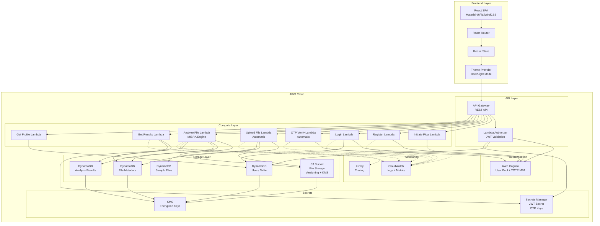
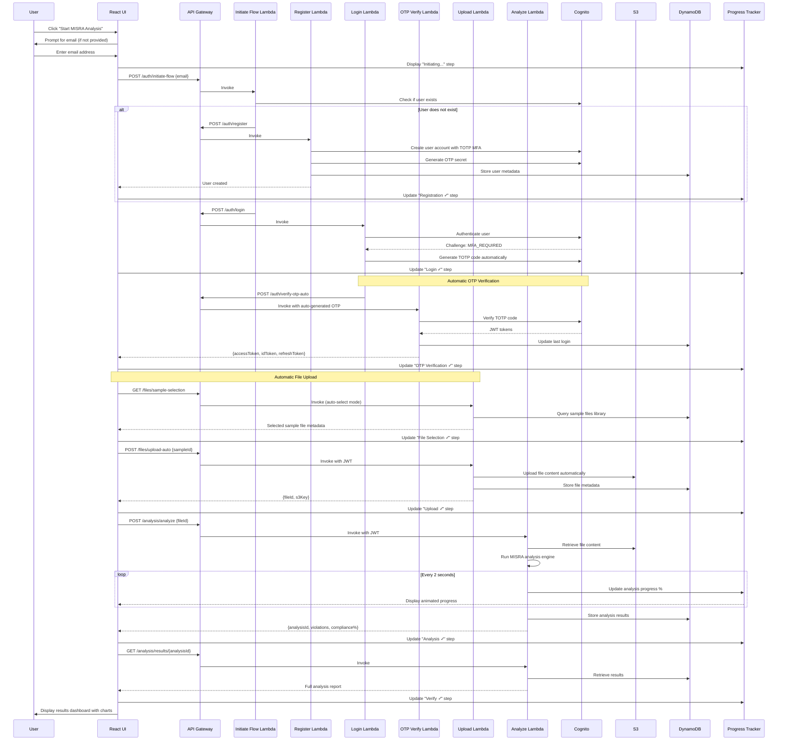

# Design Document: Production-Ready MISRA Compliance Platform

## Overview

The Production-Ready MISRA Compliance Platform is a fully automated, serverless SaaS solution built on AWS infrastructure that provides MISRA C/C++ compliance analysis with a fire-and-forget workflow. The system transforms the existing test-button.html demonstration into a production-grade platform suitable for internship defense presentations and real-world deployment.

### Key Design Principles

1. **ONE CLICK Automation**: Users enter only their email address; the system handles everything else
2. **Real AWS Services**: No mocks - production-ready Cognito, API Gateway, Lambda, S3, DynamoDB, CloudWatch
3. **Real MISRA Analysis**: Actual rule checking using the existing MISRA analysis engine with 40+ implemented rules
4. **Professional UI**: Full-width dashboard with sidebar navigation, multi-pane layout matching modern SaaS standards
5. **Real-time Progress**: Live workflow tracking with terminal-style output and progress indicators
6. **Security First**: JWT authentication, encryption at rest and in transit, IAM least privilege
7. **Scalability**: Serverless architecture with auto-scaling Lambda and DynamoDB
8. **Cost Optimization**: AWS Free Tier eligible, lifecycle policies, on-demand billing

### Critical Implementation Decisions

#### 1. Automatic OTP Verification Approach

**Decision**: Use Cognito's native SOFTWARE_TOKEN_MFA challenge flow with server-side TOTP generation

**Rationale**:
- Leverages Cognito's built-in TOTP MFA security features
- Secrets stored securely in Cognito's native MFA storage
- Complies with RFC 6238 TOTP standard
- Maintains production-grade security while automating user experience

**Implementation**:
- Register Lambda enables SOFTWARE_TOKEN_MFA on user creation
- Login Lambda initiates auth and receives SOFTWARE_TOKEN_MFA challenge
- OTP Verify Lambda generates TOTP code server-side using speakeasy/otplib
- Lambda responds to challenge using RespondToAuthChallenge API
- Frontend never sees TOTP secrets or codes

**NOT a simulation**: This uses Cognito's real MFA mechanism, just automates the code generation step that would normally require manual user input.

#### 2. Real-time Progress Updates Approach

**Decision**: Use HTTP polling (2-second interval) as primary implementation

**Rationale**:
- Simpler to implement and debug
- No additional AWS services required (WebSocket would need API Gateway WebSocket API)
- Sufficient for 60-second workflow duration
- Lower complexity for MVP/demonstration
- Can upgrade to WebSocket later if needed (Task 14.11)

**Implementation**:
- Frontend polls GET /analysis/progress/{analysisId} every 2 seconds
- Analysis Lambda updates progress in DynamoDB during execution
- Progress table stores: percentage, current step, rules processed, logs
- Polling stops when status = 'completed' or 'failed'

**Future optimization**: WebSocket support can be added in Phase 4 (Performance Optimization) if polling becomes a bottleneck at scale.

### System Context

The platform serves three primary use cases:

1. **Demonstration Mode**: Automated workflow for internship defense presentations
2. **Development Testing**: Real AWS integration for testing and validation
3. **Production Deployment**: Scalable SaaS platform for MISRA compliance checking


## Architecture

### High-Level Architecture



### Autonomous Compliance Pipeline Flow with Automatic OTP and Upload




## UI/UX Design and Visual Mockups

### Design System

#### Color Palette

**Primary Colors**:
- Deep Blue: `#1e3a8a` (primary brand color)
- Cyan Accent: `#06b6d4` (highlights and CTAs)
- Dark Blue: `#0f172a` (backgrounds in dark mode)
- Light Gray: `#f8fafc` (backgrounds in light mode)

**Semantic Colors**:
- Success: `#10b981` (completed steps, compliance scores)
- Warning: `#f59e0b` (advisory violations)
- Error: `#ef4444` (critical violations)
- Info: `#3b82f6` (informational messages)

**Gradient Backgrounds**:
- Hero Gradient: `linear-gradient(135deg, #1e3a8a 0%, #06b6d4 100%)`
- Card Gradient: `linear-gradient(145deg, #ffffff 0%, #f8fafc 100%)` (light mode)
- Dark Card Gradient: `linear-gradient(145deg, #1e293b 0%, #0f172a 100%)` (dark mode)

#### Typography

**Font Family**:
- Primary: `'Inter', -apple-system, BlinkMacSystemFont, 'Segoe UI', sans-serif`
- Monospace: `'Fira Code', 'Monaco', 'Courier New', monospace` (for code viewer and terminal)

**Font Sizes**:
- Hero Title: `3.5rem` (56px)
- Section Title: `2rem` (32px)
- Card Title: `1.5rem` (24px)
- Body Text: `1rem` (16px)
- Small Text: `0.875rem` (14px)
- Code Text: `0.875rem` (14px)

#### Spacing System

- Base unit: `8px`
- Spacing scale: `4px, 8px, 12px, 16px, 24px, 32px, 48px, 64px`

#### Visual Effects

**Glassmorphism**:
```css
background: rgba(255, 255, 255, 0.1);
backdrop-filter: blur(10px);
border: 1px solid rgba(255, 255, 255, 0.2);
box-shadow: 0 8px 32px 0 rgba(31, 38, 135, 0.37);
```

**Neumorphism** (Light Mode):
```css
background: #f8fafc;
box-shadow: 8px 8px 16px #d1d5db, -8px -8px 16px #ffffff;
```

**Card Elevation**:
```css
box-shadow: 0 4px 6px -1px rgba(0, 0, 0, 0.1), 
            0 2px 4px -1px rgba(0, 0, 0, 0.06);
```

### Visual Mockup 1: Landing Page

```
┌─────────────────────────────────────────────────────────────────────────┐
│  [Logo] MISRA Compliance Analyzer          [Dark/Light] [Login] [Docs] │
├─────────────────────────────────────────────────────────────────────────┤
│                                                                         │
│  ╔═══════════════════════════════════════════════════════════════════╗ │
│  ║                    HERO BANNER (Gradient Background)              ║ │
│  ║                                                                   ║ │
│  ║              🛡️ Ensuring Safe & Reliable C/C++ Code              ║ │
│  ║                                                                   ║ │
│  ║        Professional MISRA C/C++ Compliance Analysis Platform     ║ │
│  ║                                                                   ║ │
│  ╚═══════════════════════════════════════════════════════════════════╝ │
│                                                                         │
│  ┌─────────────────────────────┐  ┌───────────────────────────────────┐│
│  │  PLATFORM OVERVIEW          │  │  QUICK START                      ││
│  │  (Left Panel)               │  │  (Right Panel - Glassmorphism)    ││
│  │                             │  │                                   ││
│  │  ✓ Real-time Analysis       │  │  Fully Automated Analysis         ││
│  │  ✓ 40+ MISRA Rules          │  │                                   ││
│  │  ✓ AWS Cloud Infrastructure │  │  ┌─────────────────────────────┐ ││
│  │  ✓ Automated Workflow       │  │  │ Email:                      │ ││
│  │  ✓ Detailed Reports         │  │  │ [____________________]      │ ││
│  │                             │  │  └─────────────────────────────┘ ││
│  │  Key Features:              │  │                                   ││
│  │  • Automatic OTP            │  │  [🚀 Start MISRA Analysis]       ││
│  │  • Sample File Library      │  │  (Large Cyan Button)              ││
│  │  • Interactive Dashboard    │  │                                   ││
│  │  • PDF/JSON Export          │  │  One-click automated workflow:    ││
│  │                             │  │  1. 🔐 Login                      ││
│  │  Compliance Standards:      │  │  2. 🔑 OTP Verification           ││
│  │  • MISRA C 2012            │  │  3. 📤 File Upload                ││
│  │  • MISRA C++ 2008          │  │  4. 🔍 Analysis                   ││
│  │                             │  │  5. ✅ Results                    ││
│  └─────────────────────────────┘  └───────────────────────────────────┘│
│                                                                         │
│  ┌─────────────────────────────────────────────────────────────────┐   │
│  │  TRUSTED BY DEVELOPERS WORLDWIDE                                │   │
│  │  [Stat: 10K+ Analyses] [Stat: 99.9% Uptime] [Stat: <60s Speed] │   │
│  └─────────────────────────────────────────────────────────────────┘   │
│                                                                         │
└─────────────────────────────────────────────────────────────────────────┘
```

**Design Notes**:
- Full-width hero banner with gradient background (deep blue to cyan)
- Split layout: 60% left (overview), 40% right (quick start)
- Glassmorphism effect on Quick Start panel
- Large, prominent "Start MISRA Analysis" button with hover animation
- Animated icons with pulse effect
- Responsive: stacks vertically on mobile

### Visual Mockup 2: Analysis Progress View

```
┌─────────────────────────────────────────────────────────────────────────┐
│  [Logo] MISRA Compliance Analyzer          [Dark/Light] [user@email]   │
├─────────────────────────────────────────────────────────────────────────┤
│                                                                         │
│  ┌─────────────────────────────────────────────────────────────────┐   │
│  │  ANALYSIS IN PROGRESS                                           │   │
│  │                                                                 │   │
│  │  ┌──────┐  ┌──────┐  ┌──────┐  ┌──────┐  ┌──────┐            │   │
│  │  │  🔐  │→ │  🔑  │→ │  📤  │→ │  🔍  │→ │  ✅  │            │   │
│  │  │Login │  │ OTP  │  │Upload│  │Analyze│ │Verify│            │   │
│  │  │  ✓   │  │  ✓   │  │  ✓   │  │ ⟳... │  │      │            │   │
│  │  └──────┘  └──────┘  └──────┘  └──────┘  └──────┘            │   │
│  │                                                                 │   │
│  │  Progress: ████████████████░░░░░░░░ 65%                       │   │
│  │  Estimated Time Remaining: 18 seconds                          │   │
│  │                                                                 │   │
│  └─────────────────────────────────────────────────────────────────┘   │
│                                                                         │
│  ┌─────────────────────────────────────────────────────────────────┐   │
│  │  REAL-TIME LOGS (Terminal Style)                               │   │
│  │  ┌───────────────────────────────────────────────────────────┐ │   │
│  │  │ [12:34:01] ✓ User authentication successful               │ │   │
│  │  │ [12:34:02] ✓ OTP verified automatically                   │ │   │
│  │  │ [12:34:03] ✓ Sample file selected: sample_violations.c    │ │   │
│  │  │ [12:34:04] ✓ File uploaded to S3 (2.4 KB)                 │ │   │
│  │  │ [12:34:05] ⟳ Starting MISRA analysis...                   │ │   │
│  │  │ [12:34:07] ⟳ Parsing C code with tree-sitter...           │ │   │
│  │  │ [12:34:09] ⟳ Evaluating MISRA C 2012 rules...             │ │   │
│  │  │ [12:34:11] ⟳ Rules processed: 28/42 (67%)                 │ │   │
│  │  │ [12:34:13] ⟳ Violations found: 5 (3 Major, 2 Minor)       │ │   │
│  │  │ [12:34:15] ⟳ Generating compliance report...              │ │   │
│  │  │                                                            │ │   │
│  │  └───────────────────────────────────────────────────────────┘ │   │
│  └─────────────────────────────────────────────────────────────────┘   │
│                                                                         │
│  ┌─────────────────────────────────────────────────────────────────┐   │
│  │  ANALYSIS DETAILS                                               │   │
│  │  File: sample_violations.c                                      │   │
│  │  Language: C                                                    │   │
│  │  Size: 2.4 KB (156 lines)                                       │   │
│  │  Standard: MISRA C 2012                                         │   │
│  └─────────────────────────────────────────────────────────────────┘   │
│                                                                         │
└─────────────────────────────────────────────────────────────────────────┘
```

**Design Notes**:
- Animated progress tracker with icons (spinning during active step)
- Completed steps show checkmarks with green color
- Active step shows spinning/pulsing animation
- Terminal-style logs with timestamps and status icons
- Green text on dark background for terminal aesthetic
- Real-time updates every 2 seconds
- Progress bar with percentage and time estimate

### Visual Mockup 3: Results Dashboard

```
┌─────────────────────────────────────────────────────────────────────────┐
│  [Logo] MISRA Compliance Analyzer    [Dark/Light] [Download] [user@]   │
├─────────────────────────────────────────────────────────────────────────┤
│                                                                         │
│  ┌─────────────────────────────────────────────────────────────────┐   │
│  │  COMPLIANCE RESULTS                          [📥 Download Report]│   │
│  │                                                                 │   │
│  │  ┌──────────────┐  ┌──────────────────────────────────────────┐│   │
│  │  │              │  │  VIOLATION SUMMARY                       ││   │
│  │  │      87%     │  │                                          ││   │
│  │  │              │  │  ┌────────────────────────────────────┐ ││   │
│  │  │  Compliance  │  │  │ Critical:  █████░░░░░░░░░░  2      │ ││   │
│  │  │    Score     │  │  │ Major:     ████████░░░░░░░  5      │ ││   │
│  │  │              │  │  │ Minor:     ███░░░░░░░░░░░░  1      │ ││   │
│  │  │  (Circular   │  │  │ Advisory:  ██░░░░░░░░░░░░░  1      │ ││   │
│  │  │   Gauge)     │  │  └────────────────────────────────────┘ ││   │
│  │  │              │  │                                          ││   │
│  │  └──────────────┘  │  Total Violations: 9                    ││   │
│  │                    │  Rules Evaluated: 42                     ││   │
│  │                    │  Analysis Time: 23.4s                    ││   │
│  │                    └──────────────────────────────────────────┘│   │
│  └─────────────────────────────────────────────────────────────────┘   │
│                                                                         │
│  ┌─────────────────────────────────────────────────────────────────┐   │
│  │  TOP VIOLATIONS                                                 │   │
│  │  ┌───────────────────────────────────────────────────────────┐ │   │
│  │  │ 🔴 MISRA-C-2012-8.4 | Line 45 | MANDATORY                 │ │   │
│  │  │    Function 'calculate' has no prototype declaration      │ │   │
│  │  │    → Add function prototype before use                    │ │   │
│  │  ├───────────────────────────────────────────────────────────┤ │   │
│  │  │ 🟠 MISRA-C-2012-10.1 | Line 67 | REQUIRED                │ │   │
│  │  │    Implicit conversion from int to unsigned int           │ │   │
│  │  │    → Use explicit cast or change variable type            │ │   │
│  │  ├───────────────────────────────────────────────────────────┤ │   │
│  │  │ 🟠 MISRA-C-2012-15.5 | Line 89 | ADVISORY                │ │   │
│  │  │    Multiple exit points in function                       │ │   │
│  │  │    → Refactor to single return statement                  │ │   │
│  │  └───────────────────────────────────────────────────────────┘ │   │
│  └─────────────────────────────────────────────────────────────────┘   │
│                                                                         │
│  ┌──────────────────────────┐  ┌────────────────────────────────────┐ │
│  │  CODE VIEWER             │  │  TERMINAL OUTPUT                   │ │
│  │  ┌────────────────────┐  │  │  ┌──────────────────────────────┐ │ │
│  │  │ 43: int main() {   │  │  │  │ [12:34:20] ✓ Analysis complete│ │ │
│  │  │ 44:   int result;  │  │  │  │ [12:34:20] Compliance: 87%   │ │ │
│  │  │ 45:   result =     │⚠ │  │  │ [12:34:20] Violations: 9     │ │ │
│  │  │       calculate(); │  │  │  │ [12:34:20] Report generated  │ │ │
│  │  │ 46:   return 0;    │  │  │  │ [12:34:21] ✓ Saved to DDB    │ │ │
│  │  │ 47: }              │  │  │  └──────────────────────────────┘ │ │
│  │  └────────────────────┘  │  └────────────────────────────────────┘ │
│  │  (Syntax highlighting)   │  (Terminal-style logs)                  │
│  └──────────────────────────┘                                          │
│                                                                         │
│  [← Back to Dashboard]  [🔄 Analyze Another File]  [📤 Share Results]  │
│                                                                         │
└─────────────────────────────────────────────────────────────────────────┘
```

**Design Notes**:
- Circular compliance gauge with animated fill (87% shown in green/yellow/red based on score)
- Horizontal bar charts for violation categories
- Color-coded violations: Red (Critical), Orange (Major), Yellow (Minor), Blue (Advisory)
- Interactive code viewer with syntax highlighting
- Violation markers (⚠) on affected lines
- Click on violation to jump to code line
- Terminal output shows workflow completion logs
- Download button exports PDF or JSON report
- Responsive: stacks vertically on mobile

### Visual Mockup 4: OTP Verification Screen (Automatic)

```
┌─────────────────────────────────────────────────────────────────────────┐
│  [Logo] MISRA Compliance Analyzer                                      │
├─────────────────────────────────────────────────────────────────────────┤
│                                                                         │
│                                                                         │
│                    ┌─────────────────────────────────┐                 │
│                    │                                 │                 │
│                    │         🔑 Verifying OTP        │                 │
│                    │                                 │                 │
│                    │    ⟳ Automatic verification    │                 │
│                    │       in progress...            │                 │
│                    │                                 │                 │
│                    │    ████████████░░░░░░░ 75%     │                 │
│                    │                                 │                 │
│                    │  This happens automatically     │                 │
│                    │  No manual OTP entry required   │                 │
│                    │                                 │                 │
│                    └─────────────────────────────────┘                 │
│                                                                         │
│                                                                         │
│                    Secured by AWS Cognito TOTP MFA                     │
│                                                                         │
└─────────────────────────────────────────────────────────────────────────┘
```

**Design Notes**:
- Centered modal with glassmorphism effect
- Animated spinning icon during verification
- Progress bar showing verification status
- Clear messaging: "Automatic verification - No manual OTP entry required"
- Transitions automatically to next step upon success
- Shows for 2-3 seconds before moving to upload step

### Component Hierarchy

```
App
├── ThemeProvider (Dark/Light mode)
├── Router
│   ├── LandingPage
│   │   ├── HeroBanner
│   │   ├── PlatformOverview (Left Panel)
│   │   └── QuickStartPanel (Right Panel)
│   │       ├── EmailInput
│   │       └── StartAnalysisButton
│   │
│   ├── AnalysisProgressPage
│   │   ├── ProgressTracker
│   │   │   ├── StepIcon (Login)
│   │   │   ├── StepIcon (OTP)
│   │   │   ├── StepIcon (Upload)
│   │   │   ├── StepIcon (Analyze)
│   │   │   └── StepIcon (Verify)
│   │   ├── ProgressBar
│   │   ├── TerminalLogs
│   │   └── AnalysisDetails
│   │
│   ├── OTPVerificationModal (Automatic)
│   │   ├── SpinnerIcon
│   │   ├── ProgressBar
│   │   └── StatusMessage
│   │
│   └── ResultsDashboard
│       ├── ResultsHeader
│       │   ├── ComplianceGauge (Circular)
│       │   └── ViolationSummaryChart
│       ├── TopViolationsList
│       │   └── ViolationCard (repeating)
│       ├── CodeViewer
│       │   ├── SyntaxHighlighter
│       │   └── ViolationMarkers
│       ├── TerminalOutput
│       └── ActionButtons
│           ├── DownloadReportButton
│           ├── AnalyzeAnotherButton
│           └── ShareResultsButton
│
└── GlobalComponents
    ├── Header
    │   ├── Logo
    │   ├── ThemeToggle
    │   └── UserMenu
    └── Footer
```

### Responsive Design Breakpoints

**Desktop** (≥1280px):
- Full split layout with side-by-side panels
- Multi-column results dashboard
- Code viewer and terminal side-by-side

**Tablet** (768px - 1279px):
- Stacked panels with full width
- Two-column results dashboard
- Code viewer above terminal

**Mobile** (≤767px):
- Single column layout
- Collapsible sections
- Simplified charts
- Touch-optimized buttons

### Animation Specifications

**Progress Tracker Icons**:
- Pending: Gray, static
- Active: Cyan, pulsing animation (scale 1.0 → 1.1 → 1.0, 1s loop)
- Completed: Green, checkmark fade-in (0.3s)
- Error: Red, shake animation (0.5s)

**Progress Bar**:
- Smooth transition with CSS `transition: width 0.5s ease-in-out`
- Gradient fill: `linear-gradient(90deg, #06b6d4 0%, #10b981 100%)`

**Button Hover**:
- Scale up: `transform: scale(1.05)`
- Shadow increase: `box-shadow: 0 10px 20px rgba(6, 182, 212, 0.3)`
- Transition: `0.2s ease-in-out`

**Terminal Logs**:
- New line fade-in: `opacity: 0 → 1` (0.3s)
- Auto-scroll to bottom with smooth behavior

**Compliance Gauge**:
- Animated fill on load: `stroke-dashoffset` animation (1.5s ease-out)
- Color changes based on score:
  - 90-100%: Green `#10b981`
  - 70-89%: Yellow `#f59e0b`
  - <70%: Red `#ef4444`


### Frontend Components

#### 1. FireAndForgetInterface Component

**Purpose**: Primary entry point for the autonomous workflow

**Props**:
```typescript
interface FireAndForgetInterfaceProps {
  onStartWorkflow: (email: string, name?: string) => Promise<void>;
  isRunning: boolean;
  error: string | null;
  onRetry: () => void;
  demoMode: boolean;
}
```

**Responsibilities**:
- Email input validation (RFC 5322 format)
- Workflow initiation
- Error display and retry handling
- Demo mode toggle

**State Management**:
- Local state for email input
- Redux state for workflow status
- Error boundary for graceful failure handling

#### 2. RealTimeProgressDisplay Component

**Purpose**: Live progress tracking with terminal-style output

**Props**:
```typescript
interface RealTimeProgressDisplayProps {
  currentStep: string;
  completedSteps: string[];
  analysisProgress: number;
  isRunning: boolean;
  visible: boolean;
  estimatedTimeRemaining?: number;
  rulesProcessed?: number;
  totalRules?: number;
}
```

**Features**:
- Step-by-step progress indicators
- Real-time percentage updates (2-second intervals)
- Terminal-style log output
- Estimated time remaining
- Rule-by-rule progress for MISRA analysis

#### 3. MultiPaneDashboard Component

**Purpose**: Professional results display with multiple views

**Layout**:
```
┌─────────────────────────────────────────────────────┐
│  Sidebar Navigation                                 │
├─────────────────────────────────────────────────────┤
│                                                     │
│  ┌─────────────────────────────────────────────┐   │
│  │  Results Pane (Top)                         │   │
│  │  - Compliance Score                         │   │
│  │  - Violation Summary                        │   │
│  │  - Charts and Metrics                       │   │
│  └─────────────────────────────────────────────┘   │
│                                                     │
│  ┌──────────────────────┐ ┌────────────────────┐   │
│  │  Code Viewer (Left)  │ │  Terminal (Right)  │   │
│  │  - Syntax highlight  │ │  - Workflow logs   │   │
│  │  - Line numbers      │ │  - Progress msgs   │   │
│  │  - Violation markers │ │  - Error details   │   │
│  └──────────────────────┘ └────────────────────┘   │
│                                                     │
└─────────────────────────────────────────────────────┘
```

**Props**:
```typescript
interface MultiPaneDashboardProps {
  resultsContent: React.ReactNode;
  codeViewerContent: React.ReactNode;
  terminalContent: React.ReactNode;
}
```

#### 4. DashboardLayout Component

**Purpose**: Main application layout with sidebar navigation

**Features**:
- Responsive sidebar (collapsible on mobile)
- Navigation menu with active state
- Demo mode toggle
- User profile dropdown
- Breadcrumb navigation

### Backend Lambda Functions

#### 1. Initiate Flow Lambda

**Function**: `initiate-flow.ts`

**Purpose**: Orchestrate the autonomous workflow

**Input**:
```typescript
interface InitiateFlowRequest {
  email: string;
  name?: string;
  demoMode?: boolean;
}
```

**Output**:
```typescript
interface InitiateFlowResponse {
  workflowId: string;
  userExists: boolean;
  nextStep: 'register' | 'login';
}
```

**Logic**:
1. Validate email format
2. Check if user exists in Cognito
3. Return workflow ID and next step
4. Log workflow initiation to CloudWatch

**Environment Variables**:
- `USER_POOL_ID`: Cognito User Pool ID
- `USERS_TABLE_NAME`: DynamoDB users table

#### 2. Register Lambda

**Function**: `register.ts`

**Purpose**: Create new Cognito user account

**Input**:
```typescript
interface RegisterRequest {
  email: string;
  name: string;
  password?: string; // Auto-generated if not provided
}
```

**Output**:
```typescript
interface RegisterResponse {
  userId: string;
  email: string;
  temporaryPassword?: string;
}
```

**Logic**:
1. Generate secure temporary password (if not provided)
2. Create Cognito user with AdminCreateUser
3. Store user metadata in DynamoDB users table
4. Return user ID and credentials
5. Log registration event to CloudWatch

**Cognito Attributes**:
- `email` (required, verified)
- `name` (required)
- `custom:organizationId` (optional)
- `custom:role` (default: 'user')

#### 3. Login Lambda

**Function**: `login.ts`

**Purpose**: Authenticate user and issue JWT tokens

**Input**:
```typescript
interface LoginRequest {
  email: string;
  password: string;
}
```

**Output**:
```typescript
interface LoginResponse {
  accessToken: string;
  idToken: string;
  refreshToken: string;
  expiresIn: number;
  userId: string;
}
```

**Logic**:
1. Authenticate with Cognito using AdminInitiateAuth
2. Handle NEW_PASSWORD_REQUIRED challenge (auto-confirm)
3. Update last login timestamp in DynamoDB
4. Return JWT tokens
5. Log authentication event to CloudWatch

**Token Expiration**:
- Access Token: 1 hour
- ID Token: 1 hour
- Refresh Token: 30 days

#### 4. OTP Verify Lambda (Automatic TOTP Verification)

**Function**: `verify-otp-auto.ts`

**Purpose**: Automatically verify TOTP MFA challenge using Cognito's SOFTWARE_TOKEN_MFA flow

**Input**:
```typescript
interface OTPVerifyRequest {
  session: string;           // MFA challenge session from login
  username: string;
  userPoolId: string;
}
```

**Output**:
```typescript
interface OTPVerifyResponse {
  accessToken: string;
  idToken: string;
  refreshToken: string;
  expiresIn: number;
  userId: string;
}
```

**Logic**:
1. Receive SOFTWARE_TOKEN_MFA challenge session from Login Lambda
2. Retrieve user's TOTP secret from Cognito (stored via AssociateSoftwareToken)
3. Generate current TOTP code using server-side library (speakeasy or otplib)
4. Call RespondToAuthChallenge with generated TOTP code
5. Receive JWT tokens from Cognito
6. Update last login timestamp in DynamoDB
7. Return JWT tokens to frontend
8. Log verification event to CloudWatch

**TOTP Generation**:
```typescript
import * as speakeasy from 'speakeasy';

const token = speakeasy.totp({
  secret: totpSecret,
  encoding: 'base32',
  step: 30,
  window: 1
});
```

**Cognito Integration**:
- Uses `AdminInitiateAuth` with `SOFTWARE_TOKEN_MFA` challenge
- Calls `RespondToAuthChallenge` with `ChallengeName: SOFTWARE_TOKEN_MFA`
- Automatically handles MFA_SETUP challenge during first login
- Uses `AssociateSoftwareToken` and `VerifySoftwareToken` for TOTP setup

**Security Notes**:
- TOTP secrets stored securely in Cognito's native MFA storage
- Secrets never exposed to frontend
- Standard RFC 6238 TOTP algorithm
- 30-second time step with 1-window tolerance

**Environment Variables**:
- `USER_POOL_ID`: Cognito User Pool ID
- `CLIENT_ID`: Cognito App Client ID

**Function**: `upload.ts`

**Purpose**: Handle file uploads and sample file selection

**Input**:
```typescript
interface UploadRequest {
  mode: 'sample' | 'manual';
  sampleId?: string; // For sample mode
  fileContent?: string; // For manual mode
  fileName?: string;
  language: 'c' | 'cpp';
}
```

**Output**:
```typescript
interface UploadResponse {
  fileId: string;
  s3Key: string;
  fileName: string;
  fileSize: number;
  language: string;
  uploadTimestamp: number;
}
```

**Logic**:
1. Validate JWT token (via Lambda Authorizer)
2. If sample mode: retrieve sample file from DynamoDB
3. If manual mode: validate file content and size
4. Upload file to S3 with encryption
5. Store file metadata in DynamoDB
6. Return file ID and metadata
7. Log upload event to CloudWatch

**S3 Key Structure**: `{userId}/{fileId}/{fileName}`

**Sample File Selection Criteria**:
- Language match (C or C++)
- Compliance score range (60%-95%)
- Demonstration mode: select file with diverse violations

#### 5. Analyze File Lambda

**Function**: `analyze-file.ts`

**Purpose**: Execute MISRA compliance analysis

**Input**:
```typescript
interface AnalyzeRequest {
  fileId: string;
  enableRealTimeProgress?: boolean;
}
```

**Output**:
```typescript
interface AnalyzeResponse {
  analysisId: string;
  fileId: string;
  language: 'c' | 'cpp';
  violations: Violation[];
  summary: {
    totalViolations: number;
    criticalCount: number;
    majorCount: number;
    minorCount: number;
    compliancePercentage: number;
  };
  executionTime: number;
  cached: boolean;
}
```

**Logic**:
1. Validate JWT token
2. Retrieve file content from S3
3. Check analysis cache (hash-based)
4. If cache miss: run MISRA analysis engine
5. Update progress every 2 seconds
6. Store results in DynamoDB
7. Cache results for future use
8. Return analysis results
9. Log analysis metrics to CloudWatch

**MISRA Analysis Engine Integration**:
- Uses existing `MISRAAnalysisEngine` class
- Implements 40+ MISRA C/C++ rules
- Real AST parsing with tree-sitter
- Progress callback for real-time updates
- Cache optimization for repeated analysis

**Performance Targets**:
- Files < 1,000 lines: < 10 seconds
- Files < 10,000 lines: < 40 seconds
- Cache hit: < 2 seconds

#### 6. Get Analysis Results Lambda

**Function**: `get-analysis-results.ts`

**Purpose**: Retrieve stored analysis results

**Input**:
```typescript
interface GetResultsRequest {
  analysisId: string;
}
```

**Output**:
```typescript
interface GetResultsResponse {
  analysisId: string;
  fileId: string;
  fileName: string;
  language: string;
  violations: Violation[];
  summary: AnalysisSummary;
  createdAt: string;
  fileContent?: string; // Optional, for code viewer
}
```

**Logic**:
1. Validate JWT token
2. Query DynamoDB for analysis results
3. Optionally retrieve file content from S3
4. Return complete analysis report
5. Log retrieval event to CloudWatch

#### 7. Lambda Authorizer

**Function**: `authorizer.ts`

**Purpose**: Validate JWT tokens for API Gateway

**Input**:
```typescript
interface AuthorizerEvent {
  type: 'TOKEN';
  authorizationToken: string;
  methodArn: string;
}
```

**Output**:
```typescript
interface AuthorizerResponse {
  principalId: string;
  policyDocument: {
    Version: '2012-10-17';
    Statement: [{
      Action: 'execute-api:Invoke';
      Effect: 'Allow' | 'Deny';
      Resource: string;
    }];
  };
  context: {
    userId: string;
    email: string;
    role: string;
  };
}
```

**Logic**:
1. Extract JWT token from Authorization header
2. Verify token signature with Cognito public keys
3. Check token expiration
4. Retrieve user metadata from DynamoDB
5. Generate IAM policy (Allow/Deny)
6. Return policy with user context
7. Log authorization event to CloudWatch

**Caching**: API Gateway caches authorizer responses for 5 minutes (configurable)

### API Gateway Endpoints

#### Authentication Endpoints

```
POST /auth/initiate-flow
  - Body: { email, name?, demoMode? }
  - Response: { workflowId, userExists, nextStep }
  - Auth: None

POST /auth/register
  - Body: { email, name, password? }
  - Response: { userId, email, temporaryPassword? }
  - Auth: None
  - Note: Enables SOFTWARE_TOKEN_MFA on user creation

POST /auth/login
  - Body: { email, password }
  - Response: { session, challengeName: 'SOFTWARE_TOKEN_MFA', userId }
  - Auth: None
  - Note: Returns MFA challenge session

POST /auth/verify-otp-auto
  - Body: { session, username, userPoolId }
  - Response: { accessToken, idToken, refreshToken, expiresIn, userId }
  - Auth: None
  - Note: Automatically generates and verifies TOTP code

POST /auth/refresh
  - Body: { refreshToken }
  - Response: { accessToken, idToken, expiresIn }
  - Auth: None

GET /auth/profile
  - Response: { userId, email, name, role, organizationId }
  - Auth: JWT (Lambda Authorizer)
```

#### File Management Endpoints

```
POST /files/upload
  - Body: { mode, sampleId?, fileContent?, fileName?, language }
  - Response: { fileId, s3Key, fileName, fileSize, language, uploadTimestamp }
  - Auth: JWT

GET /files/sample-selection
  - Query: { language?, complianceRange? }
  - Response: { sampleId, fileName, language, expectedCompliance, description }
  - Auth: JWT

GET /files/{fileId}
  - Response: { fileId, fileName, s3Key, fileSize, language, uploadTimestamp }
  - Auth: JWT

GET /files
  - Query: { limit?, nextToken? }
  - Response: { files: [], nextToken? }
  - Auth: JWT
```

#### Analysis Endpoints

```
POST /analysis/analyze
  - Body: { fileId, enableRealTimeProgress? }
  - Response: { analysisId, violations, summary, executionTime, cached }
  - Auth: JWT

GET /analysis/progress/{analysisId}
  - Response: { analysisId, status, progress, estimatedTimeRemaining, logs }
  - Auth: JWT
  - Note: Polled every 2 seconds by frontend for real-time updates

GET /analysis/results/{analysisId}
  - Response: { analysisId, fileId, fileName, violations, summary, createdAt }
  - Auth: JWT

GET /analysis/history
  - Query: { limit?, nextToken? }
  - Response: { analyses: [], nextToken? }
  - Auth: JWT

GET /analysis/stats
  - Response: { totalAnalyses, avgCompliance, totalViolations, ... }
  - Auth: JWT
```

**Real-time Progress Implementation**:
- Frontend polls `GET /analysis/progress/{analysisId}` every 2 seconds
- Analysis Lambda updates progress in DynamoDB during execution
- Progress includes: percentage, current step, rules processed, violations found, logs
- Polling continues until status = 'completed' or 'failed'

#### Monitoring Endpoints

```
GET /health
  - Response: { status: 'healthy' | 'degraded' | 'unhealthy', timestamp }
  - Auth: None

GET /health/detailed
  - Response: { services: { cognito, s3, dynamodb, lambda }, timestamp }
  - Auth: API Key

POST /metrics/collect
  - Body: { metricType, value, dimensions }
  - Response: { success: true }
  - Auth: Internal (EventBridge)
```

### CORS Configuration

All API Gateway endpoints include CORS headers:

```
Access-Control-Allow-Origin: * (restrict in production)
Access-Control-Allow-Methods: GET, POST, PUT, DELETE, OPTIONS
Access-Control-Allow-Headers: Content-Type, Authorization, X-Amz-Date, X-Api-Key, X-Correlation-ID
Access-Control-Max-Age: 3600
```


## Data Models

### DynamoDB Table Schemas

#### 1. Users Table

**Table Name**: `misra-platform-users-{environment}`

**Primary Key**:
- Partition Key: `userId` (String)

**Attributes**:
```typescript
interface UserRecord {
  userId: string;              // UUID v4
  email: string;               // Unique, indexed
  name: string;
  cognitoUsername: string;     // Cognito sub
  role: 'admin' | 'user' | 'viewer';
  organizationId?: string;
  createdAt: string;           // ISO 8601
  lastLoginAt?: string;        // ISO 8601
  analysisCount: number;       // Total analyses performed
  storageUsed: number;         // Bytes
  preferences: {
    theme: 'light' | 'dark';
    notifications: boolean;
    autoSelectSamples: boolean;
  };
}
```

**Global Secondary Indexes**:
- `email-index`: Partition Key = `email`
  - Purpose: User lookup by email during login
  - Projection: ALL

**Access Patterns**:
1. Get user by userId (primary key)
2. Get user by email (GSI)
3. Update last login timestamp
4. Increment analysis count
5. Update user preferences

#### 2. File Metadata Table

**Table Name**: `misra-platform-file-metadata-{environment}`

**Primary Key**:
- Partition Key: `fileId` (String)

**Attributes**:
```typescript
interface FileMetadataRecord {
  fileId: string;              // UUID v4
  userId: string;              // Owner
  fileName: string;
  s3Key: string;               // S3 object key
  s3Bucket: string;            // S3 bucket name
  fileSize: number;            // Bytes
  language: 'c' | 'cpp';
  uploadTimestamp: number;     // Unix timestamp (ms)
  uploadedAt: string;          // ISO 8601
  isSample: boolean;           // True for sample files
  sampleId?: string;           // Reference to sample library
  contentHash: string;         // SHA-256 hash for cache
  analysisCount: number;       // Times analyzed
  lastAnalyzedAt?: string;     // ISO 8601
  tags?: string[];             // User-defined tags
}
```

**Global Secondary Indexes**:
- `userId-uploadTimestamp-index`: 
  - Partition Key = `userId`
  - Sort Key = `uploadTimestamp`
  - Purpose: List user's files chronologically
  - Projection: ALL

**Access Patterns**:
1. Get file metadata by fileId (primary key)
2. List files by userId, sorted by upload time (GSI)
3. Update analysis count
4. Query by content hash for cache lookup

#### 3. Analysis Results Table

**Table Name**: `misra-platform-analysis-results-{environment}`

**Primary Key**:
- Partition Key: `analysisId` (String)
- Sort Key: `timestamp` (Number)

**Attributes**:
```typescript
interface AnalysisResultRecord {
  analysisId: string;          // UUID v4
  fileId: string;              // Reference to file
  userId: string;              // Owner
  timestamp: number;           // Unix timestamp (ms)
  createdAt: string;           // ISO 8601
  language: 'c' | 'cpp';
  status: 'completed' | 'failed' | 'in_progress';
  violations: Violation[];
  summary: {
    totalViolations: number;
    criticalCount: number;
    majorCount: number;
    minorCount: number;
    compliancePercentage: number;
  };
  executionTime: number;       // Milliseconds
  cached: boolean;             // True if from cache
  rulesEvaluated: number;
  contentHash: string;         // For cache lookup
  ttl?: number;                // DynamoDB TTL (optional)
}

interface Violation {
  ruleId: string;              // e.g., "MISRA-C-2012-1.1"
  severity: 'mandatory' | 'required' | 'advisory';
  line: number;
  column: number;
  message: string;
  recommendation: string;
  codeSnippet?: string;
}
```

**Global Secondary Indexes**:
- `fileId-timestamp-index`:
  - Partition Key = `fileId`
  - Sort Key = `timestamp`
  - Purpose: Get analysis history for a file
  - Projection: ALL

- `userId-timestamp-index`:
  - Partition Key = `userId`
  - Sort Key = `timestamp`
  - Purpose: Get user's analysis history
  - Projection: ALL

**Access Patterns**:
1. Get analysis by analysisId (primary key)
2. List analyses for a file (GSI)
3. List analyses for a user (GSI)
4. Query by content hash for cache lookup

**TTL Configuration**: Optional 90-day expiration for old analyses

#### 4. Sample Files Table

**Table Name**: `misra-platform-sample-files-{environment}`

**Primary Key**:
- Partition Key: `sampleId` (String)

**Attributes**:
```typescript
interface SampleFileRecord {
  sampleId: string;            // UUID v4
  fileName: string;
  language: 'c' | 'cpp';
  fileContent: string;         // Stored inline for samples
  fileSize: number;            // Bytes
  description: string;
  expectedCompliance: number;  // 0-100
  expectedViolations: number;
  difficultyLevel: 'beginner' | 'intermediate' | 'advanced';
  tags: string[];              // e.g., ['pointers', 'loops', 'functions']
  violationTypes: string[];    // e.g., ['mandatory', 'required']
  createdAt: string;           // ISO 8601
  usageCount: number;          // Times selected
}
```

**Global Secondary Indexes**:
- `language-difficultyLevel-index`:
  - Partition Key = `language`
  - Sort Key = `difficultyLevel`
  - Purpose: Filter samples by language and difficulty
  - Projection: ALL

**Access Patterns**:
1. Get sample by sampleId (primary key)
2. List samples by language and difficulty (GSI)
3. Random sample selection for demo mode
4. Increment usage count

**Sample Library Contents** (Requirement 8):
- Minimum 10 sample files
- Mix of C and C++ files
- Compliance scores: 60%, 65%, 70%, 75%, 80%, 85%, 90%, 95%
- Various violation types and severities
- Real-world code patterns

### S3 Bucket Structure

**Bucket Name**: `misra-platform-files-{environment}-{accountId}`

**Folder Structure**:
```
misra-platform-files-prod-123456789012/
├── users/
│   ├── {userId-1}/
│   │   ├── {fileId-1}/
│   │   │   └── source.c
│   │   ├── {fileId-2}/
│   │   │   └── module.cpp
│   │   └── ...
│   ├── {userId-2}/
│   │   └── ...
│   └── ...
├── samples/
│   ├── {sampleId-1}.c
│   ├── {sampleId-2}.cpp
│   └── ...
└── cache/
    ├── {contentHash-1}.json
    └── ...
```

**Object Metadata**:
- `Content-Type`: `text/plain` or `text/x-c` or `text/x-c++`
- `x-amz-meta-user-id`: User ID
- `x-amz-meta-file-id`: File ID
- `x-amz-meta-language`: `c` or `cpp`
- `x-amz-meta-upload-timestamp`: Unix timestamp

**Encryption**: Server-side encryption with KMS (SSE-KMS)

**Versioning**: Enabled for data protection

**Lifecycle Policies**:
1. Transition to Infrequent Access after 30 days
2. Transition to Glacier after 90 days
3. Delete incomplete multipart uploads after 7 days
4. Expire old versions after 30 days

### Cognito User Pool Schema

**User Pool Name**: `misra-platform-users-{environment}`

**Standard Attributes**:
- `email` (required, verified)
- `name` (required)
- `given_name` (optional)
- `family_name` (optional)

**Custom Attributes**:
- `custom:organizationId` (String, max 256 chars)
- `custom:role` (String, max 50 chars)
- `custom:otpSecret` (String, max 256 chars) - for future MFA
- `custom:backupCodes` (String, max 2048 chars) - for future MFA
- `custom:otpEnabled` (String, max 10 chars) - for future MFA

**Password Policy**:
- Minimum length: 8 characters
- Require lowercase: Yes
- Require uppercase: Yes
- Require numbers: Yes
- Require symbols: No
- Temporary password validity: 7 days

**MFA Configuration**:
- MFA: Optional
- SMS MFA: Disabled
- TOTP MFA: Enabled (for future use)

**Account Recovery**: Email only

**User Pool Client**:
- Client name: `misra-platform-web-client`
- Client secret: None (public client for SPA)
- Auth flows: USER_PASSWORD_AUTH, USER_SRP_AUTH
- Token validity:
  - Access token: 1 hour
  - ID token: 1 hour
  - Refresh token: 30 days
- Token revocation: Enabled


## Enhanced Frontend Components

### 1. LandingPage Component

**Purpose**: Main entry point with hero banner and quick start panel

**Props**:
```typescript
interface LandingPageProps {
  onStartAnalysis: (email: string) => Promise<void>;
  isLoading: boolean;
  theme: 'light' | 'dark';
  onThemeToggle: () => void;
}
```

**Layout**:
- Full-width hero banner with gradient background
- Split layout: 60% platform overview (left), 40% quick start (right)
- Responsive: stacks vertically on mobile

**Features**:
- Email input with validation
- Large "Start MISRA Analysis" CTA button
- Animated feature icons
- Statistics display (analyses count, uptime, speed)
- Glassmorphism effect on quick start panel

### 2. ProgressTracker Component

**Purpose**: Visual progress tracking with animated icons

**Props**:
```typescript
interface ProgressTrackerProps {
  currentStep: 'login' | 'otp' | 'upload' | 'analyze' | 'verify';
  completedSteps: string[];
  analysisProgress: number;
  isRunning: boolean;
  estimatedTimeRemaining?: number;
  rulesProcessed?: number;
  totalRules?: number;
}
```

**Features**:
- 5 step icons: 🔐 Login, 🔑 OTP, 📤 Upload, 🔍 Analyze, ✅ Verify
- Animated icons (pulse/spin during active step)
- Progress bar with percentage
- Estimated time remaining
- Color-coded states: gray (pending), cyan (active), green (completed), red (error)

**Animations**:
- Active step: pulsing animation (scale 1.0 → 1.1 → 1.0)
- Completed step: checkmark fade-in
- Error step: shake animation

### 3. OTPVerificationModal Component

**Purpose**: Automatic OTP verification status display

**Props**:
```typescript
interface OTPVerificationModalProps {
  isVerifying: boolean;
  progress: number;
  onComplete: () => void;
  onError: (error: string) => void;
}
```

**Features**:
- Centered modal with glassmorphism effect
- Spinning icon animation
- Progress bar (0-100%)
- Status message: "Automatic verification in progress..."
- Auto-closes on success (2-3 seconds)
- Error display with retry button

### 4. ComplianceGauge Component

**Purpose**: Circular gauge showing compliance percentage

**Props**:
```typescript
interface ComplianceGaugeProps {
  score: number; // 0-100
  size?: number; // diameter in pixels
  animated?: boolean;
}
```

**Features**:
- SVG-based circular progress
- Animated fill on mount (1.5s ease-out)
- Color-coded:
  - 90-100%: Green `#10b981`
  - 70-89%: Yellow `#f59e0b`
  - <70%: Red `#ef4444`
- Center text showing percentage
- Smooth gradient stroke

### 5. CodeViewer Component

**Purpose**: Syntax-highlighted code display with violation markers

**Props**:
```typescript
interface CodeViewerProps {
  code: string;
  language: 'c' | 'cpp';
  violations: ViolationMarker[];
  onLineClick?: (lineNumber: number) => void;
}

interface ViolationMarker {
  line: number;
  severity: 'critical' | 'major' | 'minor' | 'advisory';
  message: string;
  ruleId: string;
}
```

**Features**:
- Syntax highlighting using `react-syntax-highlighter`
- Line numbers
- Violation markers (⚠) on affected lines
- Hover tooltips showing violation details
- Click line to highlight and show details
- Scroll to violation
- Copy code button

