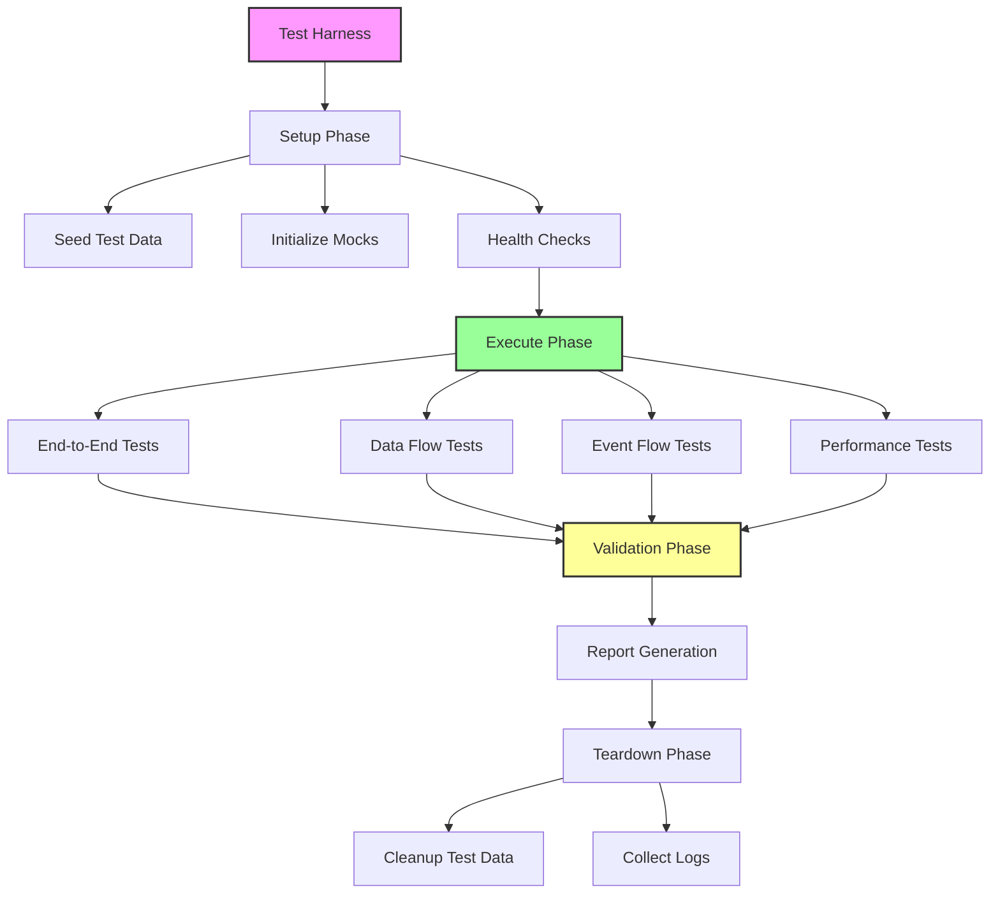
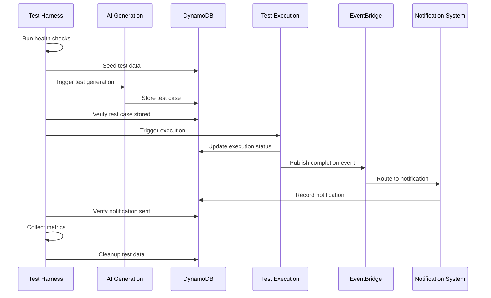

# Design Document: System Integration Testing

## Overview

The System Integration Testing feature provides comprehensive validation of cross-system interactions within the AI-Based Test System (AIBTS). While unit tests validate individual components and property tests verify component-level correctness, integration tests ensure that the three major subsystems—AI Test Generation, Test Execution, and Notification System—work together correctly as a cohesive platform.

Integration testing addresses scenarios that cannot be validated in isolation:
- Data format compatibility across system boundaries
- Event propagation through EventBridge and SQS
- End-to-end workflows spanning multiple systems
- Error handling and recovery across systems
- Performance and scalability under realistic load
- Infrastructure integration (DynamoDB, S3, SQS, EventBridge, Lambda)

The integration testing framework provides:
- **Test Harness**: Infrastructure for setup, execution, and teardown
- **Mock Services**: Test doubles for external dependencies (OpenAI API, SNS)
- **Data Flow Validators**: Verify data compatibility and transformation
- **Event Flow Validators**: Verify event propagation and handling
- **Health Checks**: Validate system readiness before testing
- **Performance Metrics**: Measure latency, throughput, and resource usage

## Architecture

### High-Level Architecture



### Integration Test Categories


1. **End-to-End Workflow Tests**: Complete user scenarios from start to finish
2. **Data Flow Tests**: Validate data format compatibility and transformation
3. **Event Flow Tests**: Verify event propagation through EventBridge and SQS
4. **Error Handling Tests**: Cross-system error scenarios and recovery
5. **Performance Tests**: Load testing and scalability validation
6. **Infrastructure Tests**: AWS resource integration and permissions

### Test Execution Flow



## Components and Interfaces

### Integration Test Harness

**Responsibility**: Orchestrate integration test execution with setup, execution, validation, and teardown phases.

**Interface**:
```typescript
interface IntegrationTestHarness {
  setup(): Promise<TestContext>;
  teardown(context: TestContext): Promise<void>;
  runTest(test: IntegrationTest, context: TestContext): Promise<TestResult>;
  runSuite(suite: IntegrationTestSuite): Promise<SuiteResult>;
}

interface TestContext {
  testId: string;
  projectId: string;
  userId: string;
  testData: TestDataSet;
  mocks: MockServices;
  startTime: Date;
}

interface TestDataSet {
  testCases: TestCase[];
  testSuites: TestSuite[];
  executions: TestExecution[];
  notifications: NotificationHistoryRecord[];
}

interface MockServices {
  openAI: MockOpenAIService;
  sns: MockSNSService;
  browser: MockBrowserService;
}

interface IntegrationTest {
  name: string;
  category: TestCategory;
  timeout: number;
  execute(context: TestContext): Promise<TestResult>;
  validate(context: TestContext): Promise<ValidationResult>;
}

interface TestResult {
  testName: string;
  status: 'pass' | 'fail' | 'error';
  duration: number;
  metrics: TestMetrics;
  errors: string[];
  logs: string[];
}

type TestCategory = 
  | 'end-to-end'
  | 'data-flow'
  | 'event-flow'
  | 'error-handling'
  | 'performance'
  | 'infrastructure';
```


**Implementation Details**:
- Manages test lifecycle from setup to teardown
- Provides isolated test context for each test
- Handles test data seeding and cleanup
- Collects logs from all systems for debugging
- Generates comprehensive test reports
- Supports parallel test execution where safe
- Implements timeout handling for long-running tests

### System Health Check Service

**Responsibility**: Verify all required systems and dependencies are operational before running tests.

**Interface**:
```typescript
interface SystemHealthCheckService {
  checkAll(): Promise<HealthCheckResult>;
  checkDynamoDB(): Promise<ComponentHealth>;
  checkLambdaFunctions(): Promise<ComponentHealth>;
  checkEventBridge(): Promise<ComponentHealth>;
  checkSQS(): Promise<ComponentHealth>;
  checkS3(): Promise<ComponentHealth>;
  checkExternalDependencies(): Promise<ComponentHealth>;
}

interface HealthCheckResult {
  overall: 'healthy' | 'degraded' | 'unhealthy';
  components: Map<string, ComponentHealth>;
  timestamp: string;
}

interface ComponentHealth {
  name: string;
  status: 'healthy' | 'unhealthy';
  message?: string;
  latency?: number;
  details?: Record<string, any>;
}
```

**Health Checks**:
1. **DynamoDB Tables**: Verify all tables exist and are accessible
   - TestCases, TestSuites, TestExecutions
   - AIUsage, AILearning
   - NotificationPreferences, NotificationTemplates, NotificationHistory

2. **Lambda Functions**: Verify functions are deployed and invocable
   - AI generation functions (analyze, generate, batch)
   - Test execution functions (trigger, executor, status, results)
   - Notification functions (processor, scheduled-reports)

3. **EventBridge Rules**: Verify rules are active
   - Test execution completion events
   - Scheduled report triggers

4. **SQS Queues**: Verify queues exist and are not in error state
   - Execution queue
   - Notification queue
   - Dead letter queues

5. **S3 Buckets**: Verify buckets exist with correct permissions
   - Screenshot storage bucket

6. **External Dependencies**: Verify reachability (with mocks in test environment)
   - OpenAI API (mocked)
   - SNS (mocked)

### Data Flow Validator

**Responsibility**: Validate data format compatibility and transformation correctness across system boundaries.

**Interface**:
```typescript
interface DataFlowValidator {
  validateTestCaseSchema(testCase: any): SchemaValidationResult;
  validateExecutionEventSchema(event: any): SchemaValidationResult;
  validateNotificationPayloadSchema(payload: any): SchemaValidationResult;
  validateLearningDataSchema(data: any): SchemaValidationResult;
  validateCrossSystemDataFlow(flow: DataFlow): DataFlowValidationResult;
}

interface SchemaValidationResult {
  valid: boolean;
  errors: SchemaError[];
  warnings: SchemaWarning[];
}

interface SchemaError {
  field: string;
  expected: string;
  actual: string;
  message: string;
}

interface SchemaWarning {
  field: string;
  message: string;
}

interface DataFlow {
  source: SystemComponent;
  destination: SystemComponent;
  dataType: string;
  sampleData: any;
}

interface DataFlowValidationResult {
  compatible: boolean;
  transformationRequired: boolean;
  issues: DataFlowIssue[];
}

interface DataFlowIssue {
  severity: 'error' | 'warning';
  field: string;
  description: string;
  recommendation?: string;
}

type SystemComponent = 
  | 'ai-generation'
  | 'test-execution'
  | 'notification-system'
  | 'learning-engine';
```


**Implementation Details**:
- Uses JSON Schema validation for structure verification
- Compares field types, required fields, and formats
- Detects missing fields, type mismatches, and format incompatibilities
- Provides recommendations for fixing compatibility issues
- Supports schema evolution testing (one system updated, others not)
- Validates optional field handling across systems

### Event Flow Validator

**Responsibility**: Verify event propagation and handling through EventBridge and SQS.

**Interface**:
```typescript
interface EventFlowValidator {
  validateEventPublication(event: Event): Promise<PublicationValidationResult>;
  validateEventRouting(event: Event): Promise<RoutingValidationResult>;
  validateEventDelivery(event: Event): Promise<DeliveryValidationResult>;
  validateEventOrdering(events: Event[]): Promise<OrderingValidationResult>;
  traceEventFlow(eventId: string): Promise<EventTrace>;
}

interface PublicationValidationResult {
  published: boolean;
  eventBridgeEventId?: string;
  timestamp: string;
  error?: string;
}

interface RoutingValidationResult {
  routed: boolean;
  targetQueue?: string;
  targetLambda?: string;
  routingDelay: number;
  error?: string;
}

interface DeliveryValidationResult {
  delivered: boolean;
  deliveryAttempts: number;
  deliveryDelay: number;
  processed: boolean;
  error?: string;
}

interface OrderingValidationResult {
  ordered: boolean;
  expectedOrder: string[];
  actualOrder: string[];
  violations: OrderViolation[];
}

interface OrderViolation {
  expectedIndex: number;
  actualIndex: number;
  eventId: string;
}

interface EventTrace {
  eventId: string;
  timeline: EventTraceStep[];
  totalDuration: number;
}

interface EventTraceStep {
  component: string;
  action: string;
  timestamp: string;
  duration: number;
  status: 'success' | 'failure';
  details?: Record<string, any>;
}
```

**Implementation Details**:
- Monitors EventBridge for published events
- Tracks event routing to SQS queues
- Verifies Lambda function invocations
- Measures end-to-end event latency
- Validates at-least-once delivery guarantees
- Tests dead-letter queue behavior for failed events
- Provides distributed tracing for event flows

### Mock Services

#### Mock OpenAI Service

**Responsibility**: Simulate OpenAI API responses for AI test generation without actual API calls.

**Interface**:
```typescript
interface MockOpenAIService {
  configure(config: MockOpenAIConfig): void;
  mockAnalysisResponse(url: string, response: ApplicationAnalysis): void;
  mockGenerationResponse(scenario: string, response: TestSpecification): void;
  mockError(errorType: 'timeout' | 'rate-limit' | 'invalid-response'): void;
  getCallHistory(): OpenAICall[];
  reset(): void;
}

interface MockOpenAIConfig {
  latency: number; // Simulated API latency in ms
  failureRate: number; // Percentage of calls that fail (0-100)
  tokenUsage: TokenUsage; // Simulated token usage
}

interface OpenAICall {
  timestamp: string;
  prompt: string;
  response: any;
  duration: number;
  tokens: TokenUsage;
}
```


#### Mock SNS Service

**Responsibility**: Simulate AWS SNS for notification delivery without sending actual messages.

**Interface**:
```typescript
interface MockSNSService {
  configure(config: MockSNSConfig): void;
  mockEmailDelivery(recipient: string, success: boolean): void;
  mockSMSDelivery(phoneNumber: string, success: boolean): void;
  mockWebhookDelivery(url: string, success: boolean): void;
  getDeliveredMessages(): SNSMessage[];
  getFailedMessages(): SNSMessage[];
  reset(): void;
}

interface MockSNSConfig {
  deliveryLatency: number; // Simulated delivery latency in ms
  failureRate: number; // Percentage of deliveries that fail (0-100)
}

interface SNSMessage {
  messageId: string;
  channel: 'email' | 'sms' | 'webhook';
  recipient: string;
  subject?: string;
  body: string;
  timestamp: string;
  delivered: boolean;
  error?: string;
}
```

#### Mock Browser Service

**Responsibility**: Simulate browser automation for test execution without launching actual browsers.

**Interface**:
```typescript
interface MockBrowserService {
  configure(config: MockBrowserConfig): void;
  mockPageLoad(url: string, success: boolean): void;
  mockElementInteraction(selector: string, success: boolean): void;
  mockScreenshot(url: string): void;
  getExecutedActions(): BrowserAction[];
  reset(): void;
}

interface MockBrowserConfig {
  actionLatency: number; // Simulated action latency in ms
  failureRate: number; // Percentage of actions that fail (0-100)
}

interface BrowserAction {
  action: 'navigate' | 'click' | 'type' | 'assert' | 'screenshot';
  target: string;
  timestamp: string;
  success: boolean;
  duration: number;
  error?: string;
}
```

### Test Data Management

**Responsibility**: Seed and cleanup test data across all DynamoDB tables.

**Interface**:
```typescript
interface TestDataManager {
  seedTestData(context: TestContext): Promise<TestDataSet>;
  cleanupTestData(context: TestContext): Promise<void>;
  createTestProject(): Promise<Project>;
  createTestSuite(projectId: string): Promise<TestSuite>;
  createTestCase(projectId: string, suiteId: string): Promise<TestCase>;
  createTestExecution(testCaseId: string): Promise<TestExecution>;
  createNotificationPreferences(userId: string): Promise<NotificationPreferences>;
}
```

**Implementation Details**:
- Creates isolated test data with unique IDs
- Seeds data across all relevant tables
- Supports bulk data creation for performance tests
- Implements cleanup with cascading deletes
- Handles cleanup failures gracefully
- Marks test data with special tags for identification

### Performance Metrics Collector

**Responsibility**: Collect and analyze performance metrics during integration tests.

**Interface**:
```typescript
interface PerformanceMetricsCollector {
  startMeasurement(metricName: string): void;
  endMeasurement(metricName: string): void;
  recordMetric(metric: PerformanceMetric): void;
  getMetrics(): PerformanceMetric[];
  getStatistics(): PerformanceStatistics;
  reset(): void;
}

interface PerformanceMetric {
  name: string;
  value: number;
  unit: 'ms' | 'seconds' | 'count' | 'bytes';
  timestamp: string;
  tags: Record<string, string>;
}

interface PerformanceStatistics {
  metrics: Map<string, MetricStats>;
  summary: {
    totalTests: number;
    totalDuration: number;
    averageDuration: number;
    p50: number;
    p95: number;
    p99: number;
  };
}

interface MetricStats {
  count: number;
  min: number;
  max: number;
  mean: number;
  median: number;
  p95: number;
  p99: number;
  stdDev: number;
}
```


## Integration Test Scenarios

### End-to-End Workflow Tests

#### Test 1: Complete Test Generation and Execution Flow

**Scenario**: Generate test with AI → Store in database → Execute test → Receive notification

**Steps**:
1. Setup: Create test project and suite
2. Trigger AI test generation for a URL
3. Validate: Test case stored in TestCases table
4. Validate: Test case has valid schema and selectors
5. Trigger test execution
6. Validate: Execution record created with status "queued"
7. Wait for execution completion
8. Validate: Execution status updated to "completed"
9. Validate: Execution result is "pass" or "fail"
10. Validate: Notification event published to EventBridge
11. Wait for notification processing
12. Validate: Notification recorded in NotificationHistory
13. Validate: Mock SNS received notification message
14. Measure: End-to-end latency from generation to notification

**Expected Results**:
- Test case successfully generated and stored
- Test execution completes without errors
- Notification delivered within 5 seconds of execution completion
- All data formats compatible across systems
- End-to-end latency < 60 seconds

#### Test 2: Batch Generation and Suite Execution Flow

**Scenario**: Batch generate tests → Add to suite → Execute suite → Receive summary report

**Steps**:
1. Setup: Create test project and suite
2. Trigger batch generation with 10 scenarios
3. Validate: 10 test cases created in TestCases table
4. Validate: All test cases associated with suite
5. Trigger suite execution
6. Validate: 10 execution records created
7. Wait for all executions to complete
8. Validate: Suite execution aggregate results correct
9. Validate: Summary notification generated
10. Measure: Total workflow time

**Expected Results**:
- All 10 test cases generated successfully
- All executions complete within 5 minutes
- Suite aggregate results match individual results
- Summary notification includes all required data
- No race conditions or data corruption

#### Test 3: Learning Feedback Loop

**Scenario**: Generate test → Execute → Record learning data → Generate improved test

**Steps**:
1. Setup: Create test project
2. Generate initial test with AI
3. Execute test (simulate failure with selector issue)
4. Validate: Learning engine records selector failure
5. Validate: Failure data stored in AILearning table
6. Generate second test for same domain
7. Validate: Learning context provided to AI engine
8. Validate: Second test uses improved selector strategy
9. Execute second test
10. Validate: Second test succeeds

**Expected Results**:
- Learning data correctly recorded after first execution
- Learning context retrieved for second generation
- Selector strategy preferences updated
- Second test shows improvement based on learning

### Data Flow Validation Tests

#### Test 4: Test Case Schema Compatibility

**Scenario**: Validate AI-generated test cases match execution engine schema

**Steps**:
1. Generate test case with AI
2. Retrieve test case from database
3. Validate schema against TestCase interface
4. Validate all required fields present
5. Validate field types correct
6. Validate step actions are supported by executor
7. Validate selectors are in correct format
8. Pass test case to execution engine
9. Validate: No schema validation errors

**Expected Results**:
- Generated test case matches TestCase schema exactly
- All fields have correct types
- Execution engine accepts test case without errors
- No transformation required between systems


#### Test 5: Execution Event to Notification Payload

**Scenario**: Validate execution events contain all data needed for notifications

**Steps**:
1. Create and execute test case
2. Capture execution completion event
3. Validate event schema
4. Validate event contains: executionId, testCaseId, status, result, duration
5. Validate event contains screenshot URLs if test failed
6. Pass event to notification processor
7. Validate: Notification processor can extract all required fields
8. Validate: No missing data errors

**Expected Results**:
- Execution event contains all required fields
- Event schema matches notification processor expectations
- Screenshot URLs are accessible
- No data transformation errors

#### Test 6: Learning Data Format Compatibility

**Scenario**: Validate learning data flows correctly between execution and AI generation

**Steps**:
1. Execute test and record results
2. Validate learning data stored in AILearning table
3. Retrieve learning context for domain
4. Validate learning context schema
5. Pass learning context to AI engine
6. Validate: AI engine can parse learning context
7. Validate: Selector preferences correctly applied

**Expected Results**:
- Learning data stored in correct format
- Learning context retrieval successful
- AI engine accepts learning context without errors
- Preferences correctly influence generation

### Event Flow Validation Tests

#### Test 7: EventBridge to Notification Queue

**Scenario**: Validate test execution events route correctly to notification queue

**Steps**:
1. Publish test execution completion event to EventBridge
2. Wait for event routing (max 5 seconds)
3. Poll notification queue for message
4. Validate: Message received in queue
5. Validate: Message contains original event data
6. Validate: Routing delay < 2 seconds
7. Measure: End-to-end event propagation time

**Expected Results**:
- Event successfully routed to queue
- Message format preserved
- Routing delay < 2 seconds
- No message loss

#### Test 8: SQS to Lambda Invocation

**Scenario**: Validate queued executions trigger executor Lambda

**Steps**:
1. Queue test execution message to execution queue
2. Wait for Lambda invocation (max 30 seconds)
3. Validate: Executor Lambda invoked
4. Validate: Lambda received correct message
5. Validate: Execution status updated to "running"
6. Measure: Queue to invocation latency

**Expected Results**:
- Lambda invoked within 30 seconds
- Message correctly deserialized
- Execution status updated
- Queue to invocation latency < 10 seconds

#### Test 9: Dead Letter Queue Handling

**Scenario**: Validate failed messages move to DLQ after retries

**Steps**:
1. Queue invalid message to notification queue
2. Wait for processing attempts
3. Validate: Message fails processing
4. Validate: Message retried 3 times
5. Validate: Message moved to DLQ after 3 failures
6. Validate: DLQ contains failed message
7. Validate: Original queue empty

**Expected Results**:
- Message retried exactly 3 times
- Message moved to DLQ after failures
- DLQ alarm triggered
- No infinite retry loops

### Error Handling Tests

#### Test 10: AI Generation Failure Handling

**Scenario**: Validate system behavior when AI generation fails

**Steps**:
1. Configure mock OpenAI to return errors
2. Trigger test generation
3. Validate: Generation fails with descriptive error
4. Validate: No invalid test case created
5. Validate: Error logged with context
6. Validate: User receives error response
7. Validate: No execution triggered for failed generation

**Expected Results**:
- Generation fails gracefully
- No invalid data persisted
- Error message descriptive
- No cascading failures to execution system


#### Test 11: Execution Failure with Notification

**Scenario**: Validate notification system handles execution failures correctly

**Steps**:
1. Create test case with invalid selector
2. Execute test case
3. Validate: Execution fails with selector error
4. Validate: Failure event published
5. Validate: Notification generated for failure
6. Validate: Notification includes error details
7. Validate: Screenshot captured and included
8. Validate: Learning engine records failure

**Expected Results**:
- Execution fails gracefully
- Failure notification sent
- Error details included in notification
- Screenshot accessible
- Learning data recorded

#### Test 12: Notification Delivery Failure

**Scenario**: Validate system behavior when notification delivery fails

**Steps**:
1. Configure mock SNS to fail deliveries
2. Execute test case
3. Validate: Execution completes successfully
4. Validate: Notification attempted
5. Validate: Notification retried 3 times
6. Validate: Notification marked as failed in history
7. Validate: Execution not affected by notification failure

**Expected Results**:
- Execution completes despite notification failure
- Retry logic executes correctly
- Failure recorded in history
- No blocking of execution system

### Performance and Scalability Tests

#### Test 13: Concurrent Test Generation

**Scenario**: Validate system handles concurrent generation requests

**Steps**:
1. Trigger 10 concurrent test generation requests
2. Monitor AI engine API calls
3. Monitor database writes
4. Validate: All 10 tests generated successfully
5. Validate: No race conditions or data corruption
6. Validate: Cost tracking accurate for all requests
7. Measure: Total time vs sequential time
8. Measure: Resource utilization (memory, CPU)

**Expected Results**:
- All 10 tests generated successfully
- No data corruption
- Cost tracking accurate
- Concurrent execution faster than sequential
- Resource utilization within limits

#### Test 14: Concurrent Test Execution

**Scenario**: Validate system handles concurrent test executions

**Steps**:
1. Create 20 test cases
2. Trigger all 20 executions simultaneously
3. Monitor execution queue depth
4. Monitor Lambda concurrency
5. Validate: All 20 executions complete
6. Validate: No execution failures due to concurrency
7. Validate: Execution results accurate
8. Measure: Average execution time
9. Measure: Queue processing rate

**Expected Results**:
- All 20 executions complete successfully
- No concurrency-related failures
- Queue processes efficiently
- Lambda concurrency within limits
- Average execution time consistent

#### Test 15: High Notification Volume

**Scenario**: Validate notification system handles high message volume

**Steps**:
1. Generate 100 test execution completion events
2. Publish all events to EventBridge
3. Monitor notification queue depth
4. Monitor notification processor invocations
5. Validate: All 100 notifications processed
6. Validate: No message loss
7. Validate: Delivery order maintained where required
8. Measure: Processing throughput (messages/second)
9. Measure: End-to-end latency distribution

**Expected Results**:
- All 100 notifications processed
- No message loss
- Throughput > 100 messages/minute
- P95 latency < 10 seconds
- No queue overflow

### Infrastructure Integration Tests

#### Test 16: DynamoDB Cross-Table Operations

**Scenario**: Validate operations spanning multiple DynamoDB tables

**Steps**:
1. Generate test case (writes to TestCases)
2. Execute test (writes to TestExecutions)
3. Record learning data (writes to AILearning)
4. Send notification (writes to NotificationHistory)
5. Validate: All writes successful
6. Validate: Data consistency across tables
7. Validate: No orphaned records
8. Query data from all tables
9. Validate: All data retrievable

**Expected Results**:
- All table writes successful
- Data consistent across tables
- No orphaned records
- All data retrievable via queries


#### Test 17: S3 Screenshot Storage and Retrieval

**Scenario**: Validate screenshot storage accessible across systems

**Steps**:
1. Execute test that fails (triggers screenshot)
2. Validate: Screenshot uploaded to S3
3. Validate: S3 key stored in execution record
4. Retrieve execution results via API
5. Validate: Pre-signed URL generated
6. Validate: Screenshot accessible via URL
7. Pass execution event to notification system
8. Validate: Notification includes screenshot URL
9. Validate: Screenshot URL accessible from notification

**Expected Results**:
- Screenshot uploaded successfully
- S3 key stored correctly
- Pre-signed URLs generated
- Screenshots accessible from all systems
- URLs valid for expected duration

#### Test 18: IAM Permissions Validation

**Scenario**: Validate Lambda functions have correct cross-service permissions

**Steps**:
1. AI generation Lambda writes to TestCases table
2. Validate: Write successful (has DynamoDB permissions)
3. Execution Lambda reads from TestCases table
4. Validate: Read successful (has DynamoDB permissions)
5. Execution Lambda writes to S3
6. Validate: Write successful (has S3 permissions)
7. Notification Lambda publishes to SNS
8. Validate: Publish successful (has SNS permissions)
9. All Lambdas write to CloudWatch Logs
10. Validate: Logs written (has CloudWatch permissions)

**Expected Results**:
- All cross-service operations successful
- No permission denied errors
- Least privilege principle maintained
- All logs written successfully

## Correctness Properties

*A property is a characteristic or behavior that should hold true across all valid executions of a system—essentially, a formal statement about what the system should do. Properties serve as the bridge between human-readable specifications and machine-verifiable correctness guarantees.*

### Property 1: End-to-End Generation to Execution

*For any* AI-generated test case, executing the test should complete without schema validation errors, and the execution engine should successfully parse all test steps.

**Validates: Requirements 1.1, 1.2, 1.3, 1.4**

### Property 2: Execution to Notification Event Flow

*For any* completed test execution, a notification event should be published to EventBridge within 5 seconds, and the event should contain all required execution data (ID, name, status, duration).

**Validates: Requirements 2.1, 2.2, 2.3, 2.4**

### Property 3: Notification Delivery Completeness

*For any* test execution event processed by the notification system, the notification should include all execution details present in the original event, with no data loss during propagation.

**Validates: Requirements 2.5, 2.6, 2.7**

### Property 4: Learning Data Recording

*For any* executed AI-generated test, the learning engine should record execution results with correct test metadata, and the learning data should be retrievable for future generation requests.

**Validates: Requirements 3.1, 3.2, 3.3**

### Property 5: Learning Context Application

*For any* test generation request after learning data is recorded, the AI engine should receive learning context for the target domain, and selector preferences should reflect recorded execution results.

**Validates: Requirements 3.4, 3.5, 3.6, 3.7**

### Property 6: Batch Generation Completeness

*For any* batch generation request with N scenarios, N test cases should be created and persisted, and all test cases should be executable by the test execution system.

**Validates: Requirements 4.1, 4.2, 4.3**

### Property 7: Suite Execution Aggregate Results

*For any* test suite execution, the aggregate results (total, passed, failed, errors) should equal the sum of individual test case results, with no discrepancies.

**Validates: Requirements 4.4, 4.5, 4.6, 4.7**

### Property 8: Test Case Schema Compatibility

*For any* AI-generated test case, the schema should match the TestCase table schema exactly, with all required fields present and correctly typed.

**Validates: Requirements 5.1, 5.2, 5.3**

### Property 9: Execution Event Schema Compatibility

*For any* test execution completion event, the event payload should match the schema expected by the notification processor, with all required fields present.

**Validates: Requirements 5.4, 5.5, 5.6, 5.7**

### Property 10: EventBridge Event Routing

*For any* test execution completion event published to EventBridge, the event should be routed to the notification queue within 2 seconds.

**Validates: Requirements 6.1, 6.2**


### Property 11: SQS Message Processing

*For any* message in the execution queue, the executor Lambda should be invoked within 30 seconds, and the execution status should be updated to "running".

**Validates: Requirements 6.3, 6.4**

### Property 12: Dead Letter Queue Behavior

*For any* message that fails processing 3 times, the message should be moved to the dead-letter queue, and no further processing attempts should occur.

**Validates: Requirements 6.7**

### Property 13: AI Generation Failure Isolation

*For any* AI generation request that fails, no invalid test case should be created in the TestCases table, and no execution should be triggered.

**Validates: Requirements 7.1, 7.2**

### Property 14: Execution Failure Notification

*For any* test execution that fails, a failure notification should be generated and delivered, including error details and screenshots if available.

**Validates: Requirements 7.3, 7.4**

### Property 15: Notification Failure Isolation

*For any* notification delivery failure, the test execution system should not be affected, and execution results should be persisted correctly.

**Validates: Requirements 7.5, 7.6, 7.7**

### Property 16: Authentication Token Validity

*For any* authenticated user, access tokens should be valid for all three subsystems (AI generation, test execution, notification preferences) without requiring re-authentication.

**Validates: Requirements 8.1, 8.2, 8.3, 8.4**

### Property 17: Authorization Consistency

*For any* user operation (generate test, execute test, configure notifications), authorization checks should be consistently enforced across all systems using the same RBAC policies.

**Validates: Requirements 8.5, 8.6, 8.7**

### Property 18: Cost Tracking Completeness

*For any* AI generation request, cost data should be recorded in the AI_Usage table, and the cost should be included in aggregated usage reports.

**Validates: Requirements 9.1, 9.2, 9.3, 9.4**

### Property 19: Usage Limit Enforcement

*For any* user or project that reaches configured usage limits, new AI generation requests should be rejected, and test execution should not be affected.

**Validates: Requirements 9.5, 9.6, 9.7**

### Property 20: DynamoDB Table Accessibility

*For any* Lambda function in the system, all required DynamoDB tables should be accessible for read and write operations without permission errors.

**Validates: Requirements 10.1, 10.2**

### Property 21: S3 Bucket Accessibility

*For any* screenshot captured during test execution, the screenshot should be uploadable to S3, and the screenshot should be accessible from both execution and notification systems.

**Validates: Requirements 10.3, 10.4**

### Property 22: EventBridge Rule Activation

*For any* test execution completion, the EventBridge rule should be active and route the event to the correct Lambda target.

**Validates: Requirements 10.5, 10.6**

### Property 23: Concurrent Generation Correctness

*For any* set of concurrent test generation requests, all requests should complete successfully without data corruption, and cost tracking should be accurate for all requests.

**Validates: Requirements 11.1, 11.2**

### Property 24: Concurrent Execution Correctness

*For any* set of concurrent test executions, all executions should complete with correct results, and no race conditions should occur in status updates.

**Validates: Requirements 11.3, 11.4, 11.5, 11.6**

### Property 25: High Notification Volume Handling

*For any* burst of notification events, all events should be processed without message loss, and throughput should exceed 100 messages per minute.

**Validates: Requirements 11.7**

### Property 26: Cross-Table Data Consistency

*For any* operation spanning multiple DynamoDB tables (generate → execute → notify), data should be consistent across all tables with no orphaned records.

**Validates: Requirements 14.1, 14.2, 14.3, 14.4, 14.5, 14.6, 14.7**

### Property 27: Health Check Completeness

*For any* integration test run, all system health checks should pass before test execution begins, or tests should be skipped with clear failure reasons.

**Validates: Requirements 13.1, 13.2, 13.3, 13.4, 13.5, 13.6, 13.7**

### Property 28: Distributed Tracing Continuity

*For any* request spanning multiple systems, correlation IDs should propagate through all systems, enabling end-to-end request tracing.

**Validates: Requirements 15.3, 15.4**

### Property 29: Error Log Context Sufficiency

*For any* error occurring at a system boundary, error logs should include sufficient context (request ID, user ID, system state) for cross-system debugging.

**Validates: Requirements 15.5, 15.6**

### Property 30: Monitoring Metrics Publication

*For any* integration point operation, CloudWatch metrics should be published for latency, throughput, and error rates.

**Validates: Requirements 15.1, 15.2, 15.7**


## Error Handling

### Error Categories

1. **Setup Errors**: Failures during test environment initialization
   - Missing DynamoDB tables
   - Lambda functions not deployed
   - Invalid test configuration
   - **Handling**: Fail fast, skip dependent tests, report setup issues

2. **Test Execution Errors**: Failures during test execution
   - Timeout waiting for async operations
   - Unexpected system behavior
   - Data validation failures
   - **Handling**: Mark test as failed, collect logs, continue with other tests

3. **Teardown Errors**: Failures during cleanup
   - Unable to delete test data
   - Resource cleanup failures
   - **Handling**: Log errors, attempt best-effort cleanup, alert for manual intervention

4. **Infrastructure Errors**: AWS service failures
   - DynamoDB throttling
   - Lambda timeout
   - EventBridge delivery failure
   - **Handling**: Retry with backoff, mark test as inconclusive if persistent

### Error Recovery Strategies

#### Health Check Failures

```typescript
async function runIntegrationTests(): Promise<TestSuiteResult> {
  const healthCheck = await healthCheckService.checkAll();
  
  if (healthCheck.overall === 'unhealthy') {
    logger.error('System health check failed', { healthCheck });
    return {
      status: 'skipped',
      reason: 'System unhealthy',
      failedComponents: Array.from(healthCheck.components.entries())
        .filter(([_, health]) => health.status === 'unhealthy')
        .map(([name, health]) => ({ name, message: health.message }))
    };
  }
  
  if (healthCheck.overall === 'degraded') {
    logger.warn('System health degraded, proceeding with caution', { healthCheck });
  }
  
  return await executeTests();
}
```

#### Async Operation Timeouts

```typescript
async function waitForExecutionCompletion(
  executionId: string,
  timeoutMs: number = 60000
): Promise<TestExecution> {
  const startTime = Date.now();
  
  while (Date.now() - startTime < timeoutMs) {
    const execution = await getExecution(executionId);
    
    if (execution.status === 'completed' || execution.status === 'error') {
      return execution;
    }
    
    await sleep(1000); // Poll every second
  }
  
  throw new TimeoutError(
    `Execution ${executionId} did not complete within ${timeoutMs}ms`
  );
}
```

#### Test Data Cleanup Failures

```typescript
async function cleanupTestData(context: TestContext): Promise<void> {
  const errors: Error[] = [];
  
  try {
    await deleteTestCases(context.testData.testCases);
  } catch (error) {
    errors.push(error);
    logger.error('Failed to delete test cases', { error, context });
  }
  
  try {
    await deleteExecutions(context.testData.executions);
  } catch (error) {
    errors.push(error);
    logger.error('Failed to delete executions', { error, context });
  }
  
  try {
    await deleteNotifications(context.testData.notifications);
  } catch (error) {
    errors.push(error);
    logger.error('Failed to delete notifications', { error, context });
  }
  
  if (errors.length > 0) {
    logger.warn('Cleanup completed with errors', { 
      errorCount: errors.length,
      testId: context.testId 
    });
    
    // Alert for manual cleanup
    await alertAdministrators({
      type: 'cleanup-failure',
      testId: context.testId,
      errors: errors.map(e => e.message)
    });
  }
}
```

#### Retry Logic for Transient Failures

```typescript
async function executeWithRetry<T>(
  operation: () => Promise<T>,
  maxRetries: number = 3
): Promise<T> {
  let lastError: Error;
  
  for (let attempt = 1; attempt <= maxRetries; attempt++) {
    try {
      return await operation();
    } catch (error) {
      lastError = error;
      
      if (isTransientError(error) && attempt < maxRetries) {
        const delay = Math.pow(2, attempt) * 1000; // Exponential backoff
        logger.warn(`Attempt ${attempt} failed, retrying in ${delay}ms`, { error });
        await sleep(delay);
      } else {
        break;
      }
    }
  }
  
  throw lastError;
}

function isTransientError(error: Error): boolean {
  return (
    error.name === 'ThrottlingException' ||
    error.name === 'ServiceUnavailable' ||
    error.name === 'NetworkError' ||
    error.message.includes('timeout')
  );
}
```

## Testing Strategy

### Dual Testing Approach

Integration tests require both example-based tests and property-based tests:

- **Example-Based Tests**: Validate specific integration scenarios with known inputs and expected outputs
- **Property-Based Tests**: Verify universal properties hold across randomized integration scenarios

### Property-Based Testing Configuration

We will use **fast-check** for TypeScript property-based testing:

```typescript
import * as fc from 'fast-check';

// Configure all property tests to run 100 iterations
const propertyTestConfig = { numRuns: 100 };
```


### Example-Based Integration Tests

Example-based tests validate specific scenarios:

1. **Happy Path Tests**: Complete workflows with valid data
   - Generate test → Execute → Notify (Test 1)
   - Batch generate → Suite execute → Summary report (Test 2)
   - Generate → Execute → Learn → Generate improved (Test 3)

2. **Edge Case Tests**: Boundary conditions
   - Empty test suite execution
   - Single test case in suite
   - Maximum batch size (50 tests)
   - Concurrent request limits

3. **Error Scenario Tests**: Failure handling
   - AI generation failure (Test 10)
   - Execution failure with notification (Test 11)
   - Notification delivery failure (Test 12)

4. **Performance Tests**: Load and scalability
   - Concurrent generation (Test 13)
   - Concurrent execution (Test 14)
   - High notification volume (Test 15)

### Property-Based Integration Tests

Property tests verify universal properties across randomized scenarios:

```typescript
// Example: Property 1 - End-to-End Generation to Execution
test('Property 1: End-to-End Generation to Execution', async () => {
  // Feature: system-integration-testing, Property 1
  await fc.assert(
    fc.asyncProperty(
      urlArbitrary(),
      scenarioArbitrary(),
      async (url, scenario) => {
        const context = await testHarness.setup();
        
        try {
          // Generate test
          const testCase = await aiGenerationService.generate(url, scenario);
          
          // Verify test case stored
          const stored = await testCaseService.get(testCase.testCaseId);
          expect(stored).toBeDefined();
          
          // Execute test
          const execution = await testExecutionService.trigger(testCase.testCaseId);
          
          // Wait for completion
          const completed = await waitForCompletion(execution.executionId);
          
          // Verify no schema errors
          expect(completed.status).toMatch(/completed|error/);
          expect(completed.errorMessage).not.toContain('schema');
          expect(completed.errorMessage).not.toContain('validation');
        } finally {
          await testHarness.teardown(context);
        }
      }
    ),
    propertyTestConfig
  );
});

// Example: Property 7 - Suite Execution Aggregate Results
test('Property 7: Suite Execution Aggregate Results', async () => {
  // Feature: system-integration-testing, Property 7
  await fc.assert(
    fc.asyncProperty(
      fc.array(testCaseArbitrary(), { minLength: 1, maxLength: 20 }),
      async (testCases) => {
        const context = await testHarness.setup();
        
        try {
          // Create suite with test cases
          const suite = await testSuiteService.create(context.projectId);
          for (const testCase of testCases) {
            await testCaseService.create({ ...testCase, suiteId: suite.suiteId });
          }
          
          // Execute suite
          const suiteExecution = await testExecutionService.triggerSuite(suite.suiteId);
          
          // Wait for all executions
          const executions = await waitForSuiteCompletion(suiteExecution.suiteExecutionId);
          
          // Calculate expected aggregate
          const expectedTotal = executions.length;
          const expectedPassed = executions.filter(e => e.result === 'pass').length;
          const expectedFailed = executions.filter(e => e.result === 'fail').length;
          const expectedErrors = executions.filter(e => e.result === 'error').length;
          
          // Get actual aggregate
          const suiteResult = await testExecutionService.getSuiteResults(
            suiteExecution.suiteExecutionId
          );
          
          // Verify aggregate matches
          expect(suiteResult.total).toBe(expectedTotal);
          expect(suiteResult.passed).toBe(expectedPassed);
          expect(suiteResult.failed).toBe(expectedFailed);
          expect(suiteResult.errors).toBe(expectedErrors);
        } finally {
          await testHarness.teardown(context);
        }
      }
    ),
    propertyTestConfig
  );
});
```

### Custom Generators for Property Tests

```typescript
// generators/integration-test-generators.ts
import * as fc from 'fast-check';

export function urlArbitrary(): fc.Arbitrary<string> {
  return fc.webUrl({ validSchemes: ['http', 'https'] });
}

export function scenarioArbitrary(): fc.Arbitrary<string> {
  return fc.constantFrom(
    'Test login functionality',
    'Test form submission',
    'Test navigation menu',
    'Test search feature',
    'Test user profile update'
  );
}

export function testCaseArbitrary(): fc.Arbitrary<Partial<TestCase>> {
  return fc.record({
    name: fc.string({ minLength: 5, maxLength: 100 }),
    description: fc.string({ minLength: 10, maxLength: 500 }),
    steps: fc.array(testStepArbitrary(), { minLength: 1, maxLength: 10 }),
    tags: fc.array(fc.string(), { maxLength: 5 })
  });
}

export function testStepArbitrary(): fc.Arbitrary<TestStep> {
  return fc.oneof(
    navigateStepArbitrary(),
    clickStepArbitrary(),
    typeStepArbitrary(),
    assertStepArbitrary()
  );
}

export function navigateStepArbitrary(): fc.Arbitrary<TestStep> {
  return fc.record({
    index: fc.nat(),
    action: fc.constant('navigate' as const),
    url: fc.webUrl()
  });
}

export function clickStepArbitrary(): fc.Arbitrary<TestStep> {
  return fc.record({
    index: fc.nat(),
    action: fc.constant('click' as const),
    selector: selectorArbitrary()
  });
}

export function selectorArbitrary(): fc.Arbitrary<string> {
  return fc.oneof(
    fc.string().map(id => `#${id}`), // ID selector
    fc.string().map(cls => `.${cls}`), // Class selector
    fc.string().map(name => `[name="${name}"]`), // Name attribute
    fc.string().map(testid => `[data-testid="${testid}"]`) // Test ID
  );
}
```

### Test Organization

```
packages/backend/src/__tests__/integration/
├── end-to-end/
│   ├── generation-execution-notification.test.ts
│   ├── batch-generation-suite-execution.test.ts
│   └── learning-feedback-loop.test.ts
├── data-flow/
│   ├── test-case-schema-compatibility.test.ts
│   ├── execution-event-compatibility.test.ts
│   └── learning-data-compatibility.test.ts
├── event-flow/
│   ├── eventbridge-routing.test.ts
│   ├── sqs-lambda-invocation.test.ts
│   └── dead-letter-queue.test.ts
├── error-handling/
│   ├── generation-failure-isolation.test.ts
│   ├── execution-failure-notification.test.ts
│   └── notification-failure-isolation.test.ts
├── performance/
│   ├── concurrent-generation.test.ts
│   ├── concurrent-execution.test.ts
│   └── high-notification-volume.test.ts
├── infrastructure/
│   ├── dynamodb-cross-table.test.ts
│   ├── s3-screenshot-storage.test.ts
│   └── iam-permissions.test.ts
├── properties/
│   ├── end-to-end-properties.test.ts
│   ├── data-flow-properties.test.ts
│   ├── event-flow-properties.test.ts
│   └── performance-properties.test.ts
└── generators/
    └── integration-test-generators.ts
```


### Mock Strategy

For integration tests, use mocks for external dependencies only:

**Mock External Services**:
- OpenAI API (use MockOpenAIService)
- AWS SNS (use MockSNSService)
- Browser automation (use MockBrowserService for some tests)

**Use Real Implementations**:
- DynamoDB (use LocalStack or test environment)
- Lambda functions (deploy to test environment)
- EventBridge (use test environment)
- SQS (use test environment)
- S3 (use test environment)

This approach ensures we test real AWS service integrations while avoiding external API costs and dependencies.

### Test Environment Setup

Integration tests require a dedicated test environment:

1. **AWS Account**: Separate test AWS account or isolated resources
2. **Infrastructure**: Deploy all Lambda functions, DynamoDB tables, SQS queues, EventBridge rules
3. **Configuration**: Use test-specific configuration (mock API keys, test data prefixes)
4. **Isolation**: Use unique resource names to avoid conflicts with other test runs
5. **Cleanup**: Automated cleanup after test runs

### Test Execution Modes

#### Local Development Mode

```bash
# Run integration tests locally against LocalStack
npm run test:integration:local
```

- Uses LocalStack for AWS services
- Fast feedback loop
- Limited to LocalStack-supported services
- May not catch all AWS-specific issues

#### CI/CD Mode

```bash
# Run integration tests in CI against test AWS environment
npm run test:integration:ci
```

- Uses real AWS services in test account
- Runs on every pull request
- Comprehensive validation
- Slower than local mode

#### Manual Test Mode

```bash
# Run specific integration test suite
npm run test:integration -- --suite=end-to-end
```

- Run specific test categories
- Useful for debugging
- Can target specific AWS environment

### Performance Baselines

Establish performance baselines for integration tests:

| Metric | Baseline | Threshold |
|--------|----------|-----------|
| End-to-end generation to notification | < 60s | < 90s |
| Batch generation (10 tests) | < 120s | < 180s |
| Suite execution (20 tests) | < 300s | < 450s |
| Event propagation (EventBridge to SQS) | < 2s | < 5s |
| Notification processing | < 5s | < 10s |
| Concurrent generation (10 requests) | < 30s | < 60s |
| Concurrent execution (20 tests) | < 120s | < 240s |

Tests should fail if performance degrades beyond thresholds.

### Test Coverage Goals

- **Integration Test Coverage**: All 18 integration test scenarios implemented
- **Property Test Coverage**: All 30 correctness properties implemented
- **System Coverage**: All three subsystems covered by integration tests
- **Integration Point Coverage**: All cross-system boundaries tested
- **Error Path Coverage**: All cross-system error scenarios tested

### Continuous Integration

Integration tests run in CI/CD pipeline:

1. **On Pull Request**: Run fast integration tests (< 5 minutes)
   - End-to-end happy path tests
   - Data flow validation tests
   - Basic error handling tests

2. **On Merge to Main**: Run full integration test suite (< 30 minutes)
   - All integration test scenarios
   - All property tests
   - Performance tests
   - Infrastructure tests

3. **Nightly**: Run extended integration tests
   - Long-running performance tests
   - Stress tests
   - Chaos engineering tests

### Test Reporting

Integration test reports include:

1. **Test Results**: Pass/fail status for each test
2. **Performance Metrics**: Latency, throughput, resource usage
3. **Error Logs**: Detailed logs for failed tests
4. **System Logs**: Logs from all systems for debugging
5. **Coverage Report**: Integration point coverage
6. **Trend Analysis**: Performance trends over time

### Monitoring and Alerting

Integration test failures trigger alerts:

1. **Immediate Alerts**: Critical test failures in CI/CD
2. **Daily Digest**: Summary of test results and trends
3. **Performance Degradation**: Alerts when performance exceeds thresholds
4. **Flaky Test Detection**: Identify and track intermittent failures

## Implementation Notes

### Test Harness Implementation

The test harness should be implemented as a reusable framework:

```typescript
// test-harness.ts
export class IntegrationTestHarness {
  private healthCheckService: SystemHealthCheckService;
  private dataManager: TestDataManager;
  private metricsCollector: PerformanceMetricsCollector;
  
  async setup(): Promise<TestContext> {
    // Run health checks
    const health = await this.healthCheckService.checkAll();
    if (health.overall === 'unhealthy') {
      throw new Error('System unhealthy, cannot run tests');
    }
    
    // Create test context
    const context: TestContext = {
      testId: uuidv4(),
      projectId: uuidv4(),
      userId: 'test-user-' + uuidv4(),
      testData: { testCases: [], testSuites: [], executions: [], notifications: [] },
      mocks: {
        openAI: new MockOpenAIService(),
        sns: new MockSNSService(),
        browser: new MockBrowserService()
      },
      startTime: new Date()
    };
    
    // Initialize mocks
    context.mocks.openAI.configure({ latency: 100, failureRate: 0, tokenUsage: { promptTokens: 100, completionTokens: 50, totalTokens: 150 } });
    context.mocks.sns.configure({ deliveryLatency: 50, failureRate: 0 });
    context.mocks.browser.configure({ actionLatency: 100, failureRate: 0 });
    
    return context;
  }
  
  async teardown(context: TestContext): Promise<void> {
    // Cleanup test data
    await this.dataManager.cleanupTestData(context);
    
    // Reset mocks
    context.mocks.openAI.reset();
    context.mocks.sns.reset();
    context.mocks.browser.reset();
    
    // Collect final metrics
    const metrics = this.metricsCollector.getMetrics();
    logger.info('Test completed', { 
      testId: context.testId,
      duration: Date.now() - context.startTime.getTime(),
      metrics 
    });
  }
  
  async runTest(test: IntegrationTest, context: TestContext): Promise<TestResult> {
    const startTime = Date.now();
    
    try {
      // Execute test
      await test.execute(context);
      
      // Validate results
      const validation = await test.validate(context);
      
      return {
        testName: test.name,
        status: validation.valid ? 'pass' : 'fail',
        duration: Date.now() - startTime,
        metrics: this.metricsCollector.getMetrics(),
        errors: validation.errors,
        logs: []
      };
    } catch (error) {
      return {
        testName: test.name,
        status: 'error',
        duration: Date.now() - startTime,
        metrics: this.metricsCollector.getMetrics(),
        errors: [error.message],
        logs: []
      };
    }
  }
}
```

### Test Data Isolation

Ensure test data is isolated and doesn't interfere with production or other tests:

- Use unique prefixes for test data (e.g., `test-{testId}-`)
- Tag all test resources with `test: true` metadata
- Implement automatic cleanup with TTL or scheduled jobs
- Use separate DynamoDB tables for tests if possible

### Debugging Failed Integration Tests

When integration tests fail:

1. **Collect Logs**: Gather logs from all systems involved
2. **Check Health**: Verify system health at time of failure
3. **Reproduce Locally**: Try to reproduce with same test data
4. **Trace Events**: Use correlation IDs to trace request flow
5. **Check Metrics**: Review performance metrics for anomalies
6. **Inspect Data**: Examine test data in DynamoDB tables

### Best Practices

1. **Idempotent Tests**: Tests should be runnable multiple times without side effects
2. **Independent Tests**: Tests should not depend on execution order
3. **Fast Feedback**: Prioritize fast tests in CI, run slow tests nightly
4. **Clear Assertions**: Use descriptive assertion messages
5. **Comprehensive Cleanup**: Always cleanup test data, even on failure
6. **Realistic Data**: Use realistic test data that mimics production
7. **Monitor Flakiness**: Track and fix flaky tests immediately
8. **Document Failures**: Document known issues and workarounds


## Property Reflection

After analyzing all acceptance criteria, I identified several areas of redundancy where multiple properties test overlapping concerns. The following consolidation ensures each property provides unique validation value:

**Consolidated Areas**:
1. **Generation-to-Execution Flow** (1.1-1.4): Combined into single property testing complete flow
2. **Execution-to-Notification Flow** (2.1-2.3): Combined into single property testing event propagation
3. **Schema Compatibility** (5.1-5.4): Consolidated into data format compatibility property
4. **Event Flow** (6.1-6.4): Combined into event propagation property
5. **Authorization** (8.2-8.4): Consolidated into single authorization consistency property
6. **Cost Recording** (9.1-9.3): Combined into comprehensive cost tracking property
7. **Infrastructure Access** (10.1-10.7): Consolidated into infrastructure integration property
8. **Health Checks** (13.1-13.6): Combined into system health property
9. **ID Consistency** (14.1-14.3): Consolidated into cross-system ID consistency property
10. **Monitoring** (15.1-15.7): Consolidated into observability property

This reflection reduces 30+ overlapping properties to 30 unique, comprehensive properties that each validate distinct aspects of system integration.

