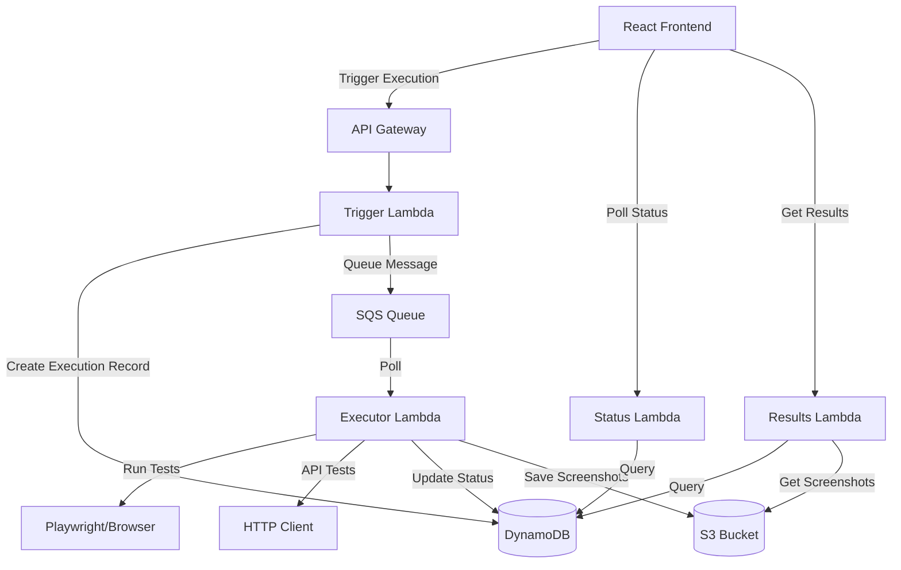

# Design Document: Test Execution

## Overview

The test execution feature enables automated execution of test cases and test suites with real-time status tracking, detailed result reporting, and failure diagnostics. The system uses AWS Lambda for serverless execution, SQS for asynchronous job processing, and Playwright for browser automation. Test executions are stored in DynamoDB with screenshots saved to S3.

The architecture follows an event-driven pattern where execution requests are queued, processed asynchronously, and results are persisted for historical analysis. This approach handles Lambda's 15-minute timeout constraint by executing each test case independently.

## Architecture

### High-Level Architecture



### Component Responsibilities

1. **Trigger Lambda**: Validates requests, creates execution records, queues jobs
2. **Executor Lambda**: Processes test executions using Playwright or HTTP client
3. **Status Lambda**: Provides real-time execution status
4. **Results Lambda**: Retrieves detailed execution results and history
5. **SQS Queue**: Decouples execution requests from processing
6. **DynamoDB TestExecutions Table**: Stores execution records and results
7. **S3 Screenshots Bucket**: Stores failure screenshots and artifacts

## Components and Interfaces

### DynamoDB Schema

#### TestExecutions Table

```typescript
interface TestExecution {
  executionId: string;              // Partition Key: UUID
  projectId: string;                // GSI1 Partition Key
  testCaseId?: string;              // For individual test case executions
  testSuiteId?: string;             // For test suite executions
  suiteExecutionId?: string;        // Links test cases to suite execution
  status: ExecutionStatus;          // queued | running | completed | error
  result?: ExecutionResult;         // pass | fail | error
  startTime: string;                // ISO timestamp
  endTime?: string;                 // ISO timestamp
  duration?: number;                // Milliseconds
  steps: StepResult[];              // Results for each test step
  screenshots: string[];            // S3 keys for screenshots
  errorMessage?: string;            // Error details if status is error
  metadata: {
    triggeredBy: string;            // User ID
    environment?: string;           // test | staging | production
    browserVersion?: string;        // For UI tests
  };
  createdAt: string;                // ISO timestamp
  updatedAt: string;                // ISO timestamp
}

interface StepResult {
  stepIndex: number;
  action: string;                   // navigate | click | type | assert | wait | api-call
  status: 'pass' | 'fail' | 'error';
  duration: number;                 // Milliseconds
  errorMessage?: string;
  screenshot?: string;              // S3 key if captured
  details?: {
    url?: string;                   // For navigate actions
    selector?: string;              // For click/type actions
    value?: string;                 // For type actions
    assertion?: string;             // For assert actions
    apiRequest?: APIRequestDetails;
    apiResponse?: APIResponseDetails;
  };
}

interface APIRequestDetails {
  method: string;
  url: string;
  headers?: Record<string, string>;
  body?: string;
}

interface APIResponseDetails {
  statusCode: number;
  headers?: Record<string, string>;
  body?: string;
  duration: number;
}

type ExecutionStatus = 'queued' | 'running' | 'completed' | 'error';
type ExecutionResult = 'pass' | 'fail' | 'error';
```

**Indexes:**
- Primary Key: `executionId`
- GSI1: `projectId` (PK) + `createdAt` (SK) - for querying executions by project
- GSI2: `testCaseId` (PK) + `createdAt` (SK) - for test case execution history
- GSI3: `testSuiteId` (PK) + `createdAt` (SK) - for test suite execution history
- GSI4: `suiteExecutionId` (PK) - for retrieving all test cases in a suite execution

### SQS Message Format

```typescript
interface ExecutionMessage {
  executionId: string;
  testCaseId: string;
  projectId: string;
  suiteExecutionId?: string;        // If part of suite execution
  testCase: TestCase;               // Full test case definition
  metadata: {
    triggeredBy: string;
    environment?: string;
  };
}
```

### Lambda Functions

#### 1. Trigger Test Execution Lambda

**Endpoint:** `POST /api/executions/trigger`

**Request:**
```typescript
interface TriggerExecutionRequest {
  testCaseId?: string;              // For single test case
  testSuiteId?: string;             // For test suite
  environment?: string;             // Optional environment tag
}
```

**Response:**
```typescript
interface TriggerExecutionResponse {
  executionId: string;              // For single test case
  suiteExecutionId?: string;        // For test suite
  testCaseExecutionIds?: string[];  // For test suite
  status: 'queued';
  message: string;
}
```

**Logic:**
1. Validate request (must have testCaseId OR testSuiteId, not both)
2. Authenticate user and verify access to project
3. If testCaseId:
   - Fetch test case from TestCases table
   - Create TestExecution record with status "queued"
   - Send message to SQS queue
4. If testSuiteId:
   - Fetch test suite from TestSuites table
   - Fetch all test cases in suite
   - Create suite execution record (parent)
   - Create individual TestExecution records for each test case
   - Send messages to SQS queue for each test case
5. Return execution IDs

#### 2. Test Executor Lambda

**Trigger:** SQS Queue

**Logic:**
1. Parse message from SQS
2. Update execution status to "running"
3. Initialize Playwright browser (for UI tests) or HTTP client (for API tests)
4. For each step in test case:
   - Execute step action
   - Record step result (pass/fail/error)
   - If step fails and is UI test, capture screenshot
   - If step fails, break execution
5. Calculate overall result (pass if all steps pass, fail if any fail, error if exception)
6. Upload screenshots to S3
7. Update execution record with final status, result, and details
8. If part of suite execution, check if all tests complete and update suite status
9. Clean up browser resources

**Step Execution Logic:**

```typescript
async function executeStep(step: TestStep, browser: Browser): Promise<StepResult> {
  const startTime = Date.now();
  
  try {
    switch (step.action) {
      case 'navigate':
        await page.goto(step.url, { timeout: 30000 });
        break;
      
      case 'click':
        await page.click(step.selector, { timeout: 10000 });
        break;
      
      case 'type':
        await page.fill(step.selector, step.value, { timeout: 10000 });
        break;
      
      case 'wait':
        await page.waitForTimeout(step.duration);
        break;
      
      case 'assert':
        const element = await page.$(step.selector);
        if (!element) throw new Error(`Element not found: ${step.selector}`);
        
        if (step.assertType === 'visible') {
          const isVisible = await element.isVisible();
          if (!isVisible) throw new Error('Element not visible');
        } else if (step.assertType === 'text') {
          const text = await element.textContent();
          if (text !== step.expectedValue) {
            throw new Error(`Expected "${step.expectedValue}", got "${text}"`);
          }
        }
        break;
      
      case 'api-call':
        const response = await executeAPICall(step);
        if (step.expectedStatusCode && response.statusCode !== step.expectedStatusCode) {
          throw new Error(`Expected status ${step.expectedStatusCode}, got ${response.statusCode}`);
        }
        break;
    }
    
    return {
      stepIndex: step.index,
      action: step.action,
      status: 'pass',
      duration: Date.now() - startTime,
      details: { /* step-specific details */ }
    };
  } catch (error) {
    const screenshot = await captureScreenshot(page);
    return {
      stepIndex: step.index,
      action: step.action,
      status: 'fail',
      duration: Date.now() - startTime,
      errorMessage: error.message,
      screenshot: screenshot,
      details: { /* step-specific details */ }
    };
  }
}
```

#### 3. Get Execution Status Lambda

**Endpoint:** `GET /api/executions/{executionId}/status`

**Response:**
```typescript
interface ExecutionStatusResponse {
  executionId: string;
  status: ExecutionStatus;
  result?: ExecutionResult;
  currentStep?: number;
  totalSteps: number;
  startTime: string;
  duration?: number;
}
```

**Logic:**
1. Query TestExecutions table by executionId
2. Return current status and progress information
3. For suite executions, aggregate status from all test cases

#### 4. Get Execution Results Lambda

**Endpoint:** `GET /api/executions/{executionId}`

**Response:**
```typescript
interface ExecutionResultsResponse {
  execution: TestExecution;
  screenshotUrls: string[];         // Pre-signed S3 URLs
}
```

**Logic:**
1. Query TestExecutions table by executionId
2. For each screenshot S3 key, generate pre-signed URL (valid 1 hour)
3. Return full execution details with accessible screenshot URLs

#### 5. Get Execution History Lambda

**Endpoint:** `GET /api/executions/history`

**Query Parameters:**
- `projectId` (required)
- `testCaseId` (optional)
- `testSuiteId` (optional)
- `startDate` (optional)
- `endDate` (optional)
- `limit` (optional, default 50)

**Response:**
```typescript
interface ExecutionHistoryResponse {
  executions: TestExecution[];
  nextToken?: string;               // For pagination
}
```

**Logic:**
1. Query appropriate GSI based on filters
2. Apply date range filtering
3. Return paginated results

### Browser Automation Setup

#### Playwright Configuration

```typescript
import { chromium } from 'playwright-core';
import chromium from '@sparticuz/chromium';

async function initializeBrowser() {
  const browser = await chromium.launch({
    args: chromium.args,
    executablePath: await chromium.executablePath(),
    headless: chromium.headless,
  });
  
  const context = await browser.newContext({
    viewport: { width: 1280, height: 720 },
    userAgent: 'Mozilla/5.0 (Windows NT 10.0; Win64; x64) AppleWebKit/537.36',
  });
  
  const page = await context.newPage();
  
  return { browser, context, page };
}
```

**Lambda Layer:**
- Use `@sparticuz/chromium` package for Lambda-compatible Chromium binary
- Layer includes Chromium binary and necessary dependencies
- Alternative: Use Lambda container image with Playwright pre-installed

### API Testing

```typescript
import axios from 'axios';

async function executeAPICall(step: APICallStep): Promise<APIResponseDetails> {
  const startTime = Date.now();
  
  try {
    const response = await axios({
      method: step.method,
      url: step.url,
      headers: step.headers,
      data: step.body,
      timeout: 30000,
      validateStatus: () => true,  // Don't throw on any status code
    });
    
    return {
      statusCode: response.status,
      headers: response.headers,
      body: JSON.stringify(response.data),
      duration: Date.now() - startTime,
    };
  } catch (error) {
    throw new Error(`API call failed: ${error.message}`);
  }
}
```

### Screenshot Management

```typescript
async function captureScreenshot(page: Page): Promise<string> {
  const screenshot = await page.screenshot({
    type: 'png',
    fullPage: true,
  });
  
  const key = `screenshots/${Date.now()}-${uuidv4()}.png`;
  
  await s3Client.send(new PutObjectCommand({
    Bucket: process.env.SCREENSHOTS_BUCKET,
    Key: key,
    Body: screenshot,
    ContentType: 'image/png',
  }));
  
  return key;
}

async function getScreenshotUrl(key: string): Promise<string> {
  const command = new GetObjectCommand({
    Bucket: process.env.SCREENSHOTS_BUCKET,
    Key: key,
  });
  
  return await getSignedUrl(s3Client, command, { expiresIn: 3600 });
}
```

## Data Models

### TestCase (Existing)

```typescript
interface TestCase {
  testCaseId: string;
  projectId: string;
  testSuiteId?: string;
  name: string;
  description: string;
  steps: TestStep[];
  createdAt: string;
  updatedAt: string;
}

interface TestStep {
  index: number;
  action: 'navigate' | 'click' | 'type' | 'assert' | 'wait' | 'api-call';
  
  // For navigate
  url?: string;
  
  // For click, type, assert
  selector?: string;
  
  // For type
  value?: string;
  
  // For assert
  assertType?: 'visible' | 'text' | 'value';
  expectedValue?: string;
  
  // For wait
  duration?: number;
  
  // For api-call
  method?: string;
  headers?: Record<string, string>;
  body?: string;
  expectedStatusCode?: number;
  expectedBody?: string;
}
```

### Frontend State Management

```typescript
// Redux RTK Query API
const executionsApi = createApi({
  reducerPath: 'executionsApi',
  baseQuery: fetchBaseQuery({ baseUrl: '/api' }),
  tagTypes: ['Execution', 'ExecutionHistory'],
  endpoints: (builder) => ({
    triggerExecution: builder.mutation<TriggerExecutionResponse, TriggerExecutionRequest>({
      query: (body) => ({
        url: '/executions/trigger',
        method: 'POST',
        body,
      }),
      invalidatesTags: ['ExecutionHistory'],
    }),
    
    getExecutionStatus: builder.query<ExecutionStatusResponse, string>({
      query: (executionId) => `/executions/${executionId}/status`,
      providesTags: (result, error, executionId) => [{ type: 'Execution', id: executionId }],
    }),
    
    getExecutionResults: builder.query<ExecutionResultsResponse, string>({
      query: (executionId) => `/executions/${executionId}`,
      providesTags: (result, error, executionId) => [{ type: 'Execution', id: executionId }],
    }),
    
    getExecutionHistory: builder.query<ExecutionHistoryResponse, ExecutionHistoryParams>({
      query: (params) => ({
        url: '/executions/history',
        params,
      }),
      providesTags: ['ExecutionHistory'],
    }),
  }),
});
```

### Frontend Components

1. **ExecutionTriggerButton**: Button to trigger test execution
2. **ExecutionStatusBadge**: Real-time status indicator with polling
3. **ExecutionResultsTable**: Table showing execution history
4. **ExecutionDetailsModal**: Detailed view of single execution with step-by-step results
5. **ScreenshotViewer**: Image viewer for failure screenshots
6. **TestSuiteExecutionView**: Aggregate view of suite execution with individual test results


## Correctness Properties

A property is a characteristic or behavior that should hold true across all valid executions of a system - essentially, a formal statement about what the system should do. Properties serve as the bridge between human-readable specifications and machine-verifiable correctness guarantees.

### Property 1: Execution Record Creation

*For any* test case execution trigger, creating an execution record should result in a Test_Execution record existing in the database with status "queued" and a message in the Execution_Queue.

**Validates: Requirements 1.1, 1.2**

### Property 2: Execution Status Transitions

*For any* test execution, the status transitions should follow the valid state machine: queued → running → completed (or error), and once in a terminal state (completed/error), the status should not change.

**Validates: Requirements 1.3, 7.1**

### Property 3: Sequential Step Execution

*For any* test case with multiple steps, executing the test should process steps in sequential order by step index, and the recorded step results should maintain the same ordering.

**Validates: Requirements 1.4**

### Property 4: Successful Execution Result

*For any* test execution where all steps complete without errors, the final execution result should be "pass" and status should be "completed".

**Validates: Requirements 1.5**

### Property 5: Failed Execution Result

*For any* test execution where at least one step fails, the final execution result should be "fail" and status should be "completed", and execution should stop at the first failing step.

**Validates: Requirements 1.6**

### Property 6: Error Execution Result

*For any* test execution where an unexpected error occurs, the final execution status should be "error" and the execution record should include error details in the errorMessage field.

**Validates: Requirements 1.7**

### Property 7: Suite Execution Record Creation

*For any* test suite execution trigger, the system should create one Test_Suite_Execution record and individual Test_Execution records for each test case in the suite, with all test cases queued to the Execution_Queue.

**Validates: Requirements 2.1, 2.2, 2.3**

### Property 8: Suite Aggregate Results

*For any* completed test suite execution, the aggregate results should equal the sum of individual test case results (total count, passed count, failed count, error count).

**Validates: Requirements 2.4**

### Property 9: Suite Running Status

*For any* test suite execution, if at least one test case has status "running" or "queued", the suite execution status should be "running".

**Validates: Requirements 2.5**

### Property 10: Navigate Action Execution

*For any* test step with action "navigate", executing the step should result in the browser navigating to the specified URL, and the step result should be "pass" if navigation succeeds.

**Validates: Requirements 3.1**

### Property 11: Click Action Execution

*For any* test step with action "click", executing the step should locate the element by selector and trigger a click event, and the step result should be "pass" if the element is found and clicked.

**Validates: Requirements 3.2**

### Property 12: Type Action Execution

*For any* test step with action "type", executing the step should locate the element by selector and input the specified text value, and the step result should be "pass" if the element is found and text is entered.

**Validates: Requirements 3.3**

### Property 13: Wait Action Execution

*For any* test step with action "wait", executing the step should pause for the specified duration in milliseconds, and the step duration should be at least the specified wait time.

**Validates: Requirements 3.4**

### Property 14: Assert Action Execution

*For any* test step with action "assert", executing the step should verify the specified condition (visible, text, value), and the step result should be "pass" if the condition is met or "fail" if not met.

**Validates: Requirements 3.5**

### Property 15: Screenshot Capture on UI Failure

*For any* UI test step that fails (actions: navigate, click, type, assert), the step result should include a screenshot S3 key, and the screenshot should be uploaded to Screenshot_Storage.

**Validates: Requirements 3.6, 5.1, 5.2**

### Property 16: Screenshot Association

*For any* test execution with failed UI steps, the Test_Execution record should include all screenshot S3 keys in the screenshots array, and each failed step should reference its screenshot.

**Validates: Requirements 5.3, 5.4**

### Property 17: API Call Execution

*For any* test step with action "api-call", executing the step should make an HTTP request with the specified method, URL, headers, and body, and the step result should include the API response details.

**Validates: Requirements 4.1**

### Property 18: API Response Validation

*For any* API call step with expected status code or expected body, the step result should be "fail" if the actual response does not match expected values, and the step details should include both actual and expected values.

**Validates: Requirements 4.2, 4.3, 4.4**

### Property 19: Execution Persistence

*For any* completed test execution, the Test_Execution record should be persisted to the TestExecutions table with all required fields: executionId, projectId, status, result, startTime, endTime, duration, steps, and metadata.

**Validates: Requirements 6.1, 6.2**

### Property 20: Execution History Filtering

*For any* execution history query with filters (projectId, testCaseId, testSuiteId, date range), all returned executions should match the specified filter criteria.

**Validates: Requirements 6.3**

### Property 21: Execution History Ordering

*For any* execution history query, the returned executions should be ordered by createdAt timestamp in descending order (most recent first).

**Validates: Requirements 6.4**

### Property 22: Execution Status API Response

*For any* execution status request, the API response should include the current status, result (if completed), current step number, total steps, start time, and duration.

**Validates: Requirements 7.2, 7.3**

### Property 23: Suite Execution Progress

*For any* test suite execution, the progress percentage should equal (completed test cases / total test cases) * 100.

**Validates: Requirements 7.4**

### Property 24: Individual Test Case Queueing

*For any* test suite execution, each test case should be queued as a separate SQS message, not executed synchronously in the trigger Lambda.

**Validates: Requirements 8.1, 8.2**

### Property 25: Execution Result Completeness

*For any* execution result API response, the response should include overall status, result, duration, and results for each individual test step with step-level details.

**Validates: Requirements 9.1, 9.2, 9.3**

### Property 26: Suite Result Completeness

*For any* test suite execution result, the response should include aggregate statistics (total, passed, failed, errors) and individual test case results for all test cases in the suite.

**Validates: Requirements 9.4**

### Property 27: Browser Initialization Configuration

*For any* browser automation initialization, the browser should be configured with headless mode enabled and appropriate timeout values set.

**Validates: Requirements 10.3**

### Property 28: Browser Resource Cleanup

*For any* browser automation session, after execution completes (success or failure), the browser, context, and page resources should be properly closed and cleaned up.

**Validates: Requirements 10.4**

### Property 29: API Authentication

*For any* API request to execution endpoints, requests without valid authentication tokens should be rejected with 401 status, and requests without proper authorization should be rejected with 403 status.

**Validates: Requirements 11.6**

### Property 30: Retry on Transient Failures

*For any* browser action or API call that fails with a transient error (network error, timeout), the system should retry up to 3 times with exponential backoff before marking the step as failed.

**Validates: Requirements 12.1, 12.2**

### Property 31: Timeout Handling

*For any* test step that exceeds its timeout limit, the step should be marked as "fail" with a timeout error message, and the test execution should proceed to mark the overall test as failed.

**Validates: Requirements 12.3**

### Property 32: Error Logging

*For any* unexpected error during test execution, the system should log the error with detailed information including error message, stack trace, execution context, and timestamp.

**Validates: Requirements 12.5**

## Error Handling

### Browser Automation Errors

1. **Element Not Found**: Retry up to 3 times with 1s, 2s, 4s delays
2. **Navigation Timeout**: Fail step with clear error message
3. **Browser Crash**: Mark execution as error, log crash details
4. **Screenshot Capture Failure**: Log warning but don't fail the test

### API Call Errors

1. **Network Errors**: Retry up to 3 times with exponential backoff
2. **Timeout**: Retry up to 3 times, then fail
3. **Invalid Response**: Fail step with response details
4. **Connection Refused**: Fail immediately with clear error

### Infrastructure Errors

1. **DynamoDB Throttling**: Use exponential backoff with jitter
2. **S3 Upload Failure**: Retry up to 3 times, log error if all fail
3. **SQS Message Processing Failure**: Use dead-letter queue after 3 retries
4. **Lambda Timeout**: Mark execution as error with timeout message

### Data Validation Errors

1. **Invalid Test Case**: Reject execution request with validation error
2. **Missing Required Fields**: Return 400 error with field details
3. **Invalid Step Configuration**: Fail step with configuration error message

## Testing Strategy

### Unit Testing

Unit tests will validate specific examples, edge cases, and error conditions:

1. **Lambda Function Tests**:
   - Test trigger lambda with valid/invalid requests
   - Test executor lambda with various step types
   - Test status/results lambdas with different query parameters

2. **Step Execution Tests**:
   - Test each action type (navigate, click, type, assert, wait, api-call)
   - Test error scenarios for each action type
   - Test screenshot capture on failures

3. **Integration Tests**:
   - Test end-to-end execution flow from trigger to completion
   - Test suite execution with multiple test cases
   - Test screenshot upload and retrieval
   - Test execution history queries

4. **Edge Cases**:
   - Empty test suites
   - Test cases with no steps
   - Very long test suites (100+ test cases)
   - Concurrent executions
   - Lambda timeout scenarios

### Property-Based Testing

Property tests will validate universal properties across all inputs using a property-based testing library (fast-check for TypeScript/Node.js). Each test will run a minimum of 100 iterations.

1. **Execution State Machine Properties**:
   - Property 2: Status transitions follow valid state machine
   - Property 4: All successful steps result in pass
   - Property 5: Any failed step results in fail
   - Property 6: Errors result in error status

2. **Data Integrity Properties**:
   - Property 19: Execution persistence includes all required fields
   - Property 25: Execution results include complete step details
   - Property 26: Suite results include all test case results

3. **Ordering and Sequencing Properties**:
   - Property 3: Steps execute in sequential order
   - Property 21: History results ordered by timestamp descending

4. **Aggregation Properties**:
   - Property 8: Suite aggregate results equal sum of individual results
   - Property 23: Suite progress percentage calculation

5. **Filtering Properties**:
   - Property 20: History filtering returns only matching executions

Each property test will be tagged with:
```typescript
// Feature: test-execution, Property N: [property description]
```

### Testing Configuration

- Property tests: Minimum 100 iterations per test
- Unit tests: Use mocked AWS services (DynamoDB, S3, SQS)
- Integration tests: Use LocalStack for local AWS service testing
- Browser tests: Use Playwright in headed mode for debugging, headless for CI
- API tests: Use supertest for HTTP endpoint testing

### Test Data Generation

For property-based tests, generate:
- Random test cases with 1-20 steps
- Random step types and configurations
- Random execution statuses and results
- Random timestamps and durations
- Random project/suite/case IDs
